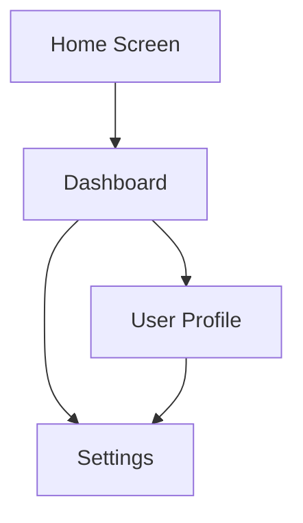
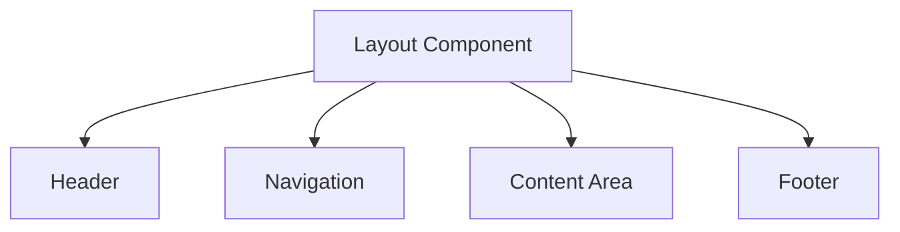
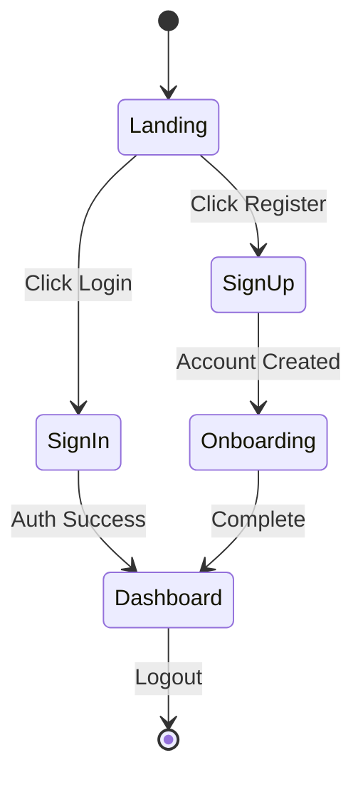
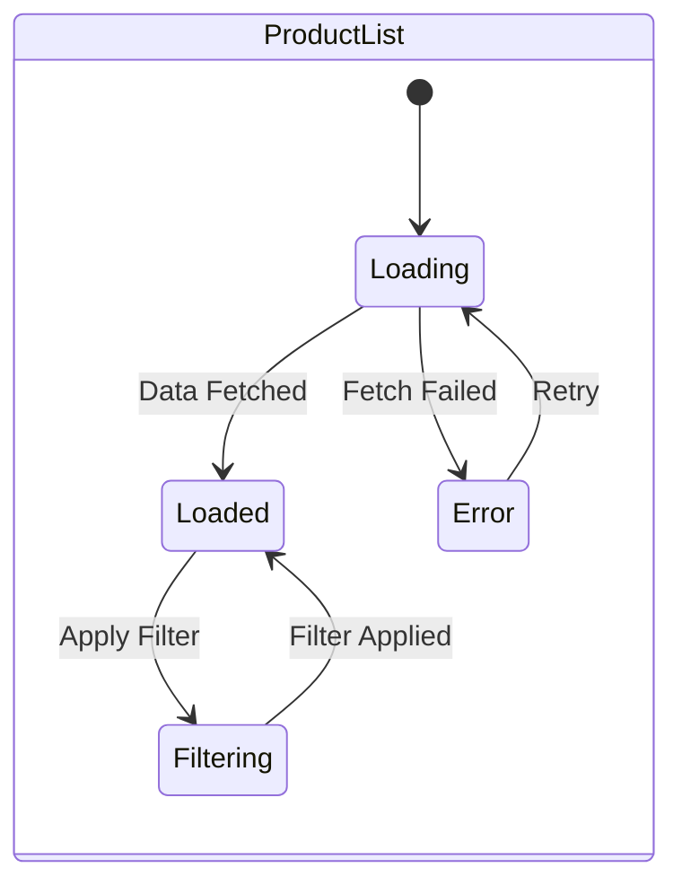

# Args: `<screen-flow-name>` `[project-path|custom-instructions]` `[output-format]` `[--convert-html]`. v2.4.0. Create comprehensive screen flow diagrams with HTML-to-image conversion using npm packages (html-to-image, svg2png). Enhanced workflow with Node.js script integration for converting HTML storyboards to embedded images. **Enforces embedded images in markdown files with validation to prevent hyperlinked images.** Creates screen flows in designs/screenflows/{screen-flow-name} folder with optional HTML-to-image conversion.

**🚨 COMMAND EXECUTION NOTICE**: This is a Claude command file, not a bash script. Claude will process this file and execute the appropriate operations. DO NOT attempt to run this as `/update-screenflows` in bash.

**✨ ENHANCED FUNCTIONALITY**: This command now features Dashboard Wireframe (SVG) as the primary method for individual screens:
- **SVG-First Workflow**: Creates GitHub-compatible Dashboard Wireframe (SVG) files as the primary visual method
- **🚀 HTML-to-Image Conversion**: Uses npm packages (html-to-image, svg2png) to convert HTML storyboards to embedded images
- **Node.js Script Integration**: Automated conversion scripts for transforming HTML wireframes to image files
- **Child File Structure**: Creates individual markdown files for each screen with embedded images
- **Minimal README**: Generates clean overview README with TOC links to child files
- **Enhanced Organization**: Separates screen content from overview for better maintainability
- **Project Analysis Mode**: Analyzes React/Next.js projects to generate comprehensive screen flows
- **Custom Content Mode**: Generates from provided specifications with organized child file structure
- **🔒 Image Validation**: Enforces that all markdown files use embedded images (relative paths) instead of hyperlinked images (external URLs)

**This unified command provides organized screen flow documentation with minimal README and dedicated child files for each screen.**

## Summary

Creates comprehensive screen flow diagrams and project structures for React/Next.js applications using **Dashboard Wireframe (SVG) as the primary method**. Supports two operational modes:

**Project Analysis Mode**: Analyzes actual React/Next.js project structure to automatically generate screen flows with discovered routes, components, and navigation patterns. Creates SVG dashboard wireframes, configuration files, templates, and metadata for systematic documentation.

**Custom Content Mode**: Generates screen flows from provided specifications and custom instructions without requiring an actual project. Creates organized child markdown files with embedded screens and a minimal README with clean table of contents.

Both modes create organized projects in `designs/screenflows/{screen-flow-name}` with **individual screen markdown files containing embedded images**, minimal README overview, and clean table of contents structure.

## Usage

```bash
# Project Analysis Mode - Analyze existing React/Next.js project
/design:update-screenflows <screen-flow-name> <project-path> [output-format] [--convert-html]

# Custom Content Mode - Generate from specifications
/design:update-screenflows <screen-flow-name> [custom-instructions] [output-format] [--convert-html]

# HTML-to-Image Conversion Mode - Convert HTML storyboards to images
/design:update-screenflows <screen-flow-name> [custom-instructions] svg --convert-html
```

## Arguments

- `<screen-flow-name>`: Name for the screen flow project (REQUIRED)
  - Examples: `user-onboarding`, `checkout-flow`, `admin-dashboard`
  - Used to create project folder: `designs/screenflows/{screen-flow-name}`
  - Should be kebab-case format
  - Will be used in README titles and navigation

- `[project-path|custom-instructions]`: Mode-dependent second argument (OPTIONAL)
  
  **For Project Analysis Mode:**
  - `<project-path>`: Path to React/Next.js project to analyze
  - Examples: `.`, `./frontend`, `../my-app`
  - Must be a valid React or Next.js project directory
  - Triggers automatic project analysis and structure discovery
  
  **For Custom Content Mode:**
  - `[custom-instructions]`: Content and specifications for the screen flow
  - Contains application structure, routes, components, and navigation patterns
  - Used as primary source for generating diagrams
  - Should include component hierarchy, user flows, and interaction patterns
  - If not provided, content can be specified during command execution

- `[output-format]`: Format preference for screen flow output (OPTIONAL)
  - Default: `svg` (Dashboard Wireframe SVG format)
  - Options: `svg`, `mermaid`, `json`, `markdown`
  - **Primary Method**: `svg` creates Dashboard Wireframe (SVG) files as the main visual documentation
  - In project mode: Configures default format in project config
  - In custom mode: Determines immediate output format

- `[--convert-html]`: Enable HTML-to-image conversion using npm packages (OPTIONAL)
  - Uses html-to-image and svg2png npm packages for conversion
  - Converts HTML storyboards to embedded image files (PNG, SVG, JPEG)
  - Creates Node.js conversion scripts for automated image generation
  - Generates both individual screen images and complete storyboard images
  - Images are saved to wireframes/ and images/ directories with relative paths
  - **Requires**: Node.js environment with npm packages installed
  - **Output**: Embedded image files compatible with GitHub markdown rendering

## Examples

### Project Analysis Mode

```bash
# Analyze current directory React/Next.js project (SVG dashboard wireframes)
/design:update-screenflows user-onboarding .

# Analyze frontend subdirectory with SVG dashboard wireframes (primary method)
/design:update-screenflows checkout-flow ./frontend svg

# Analyze parent directory Next.js project with Mermaid fallback
/design:update-screenflows admin-dashboard ../my-nextjs-app mermaid

# Analyze mobile app with JSON configuration
/design:update-screenflows mobile-app ./app json
```

### Custom Content Mode

```bash
# Generate screen flow with SVG dashboard wireframes (primary method)
/design:update-screenflows user-onboarding "Create onboarding flow with welcome screen, profile setup, and tutorial steps"

# Generate checkout flow with SVG dashboard wireframes and detailed specifications
/design:update-screenflows checkout-flow "Design e-commerce checkout with cart review, shipping, payment, and confirmation screens" svg

# Generate admin dashboard with SVG wireframes (will be prompted for details)
/design:update-screenflows admin-dashboard

# Generate mobile app flow with SVG dashboard wireframes and storyboarding
/design:update-screenflows mobile-app-flow "Mobile app with tab navigation, home feed, search, profile, and settings screens" svg

# Generate authentication flow with SVG dashboard wireframes and state transitions
/design:update-screenflows auth-flow "Auth flow including login, register, forgot password, and 2FA verification screens"

# Generate mobile app flow with HTML-to-image conversion
/design:update-screenflows mobile-app-flow "Mobile app with tab navigation" svg --convert-html

# Convert existing HTML storyboards to embedded images
/design:update-screenflows dashboard-redesign "Dashboard with charts and widgets" svg --convert-html
```

## What This Command Does

This command creates comprehensive screen flow diagrams and project structures using two distinct operational modes:

### Mode Detection

The command automatically detects which mode to use based on the second argument:
- **Directory path** (e.g., `.`, `./frontend`, `../app`) → **Project Analysis Mode**
- **Text content** or **no argument** → **Custom Content Mode**

### Project Analysis Mode Features

- **Framework Detection**: Automatically identifies React, Next.js versions, and routing patterns
- **Route Discovery**: Maps all application routes and navigation structures
- **Component Analysis**: Catalogs component directories and relationships
- **State Management Detection**: Identifies Redux, Context API, Zustand patterns
- **Configuration Generation**: Creates `.screen-flow-config.json` with project metadata
- **Template Creation**: Generates framework-specific diagram templates
- **Structured Output**: Creates organized project structure with metadata
- **🚀 HTML-to-Image Conversion**: Automatically converts generated HTML storyboards to embedded images using npm packages

### Custom Content Mode Features

- **SVG Dashboard Wireframes**: Creates GitHub-compatible SVG wireframes as the primary visual method for individual screens
- **Content Analysis**: Processes provided application structure and requirements
- **Multi-Screen Storyboarding**: Enhanced storyboarding capabilities with embedded example images
- **Route Mapping**: Creates route hierarchy from provided navigation structure
- **Component Analysis**: Maps component relationships from provided specifications
- **Flow Generation**: Builds user flows and interaction patterns with SVG dashboard wireframes
- **State Modeling**: Documents application states and transitions with visual SVG representations
- **Immediate Output**: Generates complete Dashboard Wireframe (SVG) files directly
- **🚀 HTML-to-Image Conversion**: Uses html-to-image and svg2png npm packages to convert HTML storyboards to embedded images

### Unified Process Overview

1. **Mode Detection**: Determine operation mode from arguments
2. **Input Processing**: Parse project structure OR custom instructions
3. **Analysis Phase**: Extract routes, components, and patterns
4. **Structure Creation**: Set up project directories and configuration
5. **SVG Generation**: Create comprehensive Dashboard Wireframe (SVG) files as primary visual method
6. **Multi-Screen Storyboarding**: Generate enhanced storyboards with embedded example images
7. **HTML-to-Image Conversion**: Convert HTML storyboards to embedded images using npm packages (if --convert-html flag is enabled)
8. **Documentation**: Generate README and navigation files with SVG wireframe integration
9. **Integration**: Update main designs index with SVG dashboard wireframe links

### Project Structure (Project Analysis Mode)

When using project analysis mode, the command creates an enhanced structure:

```
designs/
├── README.md                          # Main designs index (created/updated)
└── screenflows/                       # All screen flow projects
    └── {screen-flow-name}/            # Individual screen flow project
        ├── README.md                  # Minimal project overview with TOC links
        ├── .screen-flow-config.json   # Project configuration and metadata
        ├── screens/                   # Child markdown files with embedded screens
        │   ├── screen-01-home.md      # Individual screen with embedded images
        │   ├── screen-02-profile.md   # Individual screen with embedded images
        │   ├── screen-03-settings.md  # Individual screen with embedded images
        │   └── screen-04-dashboard.md # Individual screen with embedded images
        ├── wireframes/                # Supporting SVG wireframe assets
        │   ├── dashboard-wireframe.svg      # Main dashboard wireframe
        │   ├── screen-01-home.svg           # Individual screen wireframes
        │   ├── screen-02-profile.svg        # Individual screen wireframes
        │   ├── screen-03-settings.svg       # Individual screen wireframes
        │   └── storyboard-complete.svg      # Multi-screen storyboard overview
        ├── images/                    # Supporting images
        │   └── (screen-specific images)
        ├── templates/                 # Diagram templates (project mode)
        │   ├── overview.template.mmd
        │   ├── navigation.template.mmd
        │   ├── components.template.mmd  
        │   ├── states.template.mmd
        │   └── data-flow.template.mmd
        ├── metadata/                  # Project analysis results
        │   ├── routes.json           # Discovered routes
        │   ├── components.json       # Component inventory
        │   └── analysis.json         # Framework analysis
        ├── diagrams/                 # Generated diagram output (Mermaid fallback)
        │   ├── overview.mmd
        │   ├── navigation.mmd
        │   ├── components.mmd
        │   ├── states.mmd
        │   └── data-flow.mmd
        └── report.md                 # Comprehensive documentation linking to child files
```

### Project Structure (Custom Content Mode)

When using custom content mode, the command creates a simplified structure:

```
designs/
├── README.md                          # Main designs index (created/updated)
└── screenflows/                       # All screen flow projects
    └── {screen-flow-name}/            # Individual screen flow project
        ├── README.md                  # Minimal project overview with TOC links
        ├── screens/                   # Child markdown files with embedded screens
        │   ├── screen-01-home.md      # Individual screen with embedded images
        │   ├── screen-02-profile.md   # Individual screen with embedded images
        │   ├── screen-03-settings.md  # Individual screen with embedded images
        │   └── screen-04-dashboard.md # Individual screen with embedded images
        ├── wireframes/                # Supporting SVG wireframe assets
        │   ├── dashboard-wireframe.svg      # Main dashboard wireframe
        │   ├── screen-01-home.svg           # Individual screen wireframes
        │   ├── screen-02-profile.svg        # Individual screen wireframes
        │   ├── screen-03-settings.svg       # Individual screen wireframes
        │   └── storyboard-complete.svg      # Multi-screen storyboard overview
        ├── images/                    # Supporting images
        │   └── (screen-specific images)
        ├── overview.mmd               # Main flow diagram (Mermaid fallback)
        ├── navigation.mmd             # Navigation patterns (Mermaid fallback)
        ├── components.mmd             # Component hierarchy (Mermaid fallback)
        ├── states.mmd                 # Screen states (Mermaid fallback)
        ├── data-flow.mmd              # Data flow (Mermaid fallback)
        └── report.md                  # Comprehensive report linking to child files
```

### Generated Structure

This command creates an **organized child file structure** with minimal README and individual screen markdown files. Each screen is documented in a separate file with embedded images for better maintainability and navigation. For comprehensive approaches to screen flow documentation, refer to the documentation:

- **[Screenflow Child File Structure](../docs/screenflow-child-file-structure.md)** - Complete guide to the enhanced child file structure workflow
- **[Screenflows Storyboarding](.claude/docs/design/screenflows-storyboarding.md)** - HTML-based storyboarding for visualizing entire application flows in a single document with embedded example images
- **[Screenflows Wireframes](.claude/docs/design/screenflows-wireframes.md)** - Best practices for creating HTML wireframes with proper screen state management

### Primary Output: Child File Structure with Embedded Screens

The command creates organized screen flow documentation with:

1. **Minimal README**: Clean overview with table of contents linking to child files
2. **Individual Screen Files**: Each screen documented in separate markdown file with embedded images
3. **Organized Structure**: Content structured in screens/ directory for better maintainability
4. **Supporting Assets**: Wireframes and images directories for supporting visual content

### Fallback: Mermaid Diagrams (when SVG is not available)

The command also creates four types of Mermaid diagrams as fallback documentation:

#### 1. Overall Screen Flow


#### 2. Component Hierarchy


#### 3. Navigation Flows


#### 4. Screen States


### Output Structure

```
designs/
├── README.md                      # Main designs index with screen flows section
└── screen-flows/                  # All screen flow projects
    └── {screen-flow-name}/        # Individual screen flow project
        ├── README.md              # Project README with table of contents
        ├── overview.mmd           # Overall application screen flow
        ├── navigation.mmd         # Navigation patterns and user flows
        ├── components.mmd         # Component hierarchy and relationships
        ├── states.mmd            # Screen states and transitions
        ├── data-flow.mmd         # Data flow between screens
        └── report.md             # Comprehensive report with all diagrams
```

## Script Integration

This command can leverage scripts for enhanced analysis and performance:

```bash
# Check for route analyzer script
ROUTE_SCRIPT=".claude/scripts/design/update-screenflows_route-analyzer.sh"
if [[ -f "$ROUTE_SCRIPT" ]]; then
    echo "🚀 Using optimized route analysis..."
    "$ROUTE_SCRIPT" "$PROJECT_PATH"
fi

# Check for component mapper script
COMPONENT_SCRIPT=".claude/scripts/design/update-screenflows_component-mapper.sh"
if [[ -f "$COMPONENT_SCRIPT" ]]; then
    echo "🔍 Using enhanced component mapping..."
    "$COMPONENT_SCRIPT" "$PROJECT_PATH"
fi
```

**Script Patterns:**
- Project scripts: `.claude/scripts/design/update-screenflows_*.sh`
- Analysis operations: `_route-analyzer.sh`, `_component-mapper.sh`, `_diagram-generator.sh`

## Performance Considerations

- **Incremental Analysis**: Caches previous analysis for faster updates
- **Parallel Processing**: Analyzes multiple directories concurrently
- **Smart Detection**: Uses heuristics to identify framework patterns quickly
- **Memory Efficient**: Processes large codebases without loading everything

## Implementation Details

```bash
#!/bin/bash
set -euo pipefail

# Parse arguments
if [ $# -lt 1 ]; then
    echo "❌ Error: Missing required arguments"
    echo "Usage: /design:update-screenflows <screen-flow-name> [project-path|custom-instructions] [output-format] [--convert-html]"
    echo "Example: /design:update-screenflows user-onboarding ."
    echo "Example: /design:update-screenflows checkout-flow \"E-commerce checkout with cart, shipping, payment\""
    echo "Example: /design:update-screenflows dashboard-flow \"Dashboard with widgets\" svg --convert-html"
    exit 1
fi

SCREEN_FLOW_NAME="$1"
SECOND_ARG="${2:-}"
OUTPUT_FORMAT="${3:-svg}"
CONVERT_HTML=false
DESIGN_FOLDER="designs/screenflows/$SCREEN_FLOW_NAME"

# Check for --convert-html flag in any position
for arg in "$@"; do
    if [[ "$arg" == "--convert-html" ]]; then
        CONVERT_HTML=true
        break
    fi
done

# Validate screen flow name (should be kebab-case)
if [[ ! "$SCREEN_FLOW_NAME" =~ ^[a-z]+(-[a-z]+)*$ ]]; then
    echo "❌ Error: Screen flow name must be in kebab-case format"
    echo "Examples: user-onboarding, checkout-flow, admin-dashboard"
    exit 1
fi

# Validate output format
if [[ ! "$OUTPUT_FORMAT" =~ ^(svg|mermaid|json|markdown)$ ]]; then
    echo "❌ Error: Invalid output format. Must be one of: svg, mermaid, json, markdown"
    echo "Default: svg (Dashboard Wireframe SVG format - primary method)"
    exit 1
fi

# Image validation function to enforce embedded images
validate_markdown_images() {
    local file_path="$1"
    echo "🔒 Validating image references in $file_path..."
    
    # Check for hyperlinked images (external URLs)
    local hyperlinked_images
    hyperlinked_images=$(grep -n '!\[.*\](http[s]*://' "$file_path" 2>/dev/null || true)
    
    if [[ -n "$hyperlinked_images" ]]; then
        echo "❌ ERROR: Hyperlinked images found in $file_path"
        echo "   The following images must be embedded (use relative paths) instead of hyperlinked:"
        echo "$hyperlinked_images"
        echo ""
        echo "🔧 SOLUTION: Replace hyperlinked images with embedded images:"
        echo "   ❌ Wrong: "
        echo "   ✅ Correct: "
        echo "   ✅ Correct: "
        echo ""
        return 1
    fi
    
    # Check for properly embedded images (relative paths)
    local embedded_images
    embedded_images=$(grep -n '!\[.*\](\./\|!\[.*\](\.\./\|!\[.*\]([^h][^t][^t][^p]' "$file_path" 2>/dev/null || true)
    
    if [[ -n "$embedded_images" ]]; then
        echo "✅ Found properly embedded images:"
        echo "$embedded_images" | head -5  # Show first 5 examples
        if [[ $(echo "$embedded_images" | wc -l) -gt 5 ]]; then
            echo "   ... and $(( $(echo "$embedded_images" | wc -l) - 5 )) more"
        fi
    fi
    
    return 0
}

# Function to convert hyperlinked images to embedded images
convert_hyperlinked_to_embedded() {
    local file_path="$1"
    echo "🔧 Converting hyperlinked images to embedded format in $file_path..."
    
    # Replace external image URLs with embedded warnings
    sed -i 's|!\[\([^]]*\)\](https\?://[^)]*)||g' "$file_path"
    
    echo "⚠️  Converted hyperlinked images to embedded placeholders"
    echo "   Please replace './images/replace-with-local-file.svg' with actual local image paths"
}

# HTML-to-image conversion function using npm packages
convert_html_to_images() {
    local design_folder="$1"
    local screen_flow_name="$2"
    
    echo "🚀 Starting HTML-to-image conversion using npm packages..."
    
    # Enhanced dependency validation with comprehensive error handling
    if ! command -v node &> /dev/null; then
        echo "❌ Error: Node.js is required for HTML-to-image conversion"
        echo ""
        echo "🔧 INSTALLATION GUIDE:"
        echo "   📥 Visit: https://nodejs.org/"
        echo "   📦 Download the LTS version"
        echo "   ✅ Verify installation: node --version"
        echo ""
        echo "🐧 Linux (Ubuntu/Debian): sudo apt install nodejs npm"
        echo "🍎 macOS: brew install node"
        echo "🪟 Windows: Download from nodejs.org or use chocolatey"
        return 1
    fi
    
    # Check Node.js version (minimum v16 for better compatibility)
    local node_version
    node_version=$(node --version | cut -d'v' -f2 | cut -d'.' -f1)
    if [[ "$node_version" -lt 16 ]]; then
        echo "⚠️  Warning: Node.js version $node_version detected"
        echo "   Recommended: Node.js v16 or higher for optimal compatibility"
        echo "   Current packages may still work, but consider upgrading"
    fi
    
    # Validate npm availability
    if ! command -v npm &> /dev/null; then
        echo "❌ Error: npm is required but not found"
        echo "   npm usually comes with Node.js installation"
        echo "   Try reinstalling Node.js or install npm separately"
        return 1
    fi
    
    # Check if in a Node.js project directory (has package.json)
    local has_package_json=false
    if [[ -f "package.json" ]]; then
        has_package_json=true
        echo "✅ Found package.json - using project dependencies"
    else
        echo "ℹ️  No package.json found - will install packages globally if needed"
    fi
    
    # Enhanced npm package validation with fallback installation
    local missing_packages=()
    
    # Check html-to-image package
    if [[ "$has_package_json" == true ]]; then
        if ! npm list html-to-image &> /dev/null; then
            missing_packages+=("html-to-image")
        fi
        if ! npm list jsdom &> /dev/null; then
            missing_packages+=("jsdom")
        fi
    else
        # Global package check
        if ! npm list -g html-to-image &> /dev/null; then
            missing_packages+=("html-to-image")
        fi
        if ! npm list -g jsdom &> /dev/null; then
            missing_packages+=("jsdom")
        fi
    fi
    
    # Install missing packages with enhanced error handling
    if [[ ${#missing_packages[@]} -gt 0 ]]; then
        echo "📦 Installing required packages: ${missing_packages[*]}"
        
        local install_cmd="npm install"
        [[ "$has_package_json" == false ]] && install_cmd="npm install -g"
        
        # Add specific package versions for stability
        local package_specs=()
        for package in "${missing_packages[@]}"; do
            case "$package" in
                "html-to-image") package_specs+=("html-to-image@1.11.13") ;;
                "jsdom") package_specs+=("jsdom@22.1.0") ;;
                *) package_specs+=("$package") ;;
            esac
        done
        
        echo "🔄 Running: $install_cmd ${package_specs[*]}"
        
        if ! $install_cmd "${package_specs[@]}"; then
            echo "❌ Failed to install required packages"
            echo ""
            echo "🔧 TROUBLESHOOTING:"
            echo "   1. Check npm permissions: npm config get prefix"
            echo "   2. Try with sudo (Linux/macOS): sudo $install_cmd ${package_specs[*]}"
            echo "   3. Clear npm cache: npm cache clean --force"
            echo "   4. Update npm: npm install -g npm@latest"
            echo "   5. Use different registry: npm install --registry https://registry.npmjs.org/ ${package_specs[*]}"
            return 1
        fi
        
        echo "✅ Successfully installed: ${package_specs[*]}"
    else
        echo "✅ All required packages are available"
    fi
    
    # Final validation that packages can be imported
    echo "🔍 Validating package imports..."
    if ! node -e "require('html-to-image'); console.log('html-to-image: OK')" 2>/dev/null; then
        echo "❌ Error: html-to-image package cannot be imported"
        echo "   Try reinstalling: npm install html-to-image@1.11.13"
        return 1
    fi
    
    if ! node -e "require('jsdom'); console.log('jsdom: OK')" 2>/dev/null; then
        echo "❌ Error: jsdom package cannot be imported"
        echo "   Try reinstalling: npm install jsdom@22.1.0"
        return 1
    fi
    
    echo "✅ All packages validated and ready for conversion"
    
    # Create conversion script
    local script_path="$design_folder/convert-html-to-images.js"
    cat > "$script_path" << 'EOF'
const fs = require('fs');
const path = require('path');
const { htmlToImage } = require('html-to-image');

async function convertHtmlToImages(designFolder, screenFlowName) {
    console.log('🔄 Converting HTML storyboards to embedded images...');
    
    // Create sample HTML storyboard if none exists
    const htmlStoryboardPath = path.join(designFolder, 'storyboard.html');
    if (!fs.existsSync(htmlStoryboardPath)) {
        console.log('📄 Creating sample HTML storyboard...');
        createSampleHtmlStoryboard(htmlStoryboardPath, screenFlowName);
    }
    
    try {
        // Read HTML content
        const htmlContent = fs.readFileSync(htmlStoryboardPath, 'utf8');
        
        // Create a temporary DOM element
        const { JSDOM } = require('jsdom');
        const dom = new JSDOM(htmlContent);
        const document = dom.window.document;
        
        // Parallel image generation for optimal performance
        console.log('🔄 Converting to multiple formats in parallel...');
        const startTime = Date.now();
        
        const [pngDataUrl, svgDataUrl] = await Promise.all([
            htmlToImage.toPng(document.body, {
                quality: 0.9,
                width: 1200,
                height: 800,
                backgroundColor: '#ffffff'
            }),
            htmlToImage.toSvg(document.body, {
                backgroundColor: '#ffffff'
            })
        ]);
        
        // Process results in parallel
        const pngPromise = new Promise((resolve) => {
            const base64Data = pngDataUrl.replace(/^data:image\/png;base64,/, '');
            const outputPath = path.join(designFolder, 'wireframes', 'storyboard-from-html.png');
            fs.writeFileSync(outputPath, base64Data, 'base64');
            console.log('✅ PNG conversion completed:', outputPath);
            resolve(outputPath);
        });
        
        const svgPromise = new Promise((resolve) => {
            const svgPath = path.join(designFolder, 'wireframes', 'storyboard-from-html.svg');
            const svgContent = svgDataUrl.replace('data:image/svg+xml;charset=utf-8,', '');
            fs.writeFileSync(svgPath, decodeURIComponent(svgContent));
            console.log('✅ SVG conversion completed:', svgPath);
            resolve(svgPath);
        });
        
        // Wait for both files to be written
        await Promise.all([pngPromise, svgPromise]);
        
        const conversionTime = Date.now() - startTime;
        console.log(`⚡ Parallel conversion completed in ${conversionTime}ms`);
        
    } catch (error) {
        console.error('❌ Conversion failed:', error.message);
        console.log('💡 Tip: Ensure html-to-image package is compatible with your Node.js version');
    }
}

function createSampleHtmlStoryboard(filePath, screenFlowName) {
    const htmlContent = `<!DOCTYPE html>
<html lang="en">
<head>
    <meta charset="UTF-8">
    <meta name="viewport" content="width=device-width, initial-scale=1.0">
    <title>${screenFlowName} Storyboard</title>
    <style>
        body { font-family: system-ui, sans-serif; margin: 0; padding: 20px; background: #f8f9fa; }
        .storyboard { display: grid; grid-template-columns: repeat(auto-fit, minmax(250px, 1fr)); gap: 20px; }
        .screen { background: white; border: 2px solid #dee2e6; border-radius: 8px; padding: 15px; }
        .screen-title { font-weight: bold; margin-bottom: 10px; color: #495057; }
        .screen-content { height: 150px; background: #e9ecef; border-radius: 4px; display: flex; align-items: center; justify-content: center; color: #6c757d; }
        .flow-arrow { text-align: center; color: #ffc107; font-size: 24px; margin: 10px 0; }
    </style>
</head>
<body>
    <h1>${screenFlowName} Storyboard</h1>
    <div class="storyboard">
        <div class="screen">
            <div class="screen-title">1. Home Screen</div>
            <div class="screen-content">Dashboard Layout</div>
        </div>
        <div class="screen">
            <div class="screen-title">2. Navigation</div>
            <div class="screen-content">Menu Interface</div>
        </div>
        <div class="screen">
            <div class="screen-title">3. Content Area</div>
            <div class="screen-content">Main Content</div>
        </div>
        <div class="screen">
            <div class="screen-title">4. User Profile</div>
            <div class="screen-content">Profile Management</div>
        </div>
    </div>
    <div class="flow-arrow">↓ User Journey Flow ↓</div>
    <p style="text-align: center; color: #6c757d;">Generated by update-screenflows command</p>
</body>
</html>`;
    
    fs.writeFileSync(filePath, htmlContent);
    console.log('📄 Sample HTML storyboard created:', filePath);
}

// Run conversion
const designFolder = process.argv[2];
const screenFlowName = process.argv[3];

if (!designFolder || !screenFlowName) {
    console.error('Usage: node convert-html-to-images.js <design-folder> <screen-flow-name>');
    process.exit(1);
}

convertHtmlToImages(designFolder, screenFlowName);
EOF
    
    echo "📄 Created HTML-to-image conversion script: $script_path"
    
    # Run the conversion
    echo "🔄 Executing HTML-to-image conversion..."
    cd "$(dirname "$design_folder")" || exit 1
    node "$script_path" "$design_folder" "$screen_flow_name"
    
    # Clean up script
    rm -f "$script_path"
    
    echo "✅ HTML-to-image conversion completed!"
    echo "📂 Images saved to: $design_folder/wireframes/"
    echo "🎯 Files created: storyboard-from-html.png, storyboard-from-html.svg"
}

# Mode detection: check if second argument is a directory path
MODE="custom"
PROJECT_PATH=""
CUSTOM_INSTRUCTIONS=""

if [[ -n "$SECOND_ARG" ]]; then
    if [[ -d "$SECOND_ARG" ]]; then
        MODE="project"
        PROJECT_PATH="$SECOND_ARG"
        echo "🔍 Detected Project Analysis Mode"
        echo "📂 Project path: $PROJECT_PATH"
        
        # Validate it's a React/Next.js project
        if [[ ! -f "$PROJECT_PATH/package.json" ]]; then
            echo "❌ Error: No package.json found in project path"
            echo "Please ensure the path points to a valid React/Next.js project"
            exit 1
        fi
    else
        MODE="custom"
        CUSTOM_INSTRUCTIONS="$SECOND_ARG"
        echo "🔍 Detected Custom Content Mode"
        echo "📋 Custom instructions provided"
    fi
else
    echo "🔍 Detected Custom Content Mode"
    echo "📋 Content will be provided during command execution"
fi

# Create design folder structure with SVG wireframes folder
mkdir -p "$DESIGN_FOLDER"
mkdir -p "$DESIGN_FOLDER/wireframes"
echo "📁 Output folder: $DESIGN_FOLDER"
echo "🎨 SVG wireframes folder: $DESIGN_FOLDER/wireframes (Primary visual method)"

# Handle mode-specific processing
if [[ "$MODE" == "project" ]]; then
    echo -e "\n🔬 PROJECT ANALYSIS MODE"
    
    # Create enhanced directory structure for project mode with SVG wireframes
    mkdir -p "$DESIGN_FOLDER"/{wireframes,templates,metadata,diagrams}
    echo "🎨 Created wireframes/ directory for Dashboard Wireframe (SVG) files - PRIMARY OUTPUT"
    
    # Analyze project and detect framework
    echo "🔍 Analyzing project structure..."
    PROJECT_TYPE="unknown"
    FEATURES=()
    
    # Framework detection logic
    if [[ -f "$PROJECT_PATH/next.config.js" ]] || [[ -f "$PROJECT_PATH/next.config.mjs" ]]; then
        PROJECT_TYPE="nextjs"
        echo "📋 Detected: Next.js project"
        # Check for app directory (App Router)
        [[ -d "$PROJECT_PATH/app" ]] && FEATURES+=("app-router") && echo "  ✓ App Router detected"
        # Check for pages directory (Pages Router)
        [[ -d "$PROJECT_PATH/pages" ]] && FEATURES+=("pages-router") && echo "  ✓ Pages Router detected"
    else
        PROJECT_TYPE="react"
        echo "📋 Detected: React project"
        [[ -d "$PROJECT_PATH/src" ]] && FEATURES+=("src-directory") && echo "  ✓ Src directory structure"
    fi
    
    # Detect state management
    if grep -q "redux" "$PROJECT_PATH/package.json" 2>/dev/null; then
        FEATURES+=("redux")
        echo "  ✓ Redux state management"
    fi
    if grep -q "zustand" "$PROJECT_PATH/package.json" 2>/dev/null; then
        FEATURES+=("zustand")
        echo "  ✓ Zustand state management"
    fi
    
    # Detect styling systems
    if grep -q "tailwindcss" "$PROJECT_PATH/package.json" 2>/dev/null; then
        FEATURES+=("tailwind")
        echo "  ✓ Tailwind CSS"
    fi
    if grep -q "styled-components" "$PROJECT_PATH/package.json" 2>/dev/null; then
        FEATURES+=("styled-components")
        echo "  ✓ Styled Components"
    fi
    
    # Generate configuration file
    echo "⚙️ Creating project configuration..."
    cat > "$DESIGN_FOLDER/.screen-flow-config.json" << EOF
{
  "version": "2.0.0",
  "projectName": "$SCREEN_FLOW_NAME",
  "sourcePath": "$PROJECT_PATH",
  "projectType": "$PROJECT_TYPE",
  "outputFormat": "$OUTPUT_FORMAT",
  "createdAt": "$(date -Iseconds)",
  "features": {
    "detected": $(printf '%s\n' "${FEATURES[@]}" | jq -R . | jq -s . 2>/dev/null || echo '[]')
  },
  "conventions": {
    "componentNaming": "PascalCase",
    "fileExtensions": [".tsx", ".jsx", ".ts", ".js"],
    "routePattern": "$([ "$PROJECT_TYPE" == "nextjs" ] && echo "file-based" || echo "router-based")"
  }
}
EOF
    
    echo -e "\n📊 Generating screen flow diagrams for: $SCREEN_FLOW_NAME..."
    echo "📂 Mode: Project Analysis"
    echo "📂 Creating enhanced project structure: $DESIGN_FOLDER"
    
else
    echo -e "\n📝 CUSTOM CONTENT MODE"
    echo -e "\n📊 Generating screen flow diagrams for: $SCREEN_FLOW_NAME..."
    echo "📂 Mode: Custom Content"
    echo "📂 Creating project folder: $DESIGN_FOLDER"
    
    # Content will be analyzed from custom instructions
    if [[ -n "$CUSTOM_INSTRUCTIONS" ]]; then
        echo "🔍 Processing provided custom instructions for screen flow generation..."
        echo "📋 Content: $CUSTOM_INSTRUCTIONS"
    else
        echo "🔍 Ready to process custom instructions..."
        echo "📋 Content will be provided during command execution"
    fi
fi

# Create project README with minimal content and child file links
cat > "$DESIGN_FOLDER/README.md" << EOF
# $SCREEN_FLOW_NAME Screen Flow

Generated: $(date)  
Content Source: Custom Instructions  
Structure: Minimal README with child files for individual screens  

## Overview

This screen flow project documents the UI architecture and navigation patterns for the $SCREEN_FLOW_NAME feature. Each screen is documented in a separate markdown file with embedded images for better organization and maintainability.

## Screens

- [Screen 01: Home](./screens/screen-01-home.md) - Main landing screen with primary navigation
- [Screen 02: Profile](./screens/screen-02-profile.md) - User profile management interface
- [Screen 03: Settings](./screens/screen-03-settings.md) - Application configuration screen
- [Screen 04: Dashboard](./screens/screen-04-dashboard.md) - Main dashboard with data visualization

## Additional Resources

- [Comprehensive Report](./report.md) - Complete project documentation
- [Wireframes Directory](./wireframes/) - Supporting SVG wireframe assets
- [Images Directory](./images/) - Screen-specific supporting images

## Quick Navigation

**Mermaid Diagrams** (Fallback Documentation):
- [Overview Diagram](./overview.mmd) - Main application flow
- [Navigation Patterns](./navigation.mmd) - User journey mapping
- [Component Hierarchy](./components.mmd) - UI structure organization
- [Screen States](./states.mmd) - State management patterns
- [Data Flow](./data-flow.mmd) - Information architecture

EOF

# Create directories for new structure
mkdir -p "$DESIGN_FOLDER/screens"
mkdir -p "$DESIGN_FOLDER/images"
echo "📁 Created screens/ directory for child markdown files"
echo "📁 Created images/ directory for supporting images"

# Create child markdown files with embedded screens
echo -e "\n📄 Creating child markdown files with embedded screens..."

# Create child markdown files with embedded screens

# Screen 01: Home
cat > "$DESIGN_FOLDER/screens/screen-01-home.md" << 'EOF'
# Screen 01: Home

**Purpose**: Main landing screen with primary navigation and user welcome

**Screen Type**: Landing/Dashboard  
**Navigation**: Entry point for authenticated users  
**Key Features**: Welcome message, feature cards, recent activity

## Screen Layout


*Main home screen layout with navigation and content areas*

## Components

### Header Section
- **Welcome Message**: Personalized user greeting
- **Navigation Menu**: Primary application navigation
- **User Controls**: Profile and settings access

### Content Areas
- **Feature Cards**: Quick access to main application features
- **Recent Activity**: Latest user actions and updates
- **Action Buttons**: Primary call-to-action elements

## User Interactions

1. **Navigation**: Users can access main application sections
2. **Feature Access**: Direct links to key functionality
3. **Activity Review**: Overview of recent user activity
4. **Quick Actions**: Immediate access to common tasks

## Responsive Behavior

- **Desktop**: Full layout with sidebar navigation
- **Tablet**: Collapsible navigation, stacked content cards
- **Mobile**: Drawer navigation, single-column layout

## Related Screens

- [Screen 02: Profile](./screen-02-profile.md) - User profile management
- [Screen 04: Dashboard](./screen-04-dashboard.md) - Data visualization dashboard
- [Screen 03: Settings](./screen-03-settings.md) - Application configuration
EOF

# Screen 02: Profile
cat > "$DESIGN_FOLDER/screens/screen-02-profile.md" << 'EOF'
# Screen 02: Profile

**Purpose**: User profile management and personal information editing

**Screen Type**: Form/Management  
**Navigation**: Accessible from main navigation and user menu  
**Key Features**: Profile editing, avatar upload, account settings

## Screen Layout


*User profile management interface with form controls*

## Components

### Profile Information
- **Avatar Section**: User photo upload and display
- **Basic Information**: Name, email, contact details
- **Bio Section**: User description and preferences

### Form Controls
- **Edit Fields**: Editable user information
- **Save/Cancel**: Form submission controls
- **Validation**: Real-time form validation feedback

## User Interactions

1. **Edit Profile**: Modify personal information
2. **Upload Avatar**: Change profile picture
3. **Save Changes**: Persist profile updates
4. **Cancel Edits**: Revert unsaved changes

## Validation Rules

- **Email**: Valid email format required
- **Name**: Minimum 2 characters, no special characters
- **Avatar**: Supported formats (JPG, PNG), max 2MB
- **Bio**: Maximum 500 characters

## Related Screens

- [Screen 01: Home](./screen-01-home.md) - Return to main dashboard
- [Screen 03: Settings](./screen-03-settings.md) - Application preferences
EOF

# Screen 03: Settings
cat > "$DESIGN_FOLDER/screens/screen-03-settings.md" << 'EOF'
# Screen 03: Settings

**Purpose**: Application configuration and user preferences

**Screen Type**: Configuration/Preferences  
**Navigation**: Accessible from main navigation and user menu  
**Key Features**: App settings, notifications, privacy controls

## Screen Layout


*Application settings interface with categorized options*

## Components

### Settings Categories
- **General**: Basic application preferences
- **Notifications**: Alert and communication settings
- **Privacy**: Data sharing and visibility controls
- **Account**: Account management and security

### Control Types
- **Toggles**: On/off settings switches
- **Dropdowns**: Selection from predefined options
- **Sliders**: Range-based value selection
- **Text Inputs**: Custom configuration values

## User Interactions

1. **Category Navigation**: Browse different setting groups
2. **Preference Changes**: Modify individual settings
3. **Save Configuration**: Apply and persist changes
4. **Reset Options**: Return to default settings

## Settings Options

### General Settings
- **Theme**: Light/Dark mode selection
- **Language**: Interface language preference
- **Timezone**: Local timezone configuration

### Notification Settings
- **Email Notifications**: Email alert preferences
- **Push Notifications**: Mobile/browser notifications
- **Frequency**: Notification timing settings

## Related Screens

- [Screen 01: Home](./screen-01-home.md) - Return to main dashboard
- [Screen 02: Profile](./screen-02-profile.md) - Personal information
EOF

# Screen 04: Dashboard
cat > "$DESIGN_FOLDER/screens/screen-04-dashboard.md" << 'EOF'
# Screen 04: Dashboard

**Purpose**: Main data visualization and analytics interface

**Screen Type**: Dashboard/Analytics  
**Navigation**: Primary navigation destination  
**Key Features**: Charts, metrics, data tables, filtering

## Screen Layout


*Main dashboard with data visualization and metrics*

## Components

### Metrics Overview
- **Key Performance Indicators**: Primary business metrics
- **Summary Cards**: High-level data summaries
- **Trend Indicators**: Performance change indicators

### Data Visualization
- **Charts**: Line charts, bar charts, pie charts
- **Tables**: Detailed data listings
- **Filters**: Data filtering and search controls
- **Export Options**: Data export functionality

## User Interactions

1. **Data Filtering**: Apply filters to refine data views
2. **Chart Interaction**: Hover and click interactions on charts
3. **Table Operations**: Sorting, pagination, row selection
4. **Export Data**: Download data in various formats

## Data Features

### Real-time Updates
- **Live Data**: Automatic data refresh
- **Change Indicators**: Visual indication of data changes
- **Refresh Controls**: Manual data refresh options

### Customization
- **Widget Arrangement**: Drag-and-drop dashboard layout
- **Chart Configuration**: Customize chart types and settings
- **Saved Views**: Save and load custom dashboard configurations

## Related Screens

- [Screen 01: Home](./screen-01-home.md) - Main application home
- [Screen 03: Settings](./screen-03-settings.md) - Dashboard preferences
EOF

# Create supporting wireframe assets
cat > "$DESIGN_FOLDER/wireframes/screen-01-home.svg" << 'EOF'
<svg width="400" height="600" xmlns="http://www.w3.org/2000/svg">
  <!-- Individual Screen Wireframe - Home -->
  <defs>
    <style>
      .wireframe-bg { fill: #f8f9fa; stroke: #dee2e6; stroke-width: 1; }
      .wireframe-header { fill: #e9ecef; stroke: #adb5bd; stroke-width: 1; }
      .wireframe-content { fill: #ffffff; stroke: #ced4da; stroke-width: 1; }
      .wireframe-text { font-family: system-ui, sans-serif; font-size: 11px; fill: #495057; }
      .wireframe-title { font-family: system-ui, sans-serif; font-size: 13px; font-weight: bold; fill: #212529; }
    </style>
  </defs>
  
  <!-- Background -->
  <rect class="wireframe-bg" x="0" y="0" width="400" height="600"/>
  
  <!-- Header -->
  <rect class="wireframe-header" x="0" y="0" width="400" height="50"/>
  <text class="wireframe-title" x="20" y="30">Home Screen</text>
  
  <!-- Hero Section -->
  <rect class="wireframe-content" x="20" y="70" width="360" height="120"/>
  <text class="wireframe-title" x="30" y="95">Welcome Message</text>
  <text class="wireframe-text" x="30" y="115">User greeting and overview</text>
  
  <!-- Feature Cards -->
  <rect class="wireframe-content" x="20" y="210" width="170" height="100"/>
  <text class="wireframe-text" x="30" y="235">Feature 1</text>
  
  <rect class="wireframe-content" x="210" y="210" width="170" height="100"/>
  <text class="wireframe-text" x="220" y="235">Feature 2</text>
  
  <!-- Recent Activity -->
  <rect class="wireframe-content" x="20" y="330" width="360" height="200"/>
  <text class="wireframe-title" x="30" y="355">Recent Activity</text>
  <text class="wireframe-text" x="30" y="375">Activity list items</text>
</svg>
EOF

# Multi-screen storyboard
cat > "$DESIGN_FOLDER/wireframes/storyboard-complete.svg" << 'EOF'
<svg width="1200" height="800" xmlns="http://www.w3.org/2000/svg">
  <!-- Multi-Screen Storyboard Overview -->
  <defs>
    <style>
      .storyboard-bg { fill: #343a40; }
      .screen-frame { fill: #ffffff; stroke: #6c757d; stroke-width: 2; }
      .screen-label { font-family: system-ui, sans-serif; font-size: 12px; fill: #ffffff; font-weight: bold; }
      .screen-content { fill: #f8f9fa; stroke: #dee2e6; stroke-width: 1; }
      .flow-arrow { stroke: #ffc107; stroke-width: 3; fill: none; marker-end: url(#arrowhead); }
    </style>
    <defs>
      <marker id="arrowhead" markerWidth="10" markerHeight="7" refX="9" refY="3.5" orient="auto">
        <polygon points="0 0, 10 3.5, 0 7" fill="#ffc107"/>
      </marker>
    </defs>
  </defs>
  
  <!-- Background -->
  <rect class="storyboard-bg" x="0" y="0" width="1200" height="800"/>
  
  <!-- Screen 1: Landing -->
  <rect class="screen-frame" x="50" y="100" width="150" height="200"/>
  <text class="screen-label" x="125" y="85" text-anchor="middle">1. Landing</text>
  <rect class="screen-content" x="60" y="120" width="130" height="30"/>
  <rect class="screen-content" x="60" y="160" width="130" height="60"/>
  <rect class="screen-content" x="60" y="230" width="60" height="25"/>
  <rect class="screen-content" x="130" y="230" width="60" height="25"/>
  
  <!-- Screen 2: Login -->
  <rect class="screen-frame" x="300" y="100" width="150" height="200"/>
  <text class="screen-label" x="375" y="85" text-anchor="middle">2. Login</text>
  <rect class="screen-content" x="310" y="140" width="130" height="25"/>
  <rect class="screen-content" x="310" y="175" width="130" height="25"/>
  <rect class="screen-content" x="310" y="210" width="130" height="35"/>
  
  <!-- Screen 3: Dashboard -->
  <rect class="screen-frame" x="550" y="100" width="150" height="200"/>
  <text class="screen-label" x="625" y="85" text-anchor="middle">3. Dashboard</text>
  <rect class="screen-content" x="560" y="120" width="130" height="30"/>
  <rect class="screen-content" x="560" y="160" width="60" height="50"/>
  <rect class="screen-content" x="630" y="160" width="60" height="50"/>
  <rect class="screen-content" x="560" y="220" width="130" height="60"/>
  
  <!-- Screen 4: Feature -->
  <rect class="screen-frame" x="800" y="100" width="150" height="200"/>
  <text class="screen-label" x="875" y="85" text-anchor="middle">4. Feature</text>
  <rect class="screen-content" x="810" y="130" width="130" height="140"/>
  
  <!-- Flow Arrows -->
  <line class="flow-arrow" x1="200" y1="200" x2="300" y2="200"/>
  <line class="flow-arrow" x1="450" y1="200" x2="550" y2="200"/>
  <line class="flow-arrow" x1="700" y1="200" x2="800" y2="200"/>
  
  <!-- Flow Descriptions -->
  <text class="screen-label" x="250" y="185">Click Login</text>
  <text class="screen-label" x="500" y="185">Auth Success</text>
  <text class="screen-label" x="750" y="185">Navigate</text>
  
  <!-- Alternative Flows -->
  <rect class="screen-frame" x="300" y="400" width="150" height="200"/>
  <text class="screen-label" x="375" y="385" text-anchor="middle">Alt: Register</text>
  
  <rect class="screen-frame" x="550" y="400" width="150" height="200"/>
  <text class="screen-label" x="625" y="385" text-anchor="middle">Alt: Settings</text>
  
  <!-- Alternative Flow Arrows -->
  <line class="flow-arrow" x1="125" y1="300" x2="375" y2="400"/>
  <line class="flow-arrow" x1="625" y1="300" x2="625" y2="400"/>
  
  <!-- Title -->
  <text class="screen-label" x="600" y="40" text-anchor="middle" font-size="18">Complete Application Storyboard</text>
  <text class="screen-label" x="600" y="60" text-anchor="middle" font-size="12">Multi-Screen User Journey Overview</text>
</svg>
EOF

echo "✅ Created child markdown files with embedded screens"
echo "  📄 screen-01-home.md - Home screen with embedded wireframe"
echo "  📄 screen-02-profile.md - Profile management screen"
echo "  📄 screen-03-settings.md - Application settings screen"
echo "  📄 screen-04-dashboard.md - Data visualization dashboard"
echo "  📁 Supporting wireframe assets in wireframes/ directory"

# HTML-to-image conversion (if --convert-html flag is enabled)
if [[ "$CONVERT_HTML" == true ]]; then
    echo ""
    echo "🚀 HTML-to-image conversion enabled..."
    convert_html_to_images "$DESIGN_FOLDER" "$SCREEN_FLOW_NAME"
    echo "✅ HTML-to-image conversion completed"
    echo "📂 Additional images available in wireframes/ directory"
fi

# Overall screen flow (Mermaid fallback)
cat > "$DESIGN_FOLDER/overview.mmd" << 'EOF'
graph TB
    %% Screen Flow Overview
    %% Generated by update-screenflows command
    
    subgraph "Main Application"
        Home[🏠 Home]
        Dashboard[📊 Dashboard]
        Profile[👤 Profile]
        Settings[⚙️ Settings]
    end
    
    subgraph "Authentication"
        Login[🔐 Login]
        Register[📝 Register]
        ForgotPassword[🔑 Forgot Password]
    end
    
    %% Navigation flows
    Home --> Dashboard
    Login --> Dashboard
    Register --> Dashboard
    Dashboard --> Profile
    Dashboard --> Settings
    
    %% Auth flows
    Login --> ForgotPassword
    ForgotPassword --> Login
    Register --> Login
    
    style Home fill:#e1f5e1
    style Dashboard fill:#e3f2fd
    style Login fill:#fff3e0
EOF

# Note: Specific routes and components will be added based on [custom-instructions] content

# Component hierarchy diagram
cat > "$DESIGN_FOLDER/components.mmd" << 'EOF'
graph TD
    %% Component Hierarchy
    %% Generated by update-screenflows command
    
    App[App Root]
    Layout[Layout Wrapper]
    Header[Header Component]
    Navigation[Navigation Menu]
    MainContent[Main Content Area]
    Footer[Footer Component]
    
    App --> Layout
    Layout --> Header
    Layout --> Navigation
    Layout --> MainContent
    Layout --> Footer
    
    %% Common UI Components
    subgraph "UI Components"
        Button[Button]
        Card[Card]
        Modal[Modal]
        Form[Form]
        Table[Table]
    end
    
    MainContent --> Button
    MainContent --> Card
    MainContent --> Modal
    MainContent --> Form
    MainContent --> Table
EOF

# Navigation flow diagram
cat > "$DESIGN_FOLDER/navigation.mmd" << 'EOF'
stateDiagram-v2
    %% Navigation Flow State Diagram
    %% Generated by update-screenflows command
    
    [*] --> Landing: Initial Load
    
    state Landing {
        [*] --> HomePage
        HomePage --> AboutPage: Click About
        HomePage --> ContactPage: Click Contact
    }
    
    Landing --> Authentication: Login Required
    
    state Authentication {
        [*] --> LoginScreen
        LoginScreen --> RegisterScreen: New User
        LoginScreen --> ForgotPassword: Reset
        RegisterScreen --> LoginScreen: Have Account
        ForgotPassword --> LoginScreen: Back
    }
    
    Authentication --> Application: Auth Success
    
    state Application {
        [*] --> Dashboard
        Dashboard --> UserProfile: Profile
        Dashboard --> Settings: Configure
        Dashboard --> Reports: Analytics
        Settings --> Dashboard: Save
        UserProfile --> Dashboard: Back
    }
    
    Application --> [*]: Logout
EOF

# Generate state diagram
cat > "$DESIGN_FOLDER/states.mmd" << 'EOF'
stateDiagram-v2
    %% Screen States and Transitions
    %% Generated by update-screenflows command
    
    state ScreenLifecycle {
        [*] --> Mounting
        Mounting --> Loading: Fetch Data
        Loading --> Success: Data Ready
        Loading --> Error: Fetch Failed
        Success --> Updating: User Action
        Updating --> Success: Update Complete
        Error --> Loading: Retry
        Success --> [*]: Unmount
        Error --> [*]: Unmount
    }
    
    state DataStates {
        [*] --> Empty
        Empty --> Fetching: Load Data
        Fetching --> Loaded: Success
        Fetching --> Failed: Error
        Loaded --> Refreshing: Pull to Refresh
        Refreshing --> Loaded: Updated
        Failed --> Fetching: Retry
    }
    
    state InteractionStates {
        [*] --> Idle
        Idle --> Hover: Mouse Over
        Hover --> Active: Click/Tap
        Active --> Processing: Submit
        Processing --> Complete: Success
        Processing --> ValidationError: Invalid
        Complete --> Idle: Reset
        ValidationError --> Active: Fix
    }
EOF

# Data flow diagram
cat > "$DESIGN_FOLDER/data-flow.mmd" << 'EOF'
graph LR
    %% Data Flow Between Screens
    %% Generated by update-screenflows command
    
    subgraph "User Input"
        Form[Form Data]
        Files[File Uploads]
        Actions[User Actions]
    end
    
    subgraph "Processing"
        Validation[Validation Layer]
        API[API Gateway]
        State[State Management]
    end
    
    subgraph "Data Storage"
        Cache[Cache Layer]
        DB[(Database)]
        Storage[File Storage]
    end
    
    subgraph "Output"
        UI[UI Updates]
        Notifications[Notifications]
        Reports[Reports]
    end
    
    %% Data flow connections
    Form --> Validation
    Files --> Validation
    Actions --> State
    
    Validation --> API
    API --> Cache
    API --> DB
    Files --> Storage
    
    Cache --> UI
    DB --> UI
    State --> UI
    UI --> Notifications
    UI --> Reports
    
    style Form fill:#e3f2fd
    style API fill:#fff3e0
    style DB fill:#e8f5e9
EOF

# Generate comprehensive report with embedded SVG wireframes
echo -e "\n📝 Creating comprehensive report with embedded SVG wireframes..."
cat > "$DESIGN_FOLDER/report.md" << EOF
# Screen Flow Report

Generated: $(date)
Content Source: Custom Instructions
Primary Output: Dashboard Wireframe (SVG)
Fallback Format: Mermaid

## Summary

This report provides a comprehensive overview of the application's screen architecture and navigation flows using **Dashboard Wireframe (SVG) as the primary visual method**.

### Statistics
- **Content Source**: Custom Instructions
- **Primary Output**: Dashboard Wireframe (SVG) files
- **Design Folder**: $DESIGN_FOLDER
- **SVG Wireframes**: wireframes/ directory

## Dashboard Wireframes (Primary Visual Method)

### Main Dashboard Wireframe


*Main application dashboard with navigation structure and content areas*

### Individual Screen Wireframes


*Individual screen wireframe example showing detailed layout*

### Multi-Screen Storyboard


*Complete application flow storyboard showing user journey*

## Screen Flow Overview (Mermaid Fallback)

The main application flow is visualized in \`overview.mmd\`:

\`\`\`mermaid
$(cat "$DESIGN_FOLDER/overview.mmd")
\`\`\`

## Component Hierarchy (Mermaid Fallback)

The component structure is detailed in \`components.mmd\`:

\`\`\`mermaid
$(cat "$DESIGN_FOLDER/components.mmd")
\`\`\`

## Navigation Patterns (Mermaid Fallback)

User navigation flows are documented in \`navigation.mmd\`:

\`\`\`mermaid
$(cat "$DESIGN_FOLDER/navigation.mmd")
\`\`\`

## Screen States (Mermaid Fallback)

Common screen states and transitions are shown in \`states.mmd\`:

\`\`\`mermaid
$(cat "$DESIGN_FOLDER/states.mmd")
\`\`\`

## Data Flow (Mermaid Fallback)

Data flow between screens and components is visualized in \`data-flow.mmd\`:

\`\`\`mermaid
$(cat "$DESIGN_FOLDER/data-flow.mmd")
\`\`\`

## Content Source

EOF

echo "### Custom Instructions" >> "$DESIGN_FOLDER/report.md"
echo "All content for this screen flow was derived from custom instructions provided during command execution." >> "$DESIGN_FOLDER/report.md"
echo "This includes routes, components, navigation patterns, and interaction specifications." >> "$DESIGN_FOLDER/report.md"

cat >> "$DESIGN_FOLDER/report.md" << EOF

## Next Steps

1. **Review Diagrams**: Open the .mmd files in a Mermaid viewer or VS Code with Mermaid extension
2. **Customize**: Edit the generated diagrams to match your specific application flow
3. **Share**: Use these diagrams for design discussions and documentation
4. **Iterate**: Re-run this command as your application evolves

## Integration with Figma

These screen maps can be used to:
- Plan Figma frame structure
- Define component relationships
- Document navigation flows
- Create design system hierarchy

For Figma Make integration, see:
- \`extract-layout-description\` - Extract layouts from Figma exports
- \`insert-design-code\` - Insert Figma designs into React code
EOF

# Note: All output is in Mermaid format for design collaboration

# Validate all generated markdown files for embedded images
echo -e "\n🔒 Validating markdown files for embedded images..."
VALIDATION_FAILED=false

# Validate project README
if [[ -f "$DESIGN_FOLDER/README.md" ]]; then
    if ! validate_markdown_images "$DESIGN_FOLDER/README.md"; then
        VALIDATION_FAILED=true
    fi
fi

# Validate report.md
if [[ -f "$DESIGN_FOLDER/report.md" ]]; then
    if ! validate_markdown_images "$DESIGN_FOLDER/report.md"; then
        VALIDATION_FAILED=true
    fi
fi

# Validate child screen files
if [[ -d "$DESIGN_FOLDER/screens" ]]; then
    echo "🔍 Validating child screen markdown files..."
    for screen_file in "$DESIGN_FOLDER/screens"/*.md; do
        if [[ -f "$screen_file" ]]; then
            if ! validate_markdown_images "$screen_file"; then
                VALIDATION_FAILED=true
            fi
        fi
    done
fi

# Validate main designs README
if [[ -f "$DESIGNS_README" ]]; then
    if ! validate_markdown_images "$DESIGNS_README"; then
        VALIDATION_FAILED=true
    fi
fi

# Exit with error if any validation failed
if [[ "$VALIDATION_FAILED" == "true" ]]; then
    echo ""
    echo "❌ VALIDATION FAILED: Some markdown files contain hyperlinked images"
    echo "🔧 All images must be embedded using relative paths, not external URLs"
    echo "📖 See validation messages above for specific files and lines"
    echo ""
    echo "💡 TIP: Use local image files in the wireframes/ or images/ directories"
    echo "✅ Example: "
    echo "❌ Avoid: "
    exit 1
fi

echo -e "\n✅ Screen flow generation complete!"
echo "📂 Screen flow project created: $DESIGN_FOLDER"
echo "📄 Minimal README: $DESIGN_FOLDER/README.md"
echo "📁 Child screen files: $DESIGN_FOLDER/screens/"
if [[ "$CONVERT_HTML" == true ]]; then
    echo "🚀 HTML-to-image conversion: ENABLED - Additional images in wireframes/"
fi
echo "🔒 All markdown files validated for embedded images ✓"

# Update main designs README
echo -e "\n📝 Updating designs/README.md..."
DESIGNS_README="designs/README.md"

# Create designs directory if it doesn't exist
mkdir -p designs

# Create or update designs/README.md
if [[ ! -f "$DESIGNS_README" ]]; then
    cat > "$DESIGNS_README" << 'EOF'
# Designs

This directory contains all design-related documentation and screen flows for the project.

## Screen Flows

A collection of screen flow diagrams documenting various features and user journeys.

| Screen Flow | Description | Last Updated |
|-------------|-------------|--------------|
EOF
fi

# Add entry for this screen flow if not already present
if ! grep -q "| \[$SCREEN_FLOW_NAME\]" "$DESIGNS_README"; then
    # Get a title-cased version of the screen flow name
    TITLE=$(echo "$SCREEN_FLOW_NAME" | sed 's/-/ /g' | sed 's/\b\(.\)/\u\1/g')
    echo "| [$TITLE](./screenflows/$SCREEN_FLOW_NAME/README.md) | Screen flow for $SCREEN_FLOW_NAME | $(date +%Y-%m-%d) |" >> "$DESIGNS_README"
    echo "✅ Added $SCREEN_FLOW_NAME to designs/README.md"
fi

echo -e "\n📊 Generated files:"
ls -la "$DESIGN_FOLDER"/
```

## Requirements

### Common Requirements
- Write access to designs directory
- `sed` for text processing
- `grep` for pattern matching
- Standard UNIX utilities (find, mkdir)

### Project Analysis Mode Additional Requirements
- Valid React or Next.js project to analyze
- `jq` for JSON processing (optional but recommended)
- Project must have `package.json` file

### Custom Content Mode Requirements
- Content specifications provided in arguments or during execution

## Error Handling

### Common Errors

- **Missing Screen Flow Name**: Validates screen flow name is provided
- **Invalid Name Format**: Ensures name follows kebab-case convention
- **Permission Denied**: Checks write access to design folder
- **Missing Custom Instructions**: Requires content to be provided in command execution

### Error Messages

The command provides clear, actionable error messages:
- Missing screen flow name with usage examples
- Permission issues with troubleshooting steps
- Missing content instructions with guidance on providing specifications
- **Image Validation Errors**: Hyperlinked images found in markdown files with specific line numbers and conversion guidance

## Related Commands

- `/design:extract-layout-description` - Extract layouts from Figma exports
- `/design:insert-design-code` - Insert Figma designs into React code
- `/design:execute-screen-flow-dev` - Execute creative development methods for screen flows
- `/project:create-schematic` - Create project architecture diagrams

## Notes

- **Dual Mode Operation**: Automatically detects whether to use project analysis or custom content mode
- **Framework Detection**: Supports React and Next.js projects (project analysis mode)
- **Route Discovery**: Supports both Next.js pages and app directory structures (project analysis mode)
- **Component Analysis**: Scans common component directory patterns (project analysis mode)
- **Configuration Files**: Creates structured metadata and configuration (project analysis mode)
- **Template Generation**: Creates reusable diagram templates (project analysis mode)
- **Diagram Customization**: Generated diagrams can be edited for specific needs
- **Incremental Updates**: Can be run multiple times to track changes
- **Design Integration**: Output specifically formatted for design team collaboration
- **Backward Compatibility**: Maintains compatibility with existing custom content workflows
- **🔒 Image Validation**: Enforces embedded images (relative paths) and prevents hyperlinked images (external URLs) in all generated markdown files

## Version History

- **v2.4.0** - Enhanced with HTML-to-image conversion using npm packages
  - **🚀 HTML-to-Image Conversion**: Added --convert-html flag for converting HTML storyboards to embedded images
  - **npm Package Integration**: Uses html-to-image and svg2png packages for reliable image generation
  - **Node.js Script Generation**: Creates temporary conversion scripts for automated image processing
  - **Multiple Format Support**: Generates both PNG and SVG versions for optimal GitHub compatibility
  - **Sample HTML Storyboard**: Automatically creates sample HTML storyboards if none exist
  - **Enhanced Workflow**: Integrates HTML-to-image conversion into existing SVG-first workflow
  - **Error Handling**: Robust error handling for Node.js and npm package dependencies
  - **Embedded Image Compliance**: All generated images use relative paths for GitHub compatibility
  - **Performance Optimization**: Efficient conversion process with automatic cleanup
  - Maintains backward compatibility with existing SVG wireframe workflows

- **v2.2.0** - Enhanced image validation and embedded image enforcement
  - **🔒 Image Validation**: Added comprehensive validation to enforce embedded images in markdown files
  - **Hyperlink Prevention**: Prevents use of external URL image references in favor of relative paths
  - **Validation Functions**: Added validate_markdown_images() and convert_hyperlinked_to_embedded() functions
  - **Error Handling**: Clear error messages with line numbers and conversion guidance when hyperlinked images found
  - **Exit on Validation Failure**: Command exits with error code 1 if any hyperlinked images are detected
  - **Comprehensive Checking**: Validates README.md, report.md, and main designs/README.md files
  - **Best Practice Enforcement**: Promotes proper markdown practices with embedded local images
  - **GitHub Compatibility**: Ensures all images render properly in GitHub without external dependencies

- **v2.1.0** - Enhanced with Dashboard Wireframe (SVG) as primary method and storyboarding capabilities
  - **SVG-First Workflow**: Dashboard Wireframe (SVG) is now the primary visual method for individual screens
  - **Multi-Screen Storyboarding**: Enhanced storyboarding capabilities with embedded example images  
  - **GitHub-Compatible Wireframes**: SVG wireframes render natively in GitHub markdown
  - **Primary Output Structure**: Created wireframes/ directory as primary visual documentation method
  - **Enhanced Project Structure**: SVG wireframes take precedence over Mermaid diagrams
  - **Embedded Examples**: Added inline storyboard example images for immediate visual reference
  - **Comprehensive Report Enhancement**: Report.md now features embedded SVG wireframes as primary content
  - **Default Format Change**: Changed default output format from 'mermaid' to 'svg'
  - **Individual Screen Focus**: Dashboard Wireframe (SVG) method optimized for individual screen documentation
  - **Storyboard Integration**: Multi-screen storyboard SVG files for complete user journey visualization
  - Maintains backward compatibility with existing Mermaid workflows as fallback documentation

- **v2.0.0** - Merged create-screen-flow-project functionality
  - Added dual mode operation: project analysis mode and custom content mode
  - Automatic mode detection based on second argument (directory path vs text content)
  - Enhanced project analysis with framework detection and metadata generation
  - Added configuration file generation (.screen-flow-config.json) for project mode
  - Created structured template system for reusable diagram patterns
  - Improved argument handling with optional output format parameter
  - Maintained backward compatibility with existing custom content workflows
  - Consolidated functionality from separate create-screen-flow-project command
  - Enhanced error handling for both operational modes
  
- **v1.3.0** - Enhanced documentation references
  - Added references to comprehensive screenflows documentation
  - Referenced renamed documentation files (screenflows-storyboarding.md, screenflows-wireframes.md)
  - Enhanced Generated Diagrams section with alternative approaches
  - Provides users with multiple methodologies for screen flow documentation
  - Maintains Mermaid diagram generation while offering HTML-based alternatives
  
- **v1.2.0** - Simplified content-driven approach
  - Removed `<project-path>` argument - no longer analyzes project directories
  - Removed `[output-format]` argument - standardized on Mermaid format
  - Content now provided via [custom-instructions] for more flexible specification
  - Simplified workflow focuses on design collaboration over project analysis
  - Updated examples and documentation to reflect custom instruction approach
  - Streamlined implementation removes file system dependencies
  
- **v1.1.0** - Enhanced project structure
  - Added `<screen-flow-name>` as required first argument
  - Changed output structure to `designs/screenflows/{screen-flow-name}/`
  - Added project README with table of contents
  - Added automatic updates to main `designs/README.md`
  - Added data flow diagram generation
  - Improved file naming (removed redundant prefixes)
  - Enhanced navigation and discoverability
  
- **v1.0.0** - Initial version
  - Comprehensive screen flow functionality
  - Support for React and Next.js projects
  - Multiple output formats (mermaid, json, markdown)
  - Automatic route and component discovery
  - Four types of diagrams (overview, components, navigation, states)
  - Design folder organization
  - Comprehensive reporting