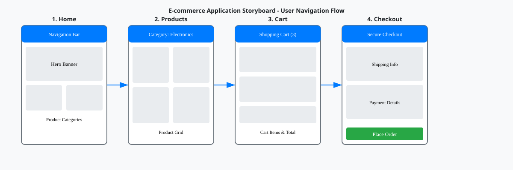
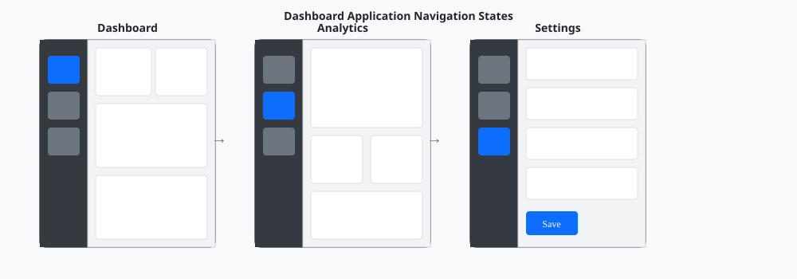
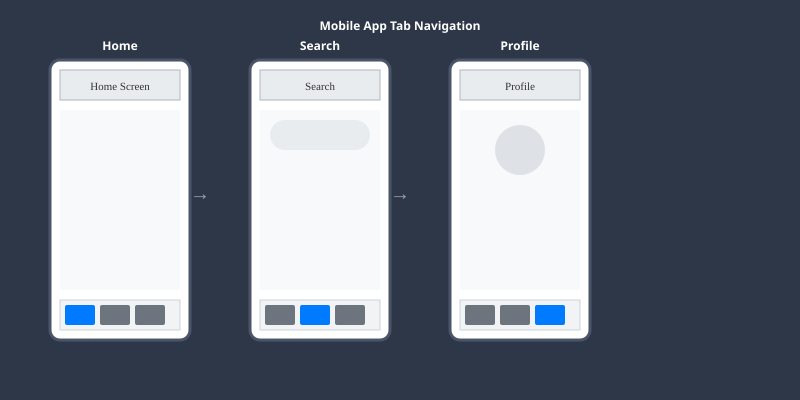

# HTML Storyboarding with Embedded Examples

A comprehensive method for visualizing an entire application's user interface and flow in a single HTML document with **Dashboard Wireframe (SVG) as the primary method** for individual screens. This approach combines SVG wireframes with HTML storyboarding to allow stakeholders to see all screens at once, understand user journeys, and review the complete application structure with embedded example images for immediate visual reference.

## Overview

**Dashboard Wireframe (SVG) is the primary method** for individual screen documentation, with HTML storyboarding providing comprehensive multi-screen visualization capabilities. HTML storyboarding combines multiple wireframe screens into a unified view, creating a visual narrative of the user experience with embedded storyboard example images. Unlike traditional wireframes that show individual screens, storyboards present the complete application flow, making it easier to identify gaps, inconsistencies, and opportunities for improvement.

## Table of Contents

- [Prerequisites](#prerequisites)
- [Embedded Storyboard Examples](#embedded-storyboard-examples)
- [🔒 Image Validation Requirements](#-image-validation-requirements)
- [Dashboard Wireframe (SVG) Integration](#dashboard-wireframe-svg-integration)
- [Key Concepts](#key-concepts)
- [Implementation](#implementation)
- [Storyboard Structure](#storyboard-structure)
- [Best Practices](#best-practices)
- [Advanced Techniques](#advanced-techniques)
- [Common Issues](#common-issues)
- [References](#references)

## Prerequisites

- Understanding of HTML/CSS wireframing principles and SVG basics
- Basic knowledge of user flow diagrams and Dashboard Wireframe (SVG) approach
- Familiarity with responsive design concepts and GitHub markdown rendering
- Text editor or IDE

## Embedded Storyboard Examples

**Enhanced multi-screen storyboarding capabilities** now include embedded example images for immediate visual reference. These examples demonstrate the Dashboard Wireframe (SVG) approach integrated with comprehensive storyboarding.

### 🔒 Critical Image Usage Requirements

**MANDATORY**: All example images must use embedded references (relative paths) instead of external URLs. The `/design:update-screenflows` command includes validation to enforce this requirement.

- **✅ CORRECT**: `` (embedded local file)
- **❌ INCORRECT**: `` (external hyperlink - FORBIDDEN)

### Example 1: E-commerce Application Storyboard



*Example storyboard showing e-commerce user journey from home to checkout*

### Example 2: Dashboard Application with Navigation States



*Example dashboard application showing consistent navigation structure across screens*

### Example 3: Mobile App Multi-Screen Flow



*Example mobile app showing tab navigation structure across different screens*

These embedded examples demonstrate:
- **Individual Screen Focus**: Each screen documented with dedicated wireframe layouts
- **Multi-Screen Storyboarding**: Complete user journeys visualized in storyboard format
- **GitHub-Compatible Output**: SVG format renders perfectly in GitHub markdown
- **Navigation Patterns**: Consistent navigation structure across application screens
- **User Journey Visualization**: Complete flows from entry to task completion

## 🔒 Image Validation Requirements

### Mandatory Embedded Image Usage

**CRITICAL REQUIREMENT**: All storyboard documentation and HTML files must use embedded images (relative paths) instead of hyperlinked images (external URLs). This requirement is enforced by the `/design:update-screenflows` command validation system.

### Image Reference Standards

#### ✅ CORRECT - Embedded Images (REQUIRED)
```html
<!-- In HTML storyboards -->


```

```markdown
<!-- In markdown documentation -->


```

#### ❌ INCORRECT - Hyperlinked Images (FORBIDDEN)
```html
<!-- These will cause validation failure -->


```

```markdown
<!-- These will cause command exit with error -->


```

### Validation Process

The enhanced workflow includes automatic validation:

1. **Command Execution**: `/design:update-screenflows` runs validation after generating files
2. **File Scanning**: Validates README.md, report.md, and designs/README.md for hyperlinked images
3. **Error Detection**: Identifies external URLs with specific line numbers
4. **Exit on Failure**: Command stops execution if any hyperlinked images are found
5. **Clear Guidance**: Provides conversion examples and best practices

### Image Organization Structure

```
designs/screenflows/{project-name}/
├── wireframes/                  # Dashboard Wireframe (SVG) - PRIMARY LOCATION
│   ├── dashboard-wireframe.svg      # Main dashboard wireframe
│   ├── screen-01-home.svg           # Individual screen wireframes
│   ├── screen-02-profile.svg        # Individual screen wireframes
│   └── storyboard-complete.svg      # Multi-screen storyboard
├── images/                      # Additional supporting images
│   └── storyboards/
│       ├── ecommerce-storyboard.svg
│       ├── dashboard-storyboard.svg
│       └── mobile-storyboard.svg
├── storyboard.html             # HTML storyboard (references ./wireframes/)
└── README.md                   # Project docs (references ./wireframes/)
```

### Benefits of Embedded Images

- **GitHub Compatibility**: Images render instantly in GitHub without external dependencies
- **Version Control**: All images tracked alongside code changes
- **Offline Access**: Documentation works without internet connectivity
- **Performance**: Faster loading times with local image assets
- **Security**: No external image loading reduces security risks
- **Reliability**: Documentation remains functional even if external sites go down

## Dashboard Wireframe (SVG) Integration

The enhanced storyboarding approach integrates **Dashboard Wireframe (SVG) as the primary method** with comprehensive HTML storyboarding:

### SVG-First Storyboard Structure

```html
<!-- Storyboard with embedded SVG wireframes -->
<div class="storyboard-section">
    <h2>User Journey: Product Purchase</h2>
    
    <!-- Individual SVG wireframes embedded in storyboard -->
    <div class="screen-sequence">
        <div class="screen-item">
            <h3>1. Product Discovery</h3>
            
            <p>User lands on homepage and browses product categories</p>
        </div>
        
        <div class="screen-item">
            <h3>2. Product Selection</h3>
            
            <p>User views product list and selects items</p>
        </div>
        
        <div class="screen-item">
            <h3>3. Checkout Process</h3>
            
            <p>User proceeds through payment and confirmation</p>
        </div>
    </div>
    
    <!-- Multi-screen storyboard overview -->
    <div class="complete-flow">
        <h3>Complete Journey Overview</h3>
        
    </div>
</div>
```

### Enhanced Documentation Structure

```
designs/screenflows/{project-name}/
├── wireframes/                  # Dashboard Wireframe (SVG) - PRIMARY OUTPUT
│   ├── dashboard-wireframe.svg      # Main dashboard layout
│   ├── screen-01-home.svg           # Individual screens
│   ├── screen-02-products.svg       # Individual screens
│   ├── screen-03-checkout.svg       # Individual screens
│   └── storyboard-complete.svg      # Multi-screen storyboard
├── storyboard.html             # HTML storyboard with embedded SVG wireframes
├── README.md                   # Documentation with SVG wireframe links
└── report.md                   # Comprehensive report with embedded examples
```

## Key Concepts

### Screen Collection
- Gather all unique screens from the application
- Include different states (empty, loading, error, success)
- Capture modal dialogs and overlays
- Document mobile responsive variations

### User Journey Mapping
- Identify primary user flows through the application
- Map out decision points and alternate paths
- Highlight critical interactions and touchpoints
- Document entry and exit points

### Visual Hierarchy
- Establish consistent screen sizing and spacing
- Use visual cues to indicate flow direction
- Apply consistent styling across all screens
- Create clear groupings for related screens

## Implementation

### Basic HTML Structure
```html
<!DOCTYPE html>
<html lang="en">
<head>
    <meta charset="UTF-8">
    <meta name="viewport" content="width=device-width, initial-scale=1.0">
    <title>Application Storyboard</title>
    <link rel="stylesheet" href="storyboard-styles.css">
</head>
<body>
    <header>
        <h1>Application Name - Complete UI Storyboard</h1>
        <nav>
            <ul>
                <li><a href="#overview">Overview</a></li>
                <li><a href="#user-flows">User Flows</a></li>
                <li><a href="#screens">All Screens</a></li>
            </ul>
        </nav>
    </header>
    
    <main>
        <section id="overview">
            <!-- Application overview and key metrics -->
        </section>
        
        <section id="user-flows">
            <!-- Primary user journeys with embedded SVG wireframes -->
        </section>
        
        <section id="screens">
            <!-- Complete screen inventory -->
        </section>
    </main>
</body>
</html>
```

### CSS Styling for Storyboards
```css
/* Storyboard Layout */
.storyboard-container {
    display: grid;
    grid-template-columns: repeat(auto-fit, minmax(300px, 1fr));
    gap: 2rem;
    padding: 2rem;
    background-color: #f5f5f5;
}

/* Screen Cards */
.screen-card {
    background: white;
    border-radius: 8px;
    box-shadow: 0 2px 8px rgba(0,0,0,0.1);
    overflow: hidden;
    transition: transform 0.2s;
}

.screen-card:hover {
    transform: translateY(-4px);
    box-shadow: 0 4px 16px rgba(0,0,0,0.15);
}

/* Flow Connections */
.flow-arrow {
    position: relative;
    margin: 1rem 0;
    text-align: center;
}

.flow-arrow::after {
    content: '↓';
    font-size: 2rem;
    color: #007bff;
}

/* Dashboard Wireframe (SVG) Integration */
.svg-wireframe {
    width: 100%;
    height: auto;
    border: 1px solid #e0e0e0;
    border-radius: 4px;
}
```

## Storyboard Structure

### 1. Overview Section
- Application name and version
- Total number of screens
- Primary user personas
- Key features highlighted

### 2. User Flow Section
- Main navigation paths
- Critical user journeys
- Decision trees
- Error recovery flows

### 3. Screen Inventory
- All screens organized by category
- Screen states and variations
- Annotations and interactions
- Technical notes

## 🚀 HTML-to-Image Conversion Patterns

The enhanced `/design:update-screenflows` command now supports HTML-to-image conversion using npm packages (html-to-image, svg2png) to transform HTML storyboards into embedded images for GitHub compatibility.

### Conversion Workflow Integration

#### Enabling HTML-to-Image Conversion
```bash
# Enable conversion with --convert-html flag
/design:update-screenflows dashboard-flow "Dashboard wireframes" svg --convert-html

# Project analysis with conversion
/design:update-screenflows mobile-app ./src svg --convert-html
```

#### Generated Output Structure
```
designs/screenflows/{project-name}/
├── README.md                           # Project overview with embedded images
├── storyboard.html                     # Source HTML storyboard
├── wireframes/                         # Primary output directory
│   ├── dashboard-wireframe.svg             # Original SVG wireframes
│   ├── storyboard-from-html.png            # 🚀 Converted PNG image
│   ├── storyboard-from-html.svg            # 🚀 Converted SVG image
│   └── screen-01-home.svg                  # Individual screen wireframes
└── convert-html-to-images.js           # Temporary conversion script
```

### Conversion-Optimized HTML Patterns

#### Responsive Storyboard Template
```html
<!DOCTYPE html>
<html lang="en">
<head>
    <meta charset="UTF-8">
    <meta name="viewport" content="width=device-width, initial-scale=1.0">
    <title>Dashboard Flow Storyboard</title>
    <style>
        /* Conversion-optimized CSS */
        body {
            font-family: -apple-system, BlinkMacSystemFont, 'Segoe UI', Roboto, sans-serif;
            margin: 0;
            padding: 20px;
            background: #f8f9fa;
            max-width: 1200px;
        }
        
        .storyboard-header {
            text-align: center;
            margin-bottom: 30px;
            padding: 20px;
            background: white;
            border-radius: 8px;
            box-shadow: 0 2px 4px rgba(0,0,0,0.1);
        }
        
        .storyboard-container {
            display: grid;
            grid-template-columns: repeat(auto-fit, minmax(250px, 1fr));
            gap: 20px;
            margin-bottom: 30px;
        }
        
        .screen-frame {
            background: white;
            border: 2px solid #dee2e6;
            border-radius: 8px;
            padding: 15px;
            box-shadow: 0 2px 4px rgba(0,0,0,0.1);
            transition: none; /* Avoid animations for conversion */
        }
        
        .screen-title {
            font-weight: bold;
            font-size: 14px;
            margin-bottom: 10px;
            color: #495057;
            text-align: center;
        }
        
        .screen-content {
            height: 150px;
            background: #e9ecef;
            border-radius: 4px;
            display: flex;
            align-items: center;
            justify-content: center;
            color: #6c757d;
            font-size: 12px;
        }
        
        .flow-connector {
            text-align: center;
            color: #007bff;
            font-size: 18px;
            margin: 15px 0;
        }
        
        /* Print-friendly styles for conversion */
        @media print {
            body { background: white; }
            .screen-frame { page-break-inside: avoid; }
        }
    </style>
</head>
<body>
    <div class="storyboard-header">
        <h1>Dashboard Flow - Complete Storyboard</h1>
        <p>Generated by update-screenflows command with HTML-to-image conversion</p>
    </div>
    
    <div class="storyboard-container">
        <div class="screen-frame">
            <div class="screen-title">1. Home Dashboard</div>
            <div class="screen-content">
                <span>Main dashboard with widgets<br>Navigation menu<br>User profile access</span>
            </div>
        </div>
        
        <div class="screen-frame">
            <div class="screen-title">2. Data Visualization</div>
            <div class="screen-content">
                <span>Charts and graphs<br>Filter controls<br>Export options</span>
            </div>
        </div>
        
        <div class="screen-frame">
            <div class="screen-title">3. Settings Panel</div>
            <div class="screen-content">
                <span>User preferences<br>Theme selection<br>Notification settings</span>
            </div>
        </div>
        
        <div class="screen-frame">
            <div class="screen-title">4. Profile Management</div>
            <div class="screen-content">
                <span>User information<br>Security settings<br>Account management</span>
            </div>
        </div>
    </div>
    
    <div class="flow-connector">
        ↓ Complete User Journey Flow ↓
    </div>
    
    <div style="text-align: center; color: #6c757d; margin-top: 20px;">
        <p>Storyboard optimized for HTML-to-image conversion</p>
        <p>Uses embedded images and relative paths for GitHub compatibility</p>
    </div>
</body>
</html>
```

### npm Package Integration Patterns

#### Automatic Conversion Script Generation
The command automatically creates a Node.js conversion script:

```javascript
// Generated conversion script (convert-html-to-images.js)
const fs = require('fs');
const path = require('path');
const { htmlToImage } = require('html-to-image');
const { JSDOM } = require('jsdom');

async function convertHtmlToImages(designFolder, screenFlowName) {
    console.log('🔄 Converting HTML storyboards to embedded images...');
    
    // Read HTML storyboard
    const htmlStoryboardPath = path.join(designFolder, 'storyboard.html');
    const htmlContent = fs.readFileSync(htmlStoryboardPath, 'utf8');
    
    // Create DOM instance for server-side rendering
    const dom = new JSDOM(htmlContent, {
        pretendToBeVisual: true,
        resources: 'usable'
    });
    
    // Convert to PNG (high quality for detailed documentation)
    const pngDataUrl = await htmlToImage.toPng(dom.window.document.body, {
        quality: 1.0,
        width: 1200,
        height: 800,
        backgroundColor: '#ffffff'
    });
    
    // Save as embedded image
    const pngBuffer = Buffer.from(pngDataUrl.split(',')[1], 'base64');
    const pngPath = path.join(designFolder, 'wireframes', 'storyboard-from-html.png');
    fs.writeFileSync(pngPath, pngBuffer);
    
    // Convert to SVG (scalable for GitHub rendering)
    const svgDataUrl = await htmlToImage.toSvg(dom.window.document.body);
    const svgContent = decodeURIComponent(svgDataUrl.split(',')[1]);
    const svgPath = path.join(designFolder, 'wireframes', 'storyboard-from-html.svg');
    fs.writeFileSync(svgPath, svgContent);
    
    console.log('✅ Conversion completed:', pngPath, svgPath);
}
```

### Integration with Embedded Images

#### Markdown Documentation Integration
After conversion, images are automatically referenced with embedded paths:

```markdown
# Dashboard Flow Storyboard

## Complete User Journey


*HTML storyboard converted to embedded PNG using html-to-image package*

## Scalable Vector Version


*Scalable SVG version for GitHub rendering and print documentation*

## Individual Screen Wireframes


```

### Conversion Best Practices

#### HTML Optimization for Conversion
1. **Use System Fonts**: Ensure consistent rendering across platforms
2. **Avoid Complex Animations**: Keep CSS transitions simple or disabled
3. **Optimize Image Sizes**: Use appropriate dimensions for GitHub rendering
4. **Inline Critical CSS**: Reduce external dependencies for conversion
5. **Test Responsive Breakpoints**: Ensure storyboards work at different sizes

#### Image Format Selection
- **PNG**: Best for detailed screenshots and complex layouts
- **SVG**: Ideal for scalable wireframes and GitHub rendering
- **JPEG**: Use for photographic content (rarely needed for wireframes)

#### Error Handling and Validation
The conversion process includes automatic validation:
- Checks Node.js and npm package availability
- Validates HTML structure before conversion
- Ensures output images use embedded paths
- Provides clear error messages for troubleshooting

### Performance Considerations

#### Memory Optimization
```javascript
// Optimized conversion settings
const conversionOptions = {
    quality: 0.9,           // Balance quality vs file size
    width: 1000,            // Optimal for GitHub
    height: 600,
    pixelRatio: 1,          // Reduce memory usage
    backgroundColor: '#ffffff'
};
```

#### Batch Processing
For multiple storyboards, the system processes them efficiently:
- Converts one HTML file at a time to manage memory
- Cleans up temporary files automatically
- Provides progress feedback during conversion

## Best Practices

### Organization
1. **Group Related Screens**: Keep similar screens together
2. **Clear Labeling**: Use descriptive names for each screen
3. **Consistent Sizing**: Maintain uniform screen dimensions
4. **Visual Flow**: Use arrows and connectors to show navigation

### Annotations
1. **Interaction Points**: Mark clickable elements
2. **Dynamic Content**: Indicate data-driven areas
3. **State Changes**: Show how screens transform
4. **Edge Cases**: Document error and empty states

### Documentation
1. **Screen Purpose**: Explain what each screen does
2. **User Actions**: List available interactions
3. **Data Requirements**: Note what data is needed
4. **Technical Notes**: Include implementation considerations

## Advanced Techniques

### Interactive Storyboards
```javascript
// Add interactivity to storyboard screens
document.querySelectorAll('.screen-card').forEach(card => {
    card.addEventListener('click', function() {
        // Expand screen for detailed view
        this.classList.toggle('expanded');
        
        // Show additional annotations
        const annotations = this.querySelector('.annotations');
        if (annotations) {
            annotations.classList.toggle('visible');
        }
    });
});

// Create flow connections
function connectScreens(fromId, toId) {
    const from = document.getElementById(fromId);
    const to = document.getElementById(toId);
    
    // Draw SVG connection line
    drawConnection(from, to);
}
```

### Responsive Storyboards
```css
/* Mobile-first responsive design */
@media (max-width: 768px) {
    .storyboard-container {
        grid-template-columns: 1fr;
        padding: 1rem;
    }
    
    .screen-card {
        max-width: 100%;
    }
}

@media (min-width: 1200px) {
    .storyboard-container {
        grid-template-columns: repeat(4, 1fr);
    }
}
```

### Version Control Integration
```html
<!-- Track storyboard versions -->
<div class="version-info">
    <span class="version">v2.1.0</span>
    <span class="date">Updated: 2024-01-15</span>
    <span class="author">Design Team</span>
</div>
```

## Common Issues

### Performance
- **Large File Sizes**: Optimize SVG wireframes and images
- **Loading Times**: Implement lazy loading for screens
- **Browser Compatibility**: Test across different browsers

### Maintenance
- **Keeping Updated**: Establish update procedures
- **Version Control**: Track changes systematically
- **Team Collaboration**: Define ownership and responsibilities

### Accessibility
- **Alt Text**: Provide descriptions for all screens
- **Keyboard Navigation**: Ensure storyboard is navigable
- **Screen Readers**: Test with accessibility tools

## References

- [HTML Living Standard](https://html.spec.whatwg.org/)
- [CSS Grid Layout](https://developer.mozilla.org/en-US/docs/Web/CSS/CSS_Grid_Layout)
- [SVG in HTML](https://developer.mozilla.org/en-US/docs/Web/SVG/Tutorial/SVG_In_HTML_Introduction)
- [Web Accessibility Guidelines](https://www.w3.org/WAI/WCAG21/quickref/)
- [Dashboard Wireframe (SVG) Patterns](./screenflows-wireframes.md)