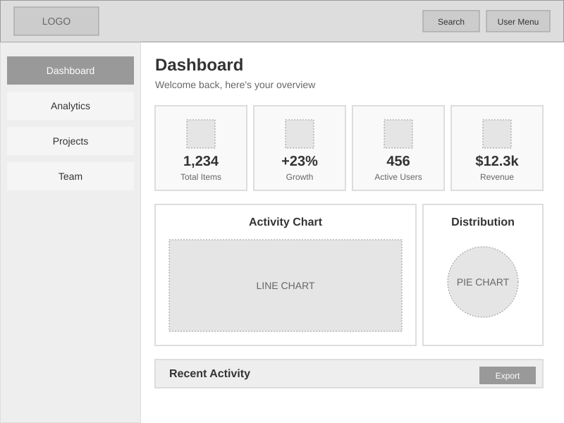

# HTML Wireframes with SVG Integration

Best practices for generating HTML wireframes and Dashboard Wireframe (SVG) files. **Dashboard Wireframe (SVG) is now the primary method** for individual screen documentation, with HTML wireframes providing comprehensive storyboarding capabilities. These should be simple screen layouts blocking out major features and minimal text and design. The purpose is to create and iterate quickly but maintain enough fidelity to easily intuit the screens.

## Overview

**Dashboard Wireframe (SVG) is the primary method** for individual screen documentation, offering GitHub-compatible wireframes that render natively in markdown. HTML wireframes complement this by providing comprehensive multi-screen storyboarding capabilities. Both approaches focus on layout, structure, and functionality rather than visual design, enabling rapid iteration and clear communication of interface concepts without the distraction of colors, typography, or imagery.

## Table of Contents

- [Prerequisites](#prerequisites)
- [🔒 Image Validation Requirements](#-image-validation-requirements)
- [Dashboard Wireframe (SVG) - Primary Method](#dashboard-wireframe-svg---primary-method)
- [Key Concepts](#key-concepts)
- [Implementation](#implementation)
- [Best Practices](#best-practices)
- [Common Issues](#common-issues)
- [References](#references)

## Prerequisites

- Basic understanding of HTML, CSS, and SVG
- Text editor or IDE for code editing
- Web browser for preview and testing
- GitHub account for native SVG wireframe rendering
- Optional: CSS framework knowledge (Tailwind CSS or similar utility-first frameworks)

## 🔒 Image Validation Requirements

### Critical Embedded Image Standards

**MANDATORY**: All wireframe documentation must use embedded SVG files and images with relative paths. The `/design:update-screenflows` command enforces this requirement through comprehensive validation.

#### ✅ CORRECT - Embedded References (REQUIRED)
```markdown
<!-- SVG wireframes embedded with relative paths -->


```

```html
<!-- HTML wireframe references -->


```

#### ❌ INCORRECT - External Links (FORBIDDEN)
```markdown
<!-- These will cause validation failure and command exit -->


```

### Validation Enforcement

The enhanced workflow includes automatic image validation:

1. **Validation Trigger**: Runs automatically after generating markdown files
2. **File Coverage**: Scans README.md, report.md, and designs/README.md
3. **Pattern Detection**: Identifies external URLs (http://, https://) in image references
4. **Error Reporting**: Provides specific file names and line numbers for violations
5. **Command Termination**: Exits with error code 1 if any hyperlinked images found
6. **Conversion Guidance**: Clear examples for fixing hyperlinked to embedded references

### Benefits of Embedded Images

- **Instant GitHub Rendering**: SVG wireframes display immediately in GitHub markdown
- **Version Control Integration**: All image changes tracked with code changes
- **Offline Documentation**: Works without internet connectivity
- **Team Accessibility**: No external dependencies for viewing wireframes
- **Performance Optimization**: Local images load faster than external resources
- **Security Enhancement**: Eliminates external image loading risks
- **Validation Compliance**: Meets v2.2.0 requirements from update-screenflows command validation system

## Dashboard Wireframe (SVG) - Primary Method

**Dashboard Wireframe (SVG) is the primary method** for individual screen documentation. These GitHub-compatible wireframes render natively in markdown and provide detailed visual layouts for each application screen.

### Embedded Wireframe Examples

**Enhanced wireframe documentation capabilities** now include embedded example images for immediate visual reference. These examples demonstrate the Dashboard Wireframe (SVG) approach with successful embedded image implementation.

#### Example 1: Inline SVG Wireframe



*Example SVG wireframe showing dashboard layout with embedded rendering*

#### Example 2: Dashboard HTML Wireframe


*HTML wireframe demonstrating interactive dashboard layout*

#### Example 3: Modal Dialog State


*Wireframe showing modal dialog overlay implementation*

These embedded examples demonstrate:
- **GitHub Native Rendering**: SVG files display directly in GitHub markdown
- **Local File References**: All images use relative paths for reliable access
- **No External Dependencies**: Images render without internet connectivity
- **Interactive Examples**: HTML wireframes provide additional interactivity
- **Validation Compliance**: All examples follow embedded image requirements

### Key Advantages of SVG Wireframes

1. **GitHub Native Rendering**: SVG files display directly in GitHub markdown without external tools
2. **Individual Screen Focus**: Each screen gets its own dedicated wireframe file
3. **Scalable and Responsive**: Vector format works at any resolution
4. **Team Collaboration**: Direct viewing in pull requests and documentation
5. **Version Control Friendly**: Text-based format with clear diffs

### Basic SVG Wireframe Template

```svg
<svg width="800" height="600" xmlns="http://www.w3.org/2000/svg">
  <!-- Dashboard Wireframe SVG Template -->
  <defs>
    <style>
      .wireframe-bg { fill: #f8f9fa; stroke: #dee2e6; stroke-width: 1; }
      .wireframe-header { fill: #e9ecef; stroke: #adb5bd; stroke-width: 1; }
      .wireframe-nav { fill: #f1f3f4; stroke: #adb5bd; stroke-width: 1; }
      .wireframe-content { fill: #ffffff; stroke: #ced4da; stroke-width: 1; }
      .wireframe-text { font-family: system-ui, sans-serif; font-size: 12px; fill: #495057; }
      .wireframe-title { font-family: system-ui, sans-serif; font-size: 14px; font-weight: bold; fill: #212529; }
    </style>
  </defs>
  
  <!-- Background -->
  <rect class="wireframe-bg" x="0" y="0" width="800" height="600"/>
  
  <!-- Header -->
  <rect class="wireframe-header" x="0" y="0" width="800" height="60"/>
  <text class="wireframe-title" x="20" y="35">Screen Title</text>
  
  <!-- Navigation Sidebar -->
  <rect class="wireframe-nav" x="0" y="60" width="200" height="540"/>
  <text class="wireframe-title" x="20" y="85">Navigation</text>
  
  <!-- Main Content Area -->
  <rect class="wireframe-content" x="220" y="80" width="560" height="500"/>
  <text class="wireframe-title" x="240" y="105">Main Content</text>
  
  <!-- Content Elements -->
  <rect class="wireframe-content" x="240" y="120" width="250" height="100"/>
  <text class="wireframe-text" x="250" y="140">Feature Block</text>
</svg>
```

### SVG Wireframe Organization

```
designs/screenflows/{project-name}/
├── wireframes/                  # PRIMARY OUTPUT DIRECTORY
│   ├── dashboard-wireframe.svg      # Main dashboard layout
│   ├── screen-01-home.svg           # Individual screen wireframes
│   ├── screen-02-profile.svg        # Individual screen wireframes
│   ├── screen-03-settings.svg       # Individual screen wireframes
│   └── storyboard-complete.svg      # Multi-screen storyboard
├── README.md                    # Project documentation with SVG links
└── report.md                    # Comprehensive report with embedded SVGs
```

### Multi-Screen Storyboard SVG

For complete user journeys, create storyboard SVG files that show multiple screens:

```svg
<svg width="1200" height="800" xmlns="http://www.w3.org/2000/svg">
  <!-- Multi-Screen Storyboard -->
  <defs>
    <style>
      .storyboard-bg { fill: #343a40; }
      .screen-frame { fill: #ffffff; stroke: #6c757d; stroke-width: 2; }
      .screen-label { font-family: system-ui, sans-serif; font-size: 12px; fill: #ffffff; font-weight: bold; }
      .flow-arrow { stroke: #ffc107; stroke-width: 3; fill: none; }
    </style>
  </defs>
  
  <!-- Background -->
  <rect class="storyboard-bg" x="0" y="0" width="1200" height="800"/>
  
  <!-- Screen 1 -->
  <rect class="screen-frame" x="50" y="100" width="200" height="300"/>
  <text class="screen-label" x="150" y="85" text-anchor="middle">1. Landing</text>
  
  <!-- Screen 2 -->
  <rect class="screen-frame" x="300" y="100" width="200" height="300"/>
  <text class="screen-label" x="400" y="85" text-anchor="middle">2. Dashboard</text>
  
  <!-- Flow Arrow -->
  <line class="flow-arrow" x1="250" y1="250" x2="300" y2="250"/>
</svg>
```

## Key Concepts

### Low-Fidelity Design Principles
- **Grayscale Only**: Use shades of gray (#fff, #eee, #ddd, #ccc, #999, #666, #333, #000) to indicate hierarchy
- **No Images**: Replace images with gray boxes labeled with content type
- **Minimal Typography**: Use system fonts and limit to 2-3 font sizes maximum
- **Basic Shapes**: Rectangles and simple geometric shapes to represent UI elements

### Screen State Management
- Create separate HTML files or sections for each major UI state
- Document state transitions with simple navigation links
- Include screens for:
  - Default page states
  - Modal/dialog open states
  - Drawer/sidebar expanded states
  - Form validation states
  - Loading/empty states

## Implementation

### Basic HTML Structure Template

```html
<!DOCTYPE html>
<html lang="en">
<head>
    <meta charset="UTF-8">
    <meta name="viewport" content="width=device-width, initial-scale=1.0">
    <title>Wireframe: [Screen Name]</title>
    <style>
        /* Reset and base styles */
        * {
            margin: 0;
            padding: 0;
            box-sizing: border-box;
        }
        
        body {
            font-family: system-ui, -apple-system, sans-serif;
            line-height: 1.5;
            color: #333;
        }
        
        /* Wireframe utilities */
        .container {
            max-width: 1200px;
            margin: 0 auto;
            padding: 20px;
        }
        
        .block {
            background: #eee;
            border: 1px solid #ccc;
            padding: 20px;
            margin-bottom: 20px;
        }
        
        .placeholder {
            background: #ddd;
            display: flex;
            align-items: center;
            justify-content: center;
            color: #666;
            min-height: 100px;
        }
    </style>
</head>
<body>
    <!-- Wireframe content here -->
</body>
</html>
```

### CSS Patterns for Rapid Wireframing

```css
/* Layout utilities */
.flex { display: flex; }
.grid { display: grid; }
.flex-1 { flex: 1; }
.gap-4 { gap: 16px; }
.mb-4 { margin-bottom: 16px; }

/* Component blocks */
.header {
    height: 60px;
    background: #ddd;
    border-bottom: 1px solid #999;
}

.sidebar {
    width: 250px;
    background: #eee;
    min-height: calc(100vh - 60px);
}

.card {
    background: #fff;
    border: 1px solid #ddd;
    padding: 16px;
    border-radius: 4px;
}

.button {
    background: #ccc;
    border: 1px solid #999;
    padding: 8px 16px;
    cursor: pointer;
    text-decoration: none;
    color: #333;
    display: inline-block;
}

/* State indicators */
.active { background: #999; }
.disabled { opacity: 0.5; cursor: not-allowed; }
```

### Component Examples

```html
<!-- Navigation -->
<nav class="header">
    <div class="container flex">
        <div class="placeholder" style="width: 150px; height: 40px;">Logo</div>
        <div class="flex-1"></div>
        <div class="flex gap-4">
            <a href="#" class="button">Nav Item 1</a>
            <a href="#" class="button">Nav Item 2</a>
            <a href="#" class="button">User Menu</a>
        </div>
    </div>
</nav>

<!-- Content Card -->
<div class="card">
    <div class="placeholder mb-4" style="height: 200px;">Image/Chart</div>
    <h3>Card Title</h3>
    <p>Brief description text placeholder</p>
    <a href="#" class="button">Action</a>
</div>

<!-- Form Elements -->
<form class="block">
    <div class="mb-4">
        <label>Field Label</label>
        <input type="text" class="block" style="width: 100%; padding: 8px;">
    </div>
    <button class="button">Submit</button>
</form>
```

### Multi-Screen Navigation

```html
<!-- Screen navigation links -->
<div class="screen-nav" style="position: fixed; top: 10px; right: 10px; background: #fff; padding: 10px; border: 2px solid #999;">
    <h4>Screens:</h4>
    <ul>
        <li><a href="index.html">Dashboard</a></li>
        <li><a href="dashboard-drawer-open.html">Dashboard (Drawer Open)</a></li>
        <li><a href="settings.html">Settings</a></li>
        <li><a href="modal-confirm.html">Confirm Modal</a></li>
    </ul>
</div>
```

## Best Practices

### 1. **Speed Over Perfection**
- Use copy-paste liberally for repeated elements
- Don't spend time aligning pixels perfectly
- Focus on communicating the concept, not crafting the design

### 2. **Consistent Visual Language**
- Use the same gray shades throughout all screens
- Maintain consistent spacing units (8px, 16px, 24px, 32px)
- Keep element heights uniform (buttons: 40px, inputs: 40px, etc.)

### 3. **Clear Labeling**
- Label every placeholder block with its content type
- Use descriptive text for buttons and links
- Include state indicators in screen filenames

### 4. **Progressive Enhancement**
- Start with mobile layouts, then expand to desktop
- Add interactive states only after base layouts are approved
- Layer in complexity gradually based on feedback

### 5. **Version Control**
- Commit early and often
- Use descriptive commit messages for each screen addition
- Branch for major layout experiments

### 6. **Efficient HTML/CSS Patterns**

```css
/* Quick layout classes */
.w-full { width: 100%; }
.h-screen { height: 100vh; }
.mx-auto { margin-left: auto; margin-right: auto; }

/* Responsive utilities */
@media (max-width: 768px) {
    .mobile-hide { display: none; }
    .mobile-stack { flex-direction: column; }
}
```

### 7. **Documentation Within Wireframes**
- Add HTML comments for complex interactions
- Include data attributes for dynamic behavior hints
- Note any technical constraints directly in the wireframe

```html
<!-- This drawer slides in from left on mobile, overlay on desktop -->
<aside class="sidebar" data-behavior="slide-drawer">
    <!-- Navigation items -->
</aside>
```

## Common Issues

### Problem: Wireframes Look Too Polished
**Solution**: Remove all colors, shadows, and rounded corners. Stick to rectangles and straight lines.

### Problem: Spending Too Much Time on Layout
**Solution**: Use CSS Grid or Flexbox with simple fractional units. Don't fine-tune spacing.

### Problem: Unclear State Transitions
**Solution**: Create a separate HTML file for each state. Link them with standard anchor tags.

### Problem: Inconsistent Component Appearance
**Solution**: Create a components.html reference page with all UI elements. Copy from this master list.

### Problem: Difficulty Visualizing Responsive Behavior
**Solution**: Use browser developer tools to preview at different breakpoints. Add minimal media queries only where critical.

## Live Examples

### Interactive Examples

View these example wireframes with embedded image references following the successful patterns from screenflows-storyboarding.md:

#### Dashboard Layout Example


*Interactive dashboard wireframe showing navigation, content areas, and component hierarchy*

#### Navigation States


*Wireframe demonstrating expanded navigation drawer state*

#### Modal Dialog Example


*Wireframe showing modal dialog overlay with backdrop*

#### Complete Storyboard Integration


*Multi-screen storyboard showing complete user journey*

**✅ All examples use embedded image references (relative paths) for GitHub compatibility and validation compliance.**

### Visual Preview

#### Dashboard Wireframe (SVG)


*SVG wireframe rendering directly in GitHub markdown with embedded reference*

#### ASCII Art Representation
```
┌─────────────────────────────────────────────────────────┐
│ [Logo]                    [Search] [Notif] [User]       │
├─────────────┬───────────────────────────────────────────┤
│ Dashboard   │  Dashboard                                 │
│ Analytics   │  Welcome back, here's your overview        │
│ Projects    │  ┌──────┐ ┌──────┐ ┌──────┐ ┌──────┐    │
│ Team        │  │Chart │ │Graph │ │Users │ │Revenue│    │
│ Reports     │  │1,234 │ │ +23% │ │ 456  │ │$12.3k │    │
│             │  └──────┘ └──────┘ └──────┘ └──────┘    │
│ Settings    │  ┌─────────────────┐ ┌─────────────┐     │
│ Help        │  │   Line Chart    │ │  Pie Chart  │     │
│ Logout      │  │                 │ │             │     │
│             │  └─────────────────┘ └─────────────┘     │
│             │  Recent Activity            [Filter] [Export]│
│             │  ┌─────────────────────────────────────┐ │
│             │  │ [Icon] Item Title    2 hrs ago [Action]│ │
│             │  │ [Icon] Another Item  5 hrs ago [Action]│ │
│             │  └─────────────────────────────────────┘ │
└─────────────┴───────────────────────────────────────────┘
```

### Embedding Techniques

#### Method 1: SVG Files (GitHub-Friendly)
Create SVG wireframes that render directly in GitHub markdown:
```markdown

```

#### Method 2: Inline SVG in Markdown (Limited Support)
Some markdown processors support inline SVG:
```html
<svg width="200" height="100">
  <rect x="10" y="10" width="180" height="80" fill="#ddd" stroke="#999"/>
  <text x="100" y="55" text-anchor="middle">Button</text>
</svg>
```

#### Method 3: Base64 Encoded Images
Convert HTML screenshots to base64 for embedding:
```markdown

```

These examples demonstrate:
- Grayscale-only design approach
- Clear state indicators
- Screen-to-screen navigation
- Responsive considerations
- Component reusability

## Related Documentation

- [HTML Storyboarding](html-storyboarding.md) - Comprehensive method for visualizing entire applications in a single view
- [Complete Storyboard Example](examples/storyboard-complete.html) - 12-screen e-commerce application storyboard

## References

- [Smashing Magazine: Guide to Wireframing and Prototyping](https://www.smashingmagazine.com/2018/03/guide-wireframing-prototyping/)
- [Figma: What is Wireframing?](https://www.figma.com/resource-library/what-is-wireframing/)
- [HTML Wireframe Best Practices](https://htmlburger.com/blog/website-wireframe/)
- Related commands: `/execute-design-dev` for generating HTML from Figma designs
- CSS frameworks suitable for wireframing: Tailwind CSS, Tachyons, BassCSS