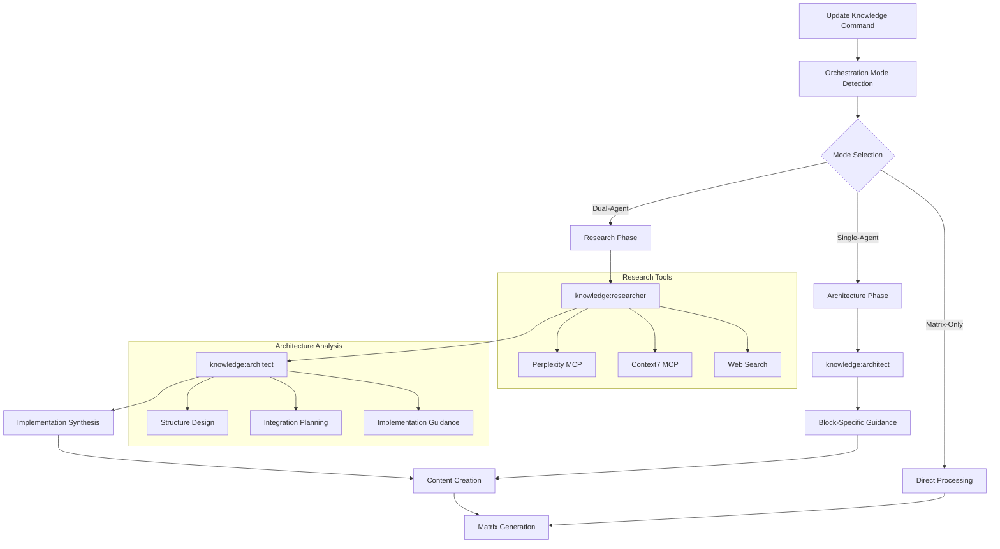

# Agent Coordination Patterns for Knowledge Management

This document outlines the comprehensive patterns and best practices for coordinating multiple agents in knowledge management workflows, focusing on optimal integration between research, architecture, and content creation processes.

## Overview

The knowledge management system employs sophisticated agent coordination patterns that leverage the unique strengths of specialized agents while maintaining coherent workflows and high-quality outcomes.

## Agent Architecture



## Core Agent Profiles

### knowledge:researcher Agent
**Specialization**: Comprehensive multi-angle research and information gathering

**Core Capabilities:**
- Multi-perspective research framework (technical, stakeholder, temporal)
- Creative investigation vectors (contrarian, analogical, emergent)
- Parallel research thread orchestration
- Cross-domain analysis and synthesis
- Progressive disclosure and chained investigation

**Tool Integration:**
- Perplexity MCP for theoretical foundations
- Context7 MCP for framework-specific documentation
- Web Search for current trends and implementations
- Citation chaining for related knowledge discovery

**Output Patterns:**
- Comprehensive research reports with multi-angle analysis
- Structured findings with source validation
- Implementation recommendations based on research
- Knowledge organization suggestions

### knowledge:architect Agent
**Specialization**: Knowledge structure design and organizational optimization

**Core Capabilities:**
- Hierarchical knowledge structure design
- Content organization and relationship mapping
- README maintenance and consistency
- Scalability management and growth planning
- Cross-referencing strategy implementation

**Operational Constraints:**
- Confined to topic directory structure only
- Security boundary enforcement for file access
- Focus on architectural decisions within knowledge domain

**Output Patterns:**
- Structural recommendations with rationale
- Organization patterns and naming conventions
- Integration strategies for new content
- Quality assurance guidelines

### knowledge:create-diagrams Agent
**Specialization**: Visual knowledge representation through Mermaid diagrams

**Core Capabilities:**
- Requirements analysis for diagram types
- Mermaid syntax generation and validation
- Pattern recognition for common scenarios
- Documentation integration optimization

**Integration Points:**
- Works with architect agent for structural visualization
- Supports researcher findings with process diagrams
- Enhances knowledge blocks with visual explanations

## Coordination Patterns

### Pattern 1: Dual-Agent Research-Architecture Flow

**Use Case**: New topic creation or comprehensive content development

**Coordination Sequence:**
```bash
1. Mode Detection → Dual-agent orchestration required
2. Research Phase → knowledge:researcher invocation
3. Architecture Phase → knowledge:architect invocation with research context
4. Implementation Synthesis → Combine findings for optimal content creation
```

**Detailed Flow:**
```markdown
Phase 1: Comprehensive Research Investigation
├── Task Tool Invocation: knowledge:researcher
├── Multi-angle research execution:
│   ├── Parallel foundation threads (Perplexity, Context7, Web Search)
│   ├── Creative investigation vectors (contrarian, analogical, emergent)
│   └── Chained deep investigation following promising leads
└── Output: Research findings with organization recommendations

Phase 2: Architectural Analysis
├── Task Tool Invocation: knowledge:architect 
├── Structure analysis incorporating research findings:
│   ├── Optimal subtopic organization based on research scope
│   ├── Block naming conventions reflecting discovered patterns  
│   ├── Hierarchy design accommodating research breadth/depth
│   └── Integration planning with existing architecture
└── Output: Specific structural recommendations with implementation guidance

Phase 3: Implementation Synthesis
├── Research-informed content creation
├── Structure-optimized organization
├── Enhanced block naming and content structure
└── Comprehensive matrix integration
```

**Coordination Benefits:**
- Research breadth ensures comprehensive coverage
- Architectural guidance optimizes long-term maintainability
- Context preservation between phases maintains coherence
- Synthesis produces research-backed, well-structured content

### Pattern 2: Single-Agent Architecture-Focused Flow

**Use Case**: Specific block updates or targeted content improvements

**Coordination Sequence:**
```bash
1. Mode Detection → Single-agent orchestration for block-specific guidance
2. Architecture Phase → knowledge:architect invocation for targeted guidance
3. Block Implementation → Direct content creation with structural guidance
```

**Detailed Flow:**
```markdown
Phase 1: Block-Specific Architectural Guidance
├── Task Tool Invocation: knowledge:architect
├── Focused analysis for specific block:
│   ├── Content organization recommendations within block
│   ├── Integration patterns with existing blocks in subtopic
│   ├── Cross-referencing opportunities identification
│   └── Matrix update implications assessment
└── Output: Targeted recommendations for block optimization

Phase 2: Guided Implementation
├── Architecture-informed content creation
├── Structure-consistent organization
├── Integration-optimized cross-references
└── Matrix updates with architectural considerations
```

**Coordination Benefits:**
- Focused guidance for specific improvements
- Maintains architectural consistency
- Efficient processing for targeted updates
- Structural coherence with existing knowledge

### Pattern 3: Matrix-Only Processing Flow

**Use Case**: Structure updates without content changes

**Coordination Sequence:**
```bash
1. Mode Detection → No agent orchestration needed
2. Direct Matrix Processing → Regenerate matrices from existing content
3. Structure Validation → Ensure consistency and completeness
```

**Benefits:**
- Minimal overhead for structural updates
- Preserves existing content while refreshing organization
- Fast processing for maintenance operations

## Agent Communication Protocols

### Context Preservation Pattern
```markdown
Research Phase → Architecture Phase Context Transfer:
├── Research findings summary
├── Discovered knowledge organization patterns
├── Identified subtopic boundaries
├── Implementation complexity assessment
└── Integration requirements with existing knowledge

Architecture Phase → Implementation Context Transfer:
├── Structural recommendations with rationale
├── Naming conventions and organization patterns
├── Cross-referencing strategies
├── Matrix generation requirements
└── Quality assurance checkpoints
```

### Information Handoff Structure
```json
{
  "phase": "research",
  "findings": {
    "technical_analysis": "...",
    "stakeholder_perspectives": "...",
    "implementation_patterns": "...",
    "recommendations": "..."
  },
  "architecture_guidance": {
    "subtopic_organization": "...",
    "block_structure": "...",
    "integration_points": "...",
    "naming_patterns": "..."
  },
  "context_preservation": {
    "scope_definition": "...",
    "quality_criteria": "...",
    "success_metrics": "..."
  }
}
```

## Advanced Coordination Strategies

### Multi-Vector Parallel Research
**Pattern**: Simultaneous research across multiple domains with synthesis

**Implementation:**
```bash
# Parallel research threads
Thread 1: Perplexity MCP → Technical foundations
Thread 2: Context7 MCP → Framework documentation
Thread 3: Web Search → Current implementations
Thread 4: Creative exploration → Alternative approaches

# Synthesis coordination
knowledge:researcher consolidates all threads
knowledge:architect analyzes consolidated findings
Implementation synthesizes research + architecture
```

### Iterative Refinement Pattern
**Pattern**: Multi-pass agent coordination for complex topics

**Implementation:**
```bash
Pass 1: Initial research and basic structure
Pass 2: Refined analysis based on structure feedback
Pass 3: Final optimization and cross-reference integration
```

### Contextual Escalation Pattern
**Pattern**: Dynamic agent invocation based on complexity

**Implementation:**
```bash
Simple updates → Matrix-only processing
Moderate complexity → Single-agent architecture guidance
High complexity → Dual-agent research + architecture
Critical topics → Multi-pass iterative refinement
```

## Error Handling in Coordination

### Agent Unavailability Handling
```bash
# Primary coordination path
if knowledge:researcher available:
    execute dual-agent orchestration
elif knowledge:architect available:
    execute single-agent mode
else:
    fallback to direct processing with inline patterns

# Graceful degradation
Research failure → Continue with available tools, document limitations
Architecture failure → Use standard patterns, note manual review needed
Complete failure → Direct processing with quality warnings
```

### Context Loss Recovery
```bash
# Context preservation mechanisms
1. Capture research outputs before architecture phase
2. Store architectural guidance for implementation phase
3. Maintain error state for recovery operations
4. Provide manual override options for critical failures
```

### Quality Assurance Fallbacks
```bash
# Quality checkpoints with fallbacks
Agent-generated content → Validate against established patterns
Missing agent guidance → Apply standard organizational rules
Incomplete research → Document knowledge gaps for future improvement
Structure inconsistency → Apply architectural correction patterns
```

## Performance Optimization

### Parallel Agent Execution
```markdown
Research Phase Optimization:
├── Concurrent tool utilization (Perplexity + Context7 + Web Search)
├── Parallel creative investigation vectors
├── Asynchronous lead following with progress tracking
└── Intelligent thread prioritization based on findings quality

Architecture Phase Optimization:
├── Parallel structure analysis across multiple dimensions
├── Concurrent cross-reference identification
├── Batch processing for multiple recommendations
└── Optimized pattern matching against existing architectures
```

### Resource Management
```bash
# Agent resource allocation
High-priority workflows → Full dual-agent orchestration
Medium-priority → Single-agent with key tool access
Low-priority → Matrix-only with pattern application
Maintenance → Batch processing with resource sharing
```

### Caching and Reuse Patterns
```bash
# Research result caching
Similar topic research → Leverage previous findings
Domain-specific patterns → Reuse architectural recommendations
Template optimization → Cache successful organization patterns
Quality metrics → Reuse validation criteria across similar content
```

## Integration with External Systems

### Tool Chain Integration
```markdown
Agent Coordination ↔ Tool Integration:
├── Perplexity MCP: Deep research capabilities
├── Context7 MCP: Framework documentation access
├── Web Search: Current trend analysis
├── GitHub MCP: Repository integration for examples
├── Mermaid: Diagram generation for visual knowledge
└── Validation Tools: Quality assurance integration
```

### Workflow System Integration
```bash
# Command-level integration
run-update-knowledge → Git workflow management + agent coordination
update-knowledge → Pure agent orchestration + knowledge processing
validate-knowledge → Quality assurance with agent insights
analyze-knowledge-gaps → Gap detection with agent recommendations
```

## Monitoring and Metrics

### Coordination Success Metrics
```bash
# Quality indicators
Agent response rate → Percentage of successful agent invocations
Context preservation → Accuracy of information transfer between phases
Output quality → Consistency and completeness of generated content
Integration effectiveness → Coherence with existing knowledge architecture
```

### Performance Metrics
```bash
# Efficiency indicators
Orchestration latency → Time from invocation to completion
Resource utilization → Agent and tool usage optimization
Error recovery rate → Success of fallback pattern application
User satisfaction → Quality of final knowledge outputs
```

### Continuous Improvement Patterns
```bash
# Feedback integration
Success pattern identification → Codify effective coordination approaches
Failure analysis → Improve error handling and recovery mechanisms
User feedback incorporation → Refine agent interaction patterns
Quality trend analysis → Optimize orchestration strategies
```

## Best Practices Summary

### Agent Invocation Best Practices
1. **Always use Task tool** for agent invocation - ensures proper isolation
2. **Provide comprehensive context** - agents perform better with detailed prompts
3. **Allow adequate processing time** - quality requires thorough analysis
4. **Capture and preserve outputs** - maintain context between coordination phases

### Coordination Flow Best Practices
1. **Follow established patterns** - proven workflows produce consistent quality
2. **Implement graceful fallbacks** - handle agent unavailability professionally
3. **Maintain context coherence** - preserve information flow between phases
4. **Validate coordination outputs** - ensure quality meets established standards

### Quality Assurance Best Practices
1. **Multi-phase validation** - check quality at each coordination stage
2. **Pattern consistency** - apply architectural guidelines consistently
3. **Cross-reference validation** - ensure integration with existing knowledge
4. **User experience optimization** - prioritize discoverable, navigable results

This coordination framework enables sophisticated multi-agent workflows that produce high-quality, well-structured knowledge resources while maintaining efficiency and reliability.