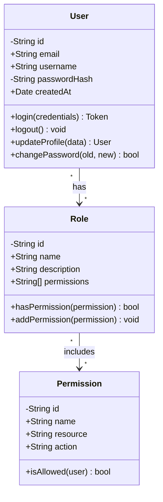
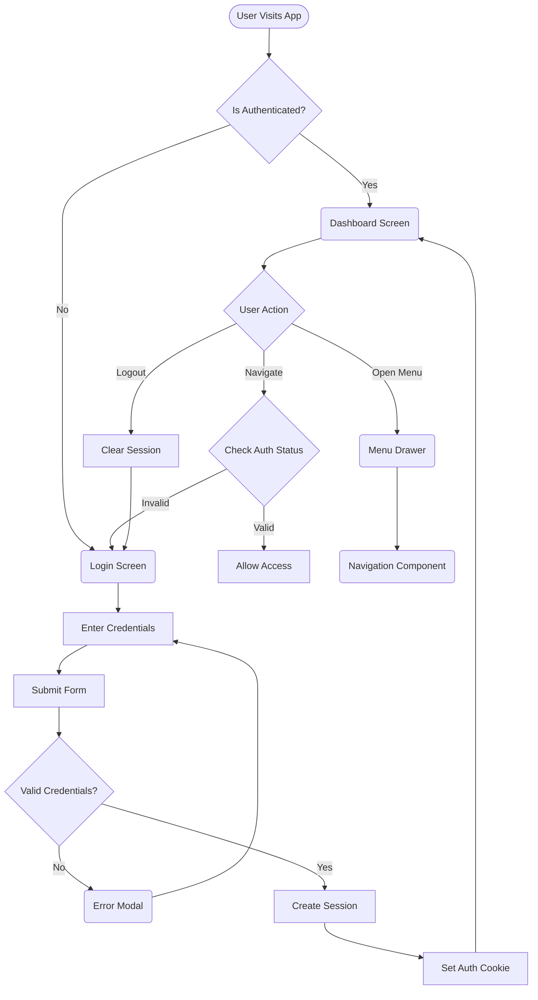
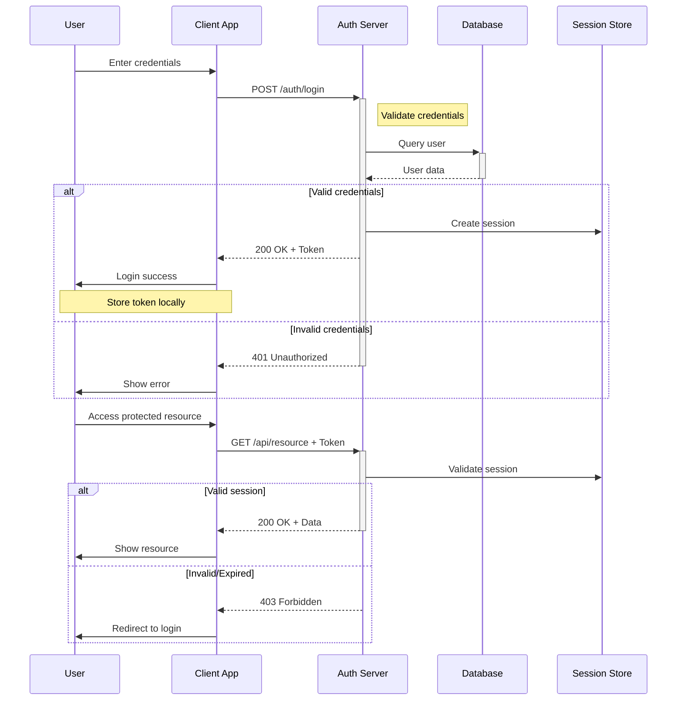
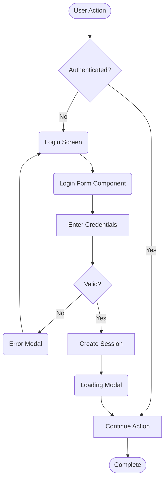
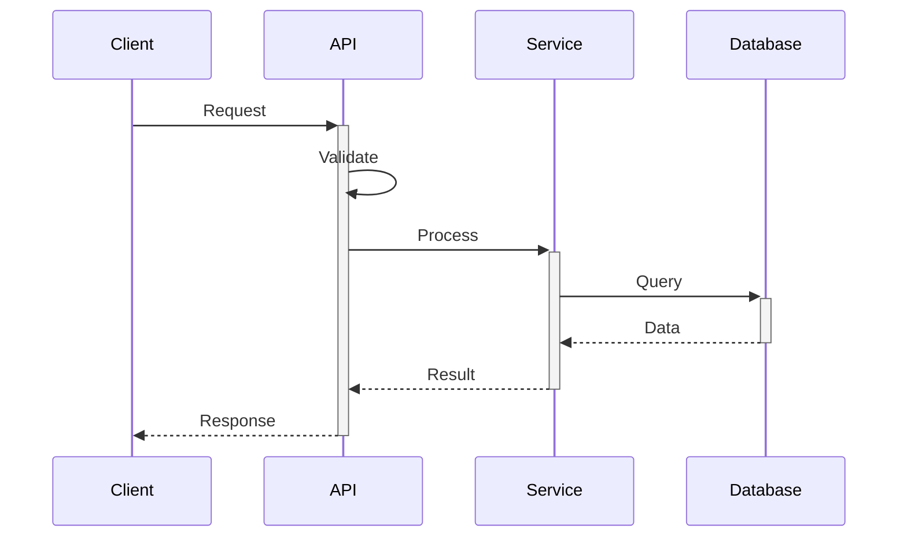
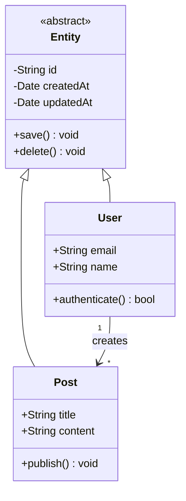

# Creating Diagrams with Mermaid

This guideline document explains how to create Mermaid diagrams in your documentation and projects. It is based on the functionality previously provided by the `create-diagram` command.

## Overview

Mermaid is a JavaScript-based diagramming tool that uses text definitions to create diagrams dynamically. It supports various diagram types including flowcharts, sequence diagrams, class diagrams, and more. This guideline covers the three main diagram types: class diagrams, flowcharts, and sequence diagrams.

## Diagram Types

### 1. Class Diagrams

Class diagrams show the structure of a system by modeling its classes, attributes, methods, and relationships between objects.

#### Syntax Elements

- **Visibility Modifiers:**
  - `+` Public
  - `-` Private
  - `#` Protected

- **Relationships:**
  - `--|>` Inheritance
  - `-->` Association
  - `..>` Dependency
  - `--` Link (solid)
  - `..` Link (dashed)

- **Multiplicity:**
  - `"1"` One
  - `"*"` Many
  - `"0..1"` Zero or One
  - `"1..*"` One or More

#### Example



### 2. Flowcharts

Flowcharts visualize workflows, processes, or algorithms using different node shapes and connections.

#### Node Types

- `[Rectangle]` - Process/Action
- `{Diamond}` - Decision
- `((Circle))` - Start/End
- `([Stadium])` - Terminal/Subprocess
- `[[Subroutine]]` - Predefined process
- `[(Database)]` - Database
- `(Rectangle)` - UI Component (rounded corners)

#### Arrow Types

- `-->` Solid arrow
- `-.->` Dotted arrow
- `==>` Thick arrow
- `--text-->` Labeled arrow

#### Flow Directions

- `TD` or `TB` - Top Down
- `LR` - Left to Right
- `RL` - Right to Left
- `BT` - Bottom to Top

#### Example



### 3. Sequence Diagrams

Sequence diagrams show interactions between objects or components over time, emphasizing the order of messages.

#### Elements

- **Participants:** Define actors/systems
  ```
  participant C as Client
  participant S as Server
  ```

- **Messages:**
  - `->>` Synchronous message
  - `-->>` Response
  - `-)` Asynchronous message
  - `-x` Lost message

- **Activation:**
  - `activate` / `deactivate`
  - Or use `+` / `-` suffixes on arrows

- **Grouping:**
  - `loop` - Iteration
  - `alt/else` - Alternative paths
  - `opt` - Optional
  - `par` - Parallel
  - `critical` - Critical region

- **Notes:**
  - `Note right of Actor: Text`
  - `Note left of Actor: Text`
  - `Note over Actor1,Actor2: Text`

#### Example



## Best Practices

### 1. General Guidelines

- **Keep it Simple:** Start with basic diagrams and add complexity as needed
- **Use Descriptive Labels:** Make node and relationship labels clear and meaningful
- **Consistent Styling:** Maintain consistent notation throughout your diagrams
- **Appropriate Detail Level:** Include enough detail to be useful but not overwhelming

### 2. File Organization

When adding diagrams to your documentation:

1. **In Existing Files:** Add diagrams in relevant sections with descriptive headers
2. **New Files:** Create dedicated diagram files with clear naming:
   - `architecture-overview.md`
   - `auth-flow-diagram.md`
   - `data-model-classes.md`

3. **Directory Structure:**
   ```
   docs/
   ├── architecture/
   │   ├── system-overview.md
   │   └── component-diagrams.md
   ├── api/
   │   └── sequence-diagrams.md
   └── data-models/
       └── class-diagrams.md
   ```

### 3. Diagram Placement

- **Inline with Documentation:** Place diagrams near related text
- **Section Headers:** Use descriptive headers above diagrams
- **Captions:** Add brief descriptions below complex diagrams

### 4. Version Control

- **Track Changes:** Commit diagram changes with descriptive messages
- **Document Updates:** Note significant diagram changes in commit messages
- **Review Process:** Include diagrams in code review processes

## Common Patterns

### Authentication Flow (Flowchart)



### API Request Pattern (Sequence)



### Domain Model (Class)



## Automated Generation Tips

When creating diagrams programmatically or with scripts:

### 1. Template-Based Approach

Create base templates for common patterns:

```javascript
// Class diagram template
const classTemplate = `classDiagram
    class ${className} {
        ${attributes.map(attr => `${attr.visibility}${attr.type} ${attr.name}`).join('\n        ')}
        ${methods.map(method => `${method.visibility}${method.name}(${method.params}) ${method.return}`).join('\n        ')}
    }`;
```

### 2. Dynamic Content

Parse descriptions to extract entities and relationships:

- **Nouns** → Classes/Entities
- **Verbs** → Methods/Actions
- **Adjectives** → Attributes/States
- **Prepositions** → Relationships
- **UI Elements** → Components (rounded rectangles)

### 3. Validation

Always validate generated diagrams:
- Check syntax correctness
- Ensure all relationships have valid endpoints
- Verify node definitions are complete

## Integration with Development Workflow

### 1. Documentation-Driven Development

- Create diagrams before implementation
- Update diagrams as code evolves
- Use diagrams in PR descriptions

### 2. Architecture Decision Records (ADRs)

Include diagrams in ADRs to visualize:
- Current state
- Proposed changes
- Impact analysis

### 3. Code Comments

Reference diagram files in code:
```javascript
/**
 * Authentication flow implementation
 * @see docs/architecture/auth-flow-diagram.md
 */
```

## Tools and Viewers

### Supported Platforms

- **GitHub:** Native Mermaid support in Markdown files
- **GitLab:** Built-in Mermaid rendering
- **VS Code:** Extensions like "Markdown Preview Mermaid Support"
- **Online Editors:** mermaid.live for testing

### Export Options

- **SVG:** Vector format for high-quality images
- **PNG:** Raster format for presentations
- **PDF:** Document inclusion

## Troubleshooting

### Common Issues

1. **Syntax Errors:** Check for missing semicolons, quotes, or brackets
2. **Rendering Issues:** Ensure proper spacing and indentation
3. **Browser Compatibility:** Use supported browsers for viewing

### Validation Steps

1. Test in mermaid.live editor
2. Check console for errors
3. Validate against Mermaid documentation

## Migration from create-diagram Command

If you were previously using the `create-diagram` command, follow these steps:

1. **Identify Diagram Type:** Determine if you need class, flowchart, or sequence
2. **Choose Location:** Decide where to place the diagram
3. **Create Manually:** Add the diagram using the patterns above
4. **Use Script (Optional):** The `create-diagram_generator.sh` script can still be used standalone for generating diagram content

## Conclusion

Creating clear, well-structured diagrams enhances documentation and improves understanding of complex systems. By following these guidelines, you can create effective diagrams that communicate architectural decisions, workflows, and system interactions clearly.

Remember to:
- Start simple and iterate
- Keep diagrams close to related documentation
- Update diagrams as systems evolve
- Use consistent notation and styling