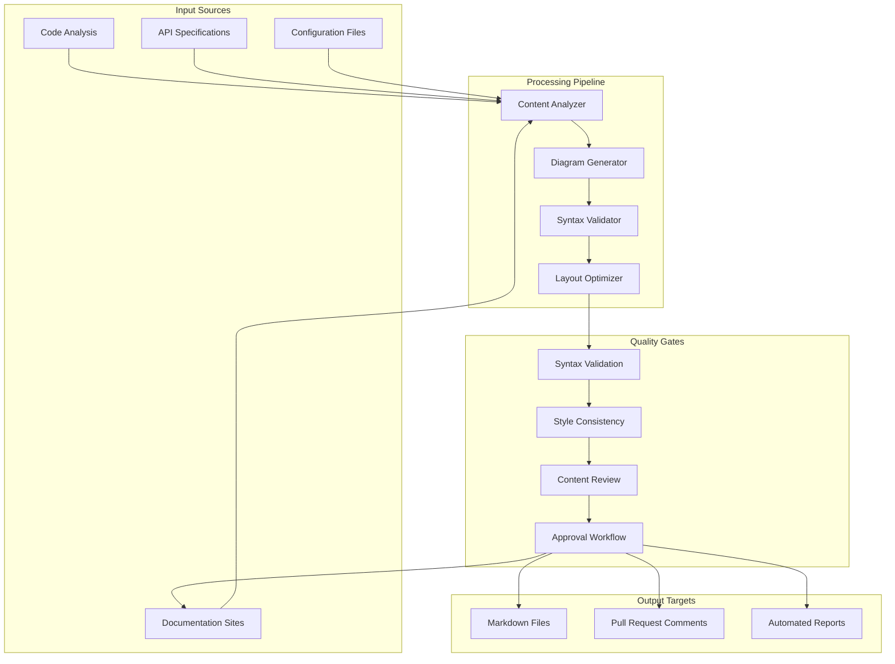

# Diagram Automation Guide

This guide provides comprehensive automation strategies for creating, maintaining, and integrating Mermaid diagrams into development workflows. It serves as an advanced reference for the create-diagrams agent complex, focusing on automation, integration, and workflow optimization.

## Overview

Diagram automation enables teams to maintain up-to-date visual documentation that evolves with code changes, reduces manual effort, and ensures consistency across projects. This guide covers automated generation, validation, integration patterns, and maintenance strategies.

## Automation Architecture

### Core Automation Components



## Automated Generation Strategies

### Code-to-Diagram Generation

#### Class Diagram Generation from Code

```bash
# Extract class information from TypeScript/JavaScript
generate_class_diagram_from_code() {
    local source_dir="$1"
    local output_file="$2"
    
    echo "🔍 Analyzing code structure in $source_dir..."
    
    # Extract classes, interfaces, and types
    local classes=$(find "$source_dir" -name "*.ts" -o -name "*.js" | xargs grep -h "^class\|^interface\|^type" | sort -u)
    
    # Generate Mermaid class diagram
    cat << EOF > "$output_file"
\`\`\`mermaid
classDiagram
EOF
    
    # Process each class/interface
    while IFS= read -r line; do
        if [[ "$line" =~ ^class[[:space:]]+([A-Za-z0-9_]+) ]]; then
            class_name="${BASH_REMATCH[1]}"
            generate_class_definition "$source_dir" "$class_name" >> "$output_file"
        elif [[ "$line" =~ ^interface[[:space:]]+([A-Za-z0-9_]+) ]]; then
            interface_name="${BASH_REMATCH[1]}"
            generate_interface_definition "$source_dir" "$interface_name" >> "$output_file"
        fi
    done <<< "$classes"
    
    # Add relationships
    generate_class_relationships "$source_dir" >> "$output_file"
    
    echo "\`\`\`" >> "$output_file"
    
    echo "✅ Class diagram generated: $output_file"
}

# Generate class definition with methods and properties
generate_class_definition() {
    local source_dir="$1"
    local class_name="$2"
    
    echo "    class $class_name {"
    
    # Extract properties
    find "$source_dir" -name "*.ts" -o -name "*.js" | xargs grep -h "private\|public\|protected" | \
    grep "$class_name" -A 10 | grep -E "^\s*(private|public|protected)" | \
    while IFS= read -r property; do
        if [[ "$property" =~ (private|public|protected)[[:space:]]+([A-Za-z0-9_]+):[[:space:]]*([A-Za-z0-9_]+) ]]; then
            visibility="${BASH_REMATCH[1]}"
            prop_name="${BASH_REMATCH[2]}"
            prop_type="${BASH_REMATCH[3]}"
            
            case "$visibility" in
                "private") echo "        -$prop_type $prop_name" ;;
                "protected") echo "        #$prop_type $prop_name" ;;
                "public") echo "        +$prop_type $prop_name" ;;
            esac
        fi
    done
    
    # Extract methods
    find "$source_dir" -name "*.ts" -o -name "*.js" | xargs grep -h "$class_name" -A 20 | \
    grep -E "^\s*(private|public|protected).*\(" | \
    while IFS= read -r method; do
        if [[ "$method" =~ (private|public|protected)[[:space:]]+([A-Za-z0-9_]+)\(.*\):[[:space:]]*([A-Za-z0-9_]+) ]]; then
            visibility="${BASH_REMATCH[1]}"
            method_name="${BASH_REMATCH[2]}"
            return_type="${BASH_REMATCH[3]}"
            
            case "$visibility" in
                "private") echo "        -$method_name() $return_type" ;;
                "protected") echo "        #$method_name() $return_type" ;;
                "public") echo "        +$method_name() $return_type" ;;
            esac
        fi
    done
    
    echo "    }"
}
```

#### API Flow Diagram Generation

```bash
# Generate sequence diagram from OpenAPI specification
generate_api_sequence_from_openapi() {
    local openapi_file="$1"
    local output_file="$2"
    
    echo "🔍 Analyzing OpenAPI specification: $openapi_file"
    
    cat << EOF > "$output_file"
\`\`\`mermaid
sequenceDiagram
    participant Client
    participant API as API Server
    participant Service as Business Logic
    participant DB as Database

EOF
    
    # Extract endpoints and generate sequence flows
    if command -v jq >/dev/null 2>&1; then
        # Use jq for JSON processing
        jq -r '.paths | to_entries[] | "\(.key) \(.value | keys[])"' "$openapi_file" | \
        while read -r path method; do
            generate_api_sequence_step "$path" "$method" >> "$output_file"
        done
    else
        # Fallback for YAML files
        grep -E "^\s*/" "$openapi_file" | \
        while IFS= read -r line; do
            path=$(echo "$line" | sed 's/://g' | xargs)
            generate_api_sequence_step "$path" "get" >> "$output_file"
        done
    fi
    
    echo "\`\`\`" >> "$output_file"
    
    echo "✅ API sequence diagram generated: $output_file"
}

# Generate sequence step for API endpoint
generate_api_sequence_step() {
    local path="$1"
    local method="$2"
    
    # Sanitize path for diagram
    local clean_path=$(echo "$path" | sed 's/{[^}]*}/ID/g')
    
    case "$method" in
        "get")
            echo "    Client->>+API: GET $clean_path"
            echo "    API->>+Service: Retrieve data"
            echo "    Service->>+DB: Query"
            echo "    DB-->>-Service: Results"
            echo "    Service-->>-API: Processed data"
            echo "    API-->>-Client: JSON response"
            ;;
        "post")
            echo "    Client->>+API: POST $clean_path"
            echo "    API->>+Service: Create resource"
            echo "    Service->>+DB: Insert"
            echo "    DB-->>-Service: Success"
            echo "    Service-->>-API: Created resource"
            echo "    API-->>-Client: 201 Created"
            ;;
        "put"|"patch")
            echo "    Client->>+API: $method $clean_path"
            echo "    API->>+Service: Update resource"
            echo "    Service->>+DB: Update"
            echo "    DB-->>-Service: Success"
            echo "    Service-->>-API: Updated resource"
            echo "    API-->>-Client: 200 OK"
            ;;
        "delete")
            echo "    Client->>+API: DELETE $clean_path"
            echo "    API->>+Service: Delete resource"
            echo "    Service->>+DB: Delete"
            echo "    DB-->>-Service: Success"
            echo "    Service-->>-API: Confirmation"
            echo "    API-->>-Client: 204 No Content"
            ;;
    esac
    
    echo ""  # Add spacing between operations
}
```

### Infrastructure Diagram Generation

#### Docker Compose to Architecture Diagram

```bash
# Generate architecture diagram from docker-compose.yml
generate_architecture_from_compose() {
    local compose_file="$1"
    local output_file="$2"
    
    echo "🔍 Analyzing Docker Compose file: $compose_file"
    
    cat << EOF > "$output_file"
\`\`\`mermaid
flowchart TB
EOF
    
    # Extract services
    local services=$(yq e '.services | keys | .[]' "$compose_file" 2>/dev/null || grep -E "^\s*[a-zA-Z].*:" "$compose_file" | sed 's/://g' | xargs)
    
    # Generate service nodes
    for service in $services; do
        # Get service details
        local image=$(yq e ".services.$service.image" "$compose_file" 2>/dev/null || echo "unknown")
        local ports=$(yq e ".services.$service.ports[]?" "$compose_file" 2>/dev/null || echo "")
        
        # Determine node style based on service type
        if [[ "$image" =~ postgres|mysql|mongo|redis ]]; then
            echo "    $service[($service Database)]" >> "$output_file"
        elif [[ "$service" =~ nginx|proxy|gateway ]]; then
            echo "    $service[$service Gateway]" >> "$output_file"
        else
            echo "    $service[$service Service]" >> "$output_file"
        fi
    done
    
    # Generate dependencies
    for service in $services; do
        local depends_on=$(yq e ".services.$service.depends_on[]?" "$compose_file" 2>/dev/null || echo "")
        for dependency in $depends_on; do
            echo "    $service --> $dependency" >> "$output_file"
        done
    done
    
    echo "\`\`\`" >> "$output_file"
    
    echo "✅ Architecture diagram generated: $output_file"
}
```

## CI/CD Integration Patterns

### GitHub Actions Workflow

```yaml
# .github/workflows/diagram-automation.yml
name: Diagram Automation

on:
  push:
    branches: [ main, develop ]
  pull_request:
    branches: [ main ]

jobs:
  generate-diagrams:
    runs-on: ubuntu-latest
    
    steps:
    - name: Checkout code
      uses: actions/checkout@v3
      
    - name: Setup Node.js
      uses: actions/setup-node@v3
      with:
        node-version: '18'
        
    - name: Install dependencies
      run: |
        npm install -g @mermaid-js/mermaid-cli
        npm install -g yq
        
    - name: Generate architecture diagrams
      run: |
        # Generate from docker-compose
        if [ -f "docker-compose.yml" ]; then
          ./scripts/generate_architecture_from_compose.sh docker-compose.yml docs/architecture.md
        fi
        
        # Generate API diagrams from OpenAPI specs
        find . -name "openapi.yml" -o -name "swagger.yml" | while read spec; do
          output_dir=$(dirname "$spec")/diagrams
          mkdir -p "$output_dir"
          ./scripts/generate_api_sequence.sh "$spec" "$output_dir/api-flow.md"
        done
        
    - name: Generate class diagrams
      run: |
        # Generate from TypeScript source
        find src -name "*.ts" -type f | head -1 | xargs dirname | while read src_dir; do
          ./scripts/generate_class_diagram.sh "$src_dir" docs/class-diagram.md
        done
        
    - name: Validate diagram syntax
      run: |
        # Validate all generated diagrams
        find . -name "*.md" -exec grep -l "```mermaid" {} \; | while read file; do
          echo "Validating diagrams in $file"
          # Extract and validate each mermaid block
          sed -n '/```mermaid/,/```/p' "$file" | sed '1d;$d' | \
          while IFS= read -r -d '' diagram; do
            echo "$diagram" | mmdc --input - --output /tmp/test.svg 2>/dev/null || {
              echo "❌ Invalid diagram syntax in $file"
              exit 1
            }
          done
        done
        
    - name: Commit updated diagrams
      run: |
        git config --local user.email "action@github.com"
        git config --local user.name "GitHub Action"
        git add docs/
        git diff --staged --quiet || git commit -m "docs: Update generated diagrams [skip ci]"
        
    - name: Push changes
      if: github.event_name == 'push'
      uses: ad-m/github-push-action@master
      with:
        github_token: ${{ secrets.GITHUB_TOKEN }}
        branch: ${{ github.ref }}
```

### Pre-commit Hook Integration

```bash
#!/bin/bash
# .git/hooks/pre-commit

echo "🔍 Checking for diagram updates needed..."

# Check if code files that might affect diagrams have changed
CHANGED_FILES=$(git diff --cached --name-only)

# Check for API specification changes
if echo "$CHANGED_FILES" | grep -qE "(openapi|swagger)\.(yml|yaml|json)"; then
    echo "📊 API specification changed, updating sequence diagrams..."
    find . -name "openapi.*" -o -name "swagger.*" | while read spec; do
        output_file="docs/api-sequences/$(basename "$spec" | sed 's/\.[^.]*$//').md"
        mkdir -p "$(dirname "$output_file")"
        ./scripts/generate_api_sequence_from_openapi.sh "$spec" "$output_file"
        git add "$output_file"
    done
fi

# Check for docker-compose changes
if echo "$CHANGED_FILES" | grep -q "docker-compose"; then
    echo "🏗️ Docker Compose changed, updating architecture diagram..."
    ./scripts/generate_architecture_from_compose.sh docker-compose.yml docs/architecture.md
    git add docs/architecture.md
fi

# Check for class structure changes
if echo "$CHANGED_FILES" | grep -qE "\.(ts|js|py|java|cs)$"; then
    echo "🔧 Source code changed, checking if class diagrams need updates..."
    
    # Extract changed classes/interfaces
    CHANGED_CLASSES=$(git diff --cached | grep -E "^[+-](class|interface)" | wc -l)
    
    if [ "$CHANGED_CLASSES" -gt 0 ]; then
        echo "📋 Class definitions changed, updating class diagrams..."
        find src -name "*.ts" -type f | head -1 | xargs dirname | while read src_dir; do
            ./scripts/generate_class_diagram_from_code.sh "$src_dir" docs/class-diagram.md
            git add docs/class-diagram.md
        done
    fi
fi

# Validate all diagram syntax before commit
echo "✅ Validating diagram syntax..."
find . -name "*.md" -exec grep -l "```mermaid" {} \; | while read file; do
    # Use the create-diagrams agent complex for validation
    mermaid_blocks=$(sed -n '/```mermaid/,/```/p' "$file" | sed '1d;$d')
    if [ -n "$mermaid_blocks" ]; then
        # Here you would call the validation command
        # /knowledge:validate-mermaid-syntax "$mermaid_blocks" --fix=false
        echo "  Validated: $file"
    fi
done

echo "✅ Pre-commit diagram checks completed"
```

## Documentation Integration

### Automated Documentation Generation

```bash
# Generate comprehensive documentation with diagrams
generate_documentation_suite() {
    local project_root="$1"
    local output_dir="$2"
    
    echo "📚 Generating comprehensive documentation suite..."
    
    mkdir -p "$output_dir"/{architecture,api,database,workflows}
    
    # Generate architecture overview
    if [ -f "$project_root/docker-compose.yml" ]; then
        echo "🏗️ Generating architecture overview..."
        cat << EOF > "$output_dir/architecture/overview.md"
# System Architecture

This document provides an overview of the system architecture, automatically generated from the current infrastructure configuration.

## System Components

EOF
        generate_architecture_from_compose "$project_root/docker-compose.yml" "$output_dir/architecture/overview.md"
    fi
    
    # Generate API documentation
    find "$project_root" -name "openapi.*" -o -name "swagger.*" | while read spec_file; do
        api_name=$(basename "$spec_file" | sed 's/\.[^.]*$//')
        echo "🔌 Generating API documentation for $api_name..."
        
        cat << EOF > "$output_dir/api/$api_name.md"
# $api_name API Documentation

This document describes the API flows and interactions for the $api_name service.

## API Sequence Flows

EOF
        generate_api_sequence_from_openapi "$spec_file" "$output_dir/api/$api_name.md"
    done
    
    # Generate database documentation
    if [ -d "$project_root/migrations" ] || [ -d "$project_root/prisma" ]; then
        echo "🗄️ Generating database documentation..."
        generate_database_diagrams "$project_root" "$output_dir/database"
    fi
    
    # Generate workflow documentation
    if [ -d "$project_root/.github/workflows" ]; then
        echo "⚙️ Generating workflow documentation..."
        generate_workflow_diagrams "$project_root/.github/workflows" "$output_dir/workflows"
    fi
    
    # Generate index page
    cat << EOF > "$output_dir/index.md"
# Project Documentation

This documentation is automatically generated and kept up-to-date with the codebase.

## Available Documentation

- [Architecture Overview](architecture/overview.md) - System architecture and component relationships
- [API Documentation](api/) - API flows and interactions
- [Database Schema](database/) - Data models and relationships
- [Workflows](workflows/) - CI/CD and automation workflows

## Last Updated

$(date)

## Generation Info

This documentation was generated using the create-diagrams agent complex.
EOF
    
    echo "✅ Documentation suite generated in $output_dir"
}
```

### Dynamic Diagram Updates

```bash
# Monitor file changes and update diagrams automatically
setup_diagram_monitoring() {
    local project_root="$1"
    
    echo "👁️ Setting up diagram monitoring..."
    
    # Install fswatch if not present
    if ! command -v fswatch >/dev/null 2>&1; then
        echo "Installing fswatch for file monitoring..."
        # Platform-specific installation would go here
    fi
    
    # Monitor relevant files for changes
    fswatch -o \
        "$project_root/src" \
        "$project_root/docker-compose.yml" \
        "$project_root/openapi.yml" \
        "$project_root/swagger.yml" \
        | while read num; do
            echo "🔄 Changes detected, updating diagrams..."
            
            # Regenerate affected diagrams
            if [ -f "$project_root/docker-compose.yml" ]; then
                generate_architecture_from_compose "$project_root/docker-compose.yml" docs/architecture.md
            fi
            
            find "$project_root" -name "openapi.*" -o -name "swagger.*" | while read spec; do
                output_file="docs/api/$(basename "$spec" | sed 's/\.[^.]*$//').md"
                generate_api_sequence_from_openapi "$spec" "$output_file"
            done
            
            # Commit changes if in git repository
            if [ -d "$project_root/.git" ]; then
                cd "$project_root"
                git add docs/
                git diff --staged --quiet || {
                    git commit -m "docs: Auto-update diagrams $(date)"
                    echo "✅ Updated diagrams committed"
                }
            fi
        done &
    
    echo "👁️ Diagram monitoring started (PID: $!)"
}
```

## Quality Assurance Automation

### Automated Diagram Testing

```bash
# Test diagram rendering and syntax
test_diagram_quality() {
    local docs_dir="$1"
    local report_file="$2"
    
    echo "🧪 Testing diagram quality..."
    
    cat << EOF > "$report_file"
# Diagram Quality Report

Generated: $(date)

## Test Results

EOF
    
    local total_diagrams=0
    local valid_diagrams=0
    local warnings=0
    
    find "$docs_dir" -name "*.md" -exec grep -l "```mermaid" {} \; | while read file; do
        echo "Testing diagrams in $file..."
        
        # Extract mermaid blocks
        awk '/```mermaid/,/```/{if(!/```/)print}' "$file" | while IFS= read -r -d '' diagram; do
            ((total_diagrams++))
            
            # Test syntax validity
            if echo "$diagram" | mmdc --input - --output /tmp/test.svg >/dev/null 2>&1; then
                ((valid_diagrams++))
                echo "  ✅ Valid diagram"
            else
                echo "  ❌ Invalid diagram syntax"
                echo "### ❌ Invalid Diagram in $file" >> "$report_file"
                echo "" >> "$report_file"
                echo "\`\`\`" >> "$report_file"
                echo "$diagram" >> "$report_file"
                echo "\`\`\`" >> "$report_file"
                echo "" >> "$report_file"
            fi
            
            # Test diagram complexity
            local lines=$(echo "$diagram" | wc -l)
            local nodes=$(echo "$diagram" | grep -cE "^\s*[A-Za-z0-9_]+\[|^\s*[A-Za-z0-9_]+\(|^\s*[A-Za-z0-9_]+\{")
            
            if [ "$lines" -gt 50 ] || [ "$nodes" -gt 20 ]; then
                ((warnings++))
                echo "  ⚠️ Complex diagram (consider splitting)"
                echo "### ⚠️ Complex Diagram in $file" >> "$report_file"
                echo "Lines: $lines, Nodes: $nodes" >> "$report_file"
                echo "" >> "$report_file"
            fi
        done
    done
    
    # Generate summary
    cat << EOF >> "$report_file"

## Summary

- Total diagrams: $total_diagrams
- Valid diagrams: $valid_diagrams
- Invalid diagrams: $((total_diagrams - valid_diagrams))
- Complexity warnings: $warnings

## Quality Score

$((valid_diagrams * 100 / total_diagrams))% of diagrams are syntactically valid.
EOF
    
    echo "✅ Quality report generated: $report_file"
}
```

## Performance Optimization

### Diagram Caching Strategy

```bash
# Implement caching for expensive diagram generation
setup_diagram_caching() {
    local cache_dir="$1"
    local source_dir="$2"
    
    mkdir -p "$cache_dir"
    
    # Generate cache key based on source files
    generate_cache_key() {
        local source="$1"
        find "$source" -type f \( -name "*.ts" -o -name "*.js" -o -name "*.yml" -o -name "*.yaml" \) \
            -exec stat -c "%Y" {} \; | sort | md5sum | cut -d' ' -f1
    }
    
    # Check if cached diagram is valid
    is_cache_valid() {
        local cache_file="$1"
        local source_key="$2"
        
        if [ -f "$cache_file.key" ] && [ -f "$cache_file" ]; then
            local cached_key=$(cat "$cache_file.key")
            [ "$cached_key" = "$source_key" ]
        else
            return 1
        fi
    }
    
    # Generate or retrieve cached diagram
    get_or_generate_diagram() {
        local diagram_type="$1"
        local source_path="$2"
        local output_path="$3"
        
        local cache_key=$(generate_cache_key "$source_path")
        local cache_file="$cache_dir/$(basename "$output_path")"
        
        if is_cache_valid "$cache_file" "$cache_key"; then
            echo "📋 Using cached diagram: $cache_file"
            cp "$cache_file" "$output_path"
        else
            echo "🔄 Generating new diagram..."
            case "$diagram_type" in
                "architecture")
                    generate_architecture_from_compose "$source_path" "$output_path"
                    ;;
                "api")
                    generate_api_sequence_from_openapi "$source_path" "$output_path"
                    ;;
                "class")
                    generate_class_diagram_from_code "$source_path" "$output_path"
                    ;;
            esac
            
            # Cache the result
            cp "$output_path" "$cache_file"
            echo "$cache_key" > "$cache_file.key"
        fi
    }
    
    echo "💾 Diagram caching setup complete"
}
```

## Best Practices for Automation

### 1. Incremental Updates
- Only regenerate diagrams when source files change
- Use file modification timestamps for change detection
- Implement efficient caching strategies

### 2. Quality Gates
- Validate diagram syntax before committing
- Check for complexity thresholds
- Ensure diagrams meet style guidelines

### 3. Error Handling
- Graceful fallbacks when generation fails
- Clear error messages for debugging
- Recovery mechanisms for partial failures

### 4. Performance Considerations
- Parallel processing for multiple diagrams
- Caching for expensive operations
- Optimized file parsing and analysis

### 5. Integration Points
- CI/CD pipeline integration
- IDE and editor plugins
- Documentation platform webhooks

## Conclusion

Diagram automation transforms static documentation into dynamic, living artifacts that stay synchronized with code changes. By implementing these patterns and strategies, teams can maintain high-quality visual documentation with minimal manual effort while ensuring consistency and accuracy across projects.

Key benefits of automation:
- **Consistency**: Standardized diagram formats and styles
- **Accuracy**: Always up-to-date with current system state
- **Efficiency**: Reduced manual effort and maintenance overhead
- **Quality**: Automated validation and quality checks
- **Integration**: Seamless workflow integration and collaboration