# Diagram Patterns and Templates

This document provides advanced patterns, templates, and best practices for creating effective Mermaid diagrams. It serves as a comprehensive reference for the create-diagrams agent complex, offering proven patterns for common scenarios and advanced techniques for complex visualizations.

## Overview

Building upon the foundational patterns in `creating-diagrams.md`, this guide provides specialized templates, advanced styling techniques, and pattern libraries for creating professional-quality diagrams that effectively communicate complex systems and processes.

## Architecture Diagram Patterns

### Microservices Architecture

#### Basic Microservices Pattern
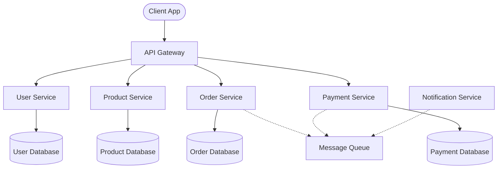

#### Advanced Microservices with Infrastructure
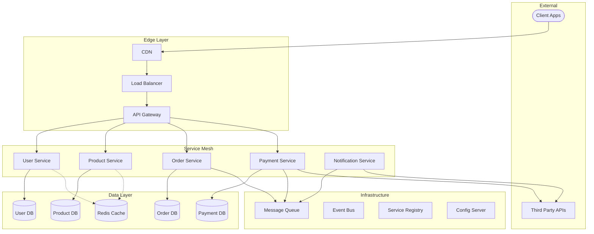

### Authentication and Authorization Patterns

#### OAuth 2.0 Flow
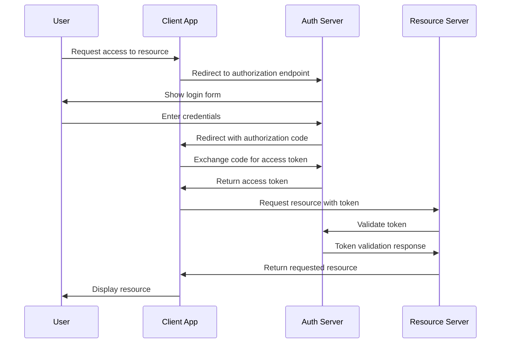

#### JWT Authentication Pattern
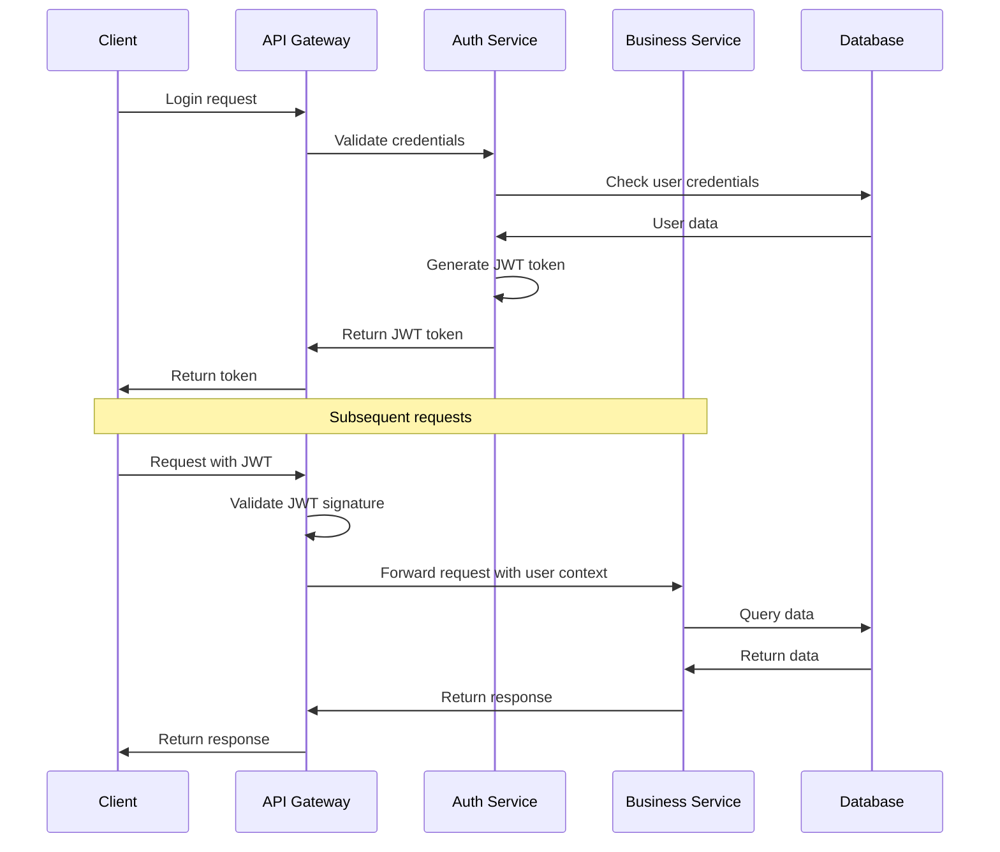

## Data Model Patterns

### Domain-Driven Design Entities

#### E-commerce Domain Model
```mermaid
classDiagram
    class User {
        -UUID id
        +String email
        +String username
        +String passwordHash
        +Profile profile
        +Date createdAt
        +Date lastLoginAt
        +authenticate(password) Boolean
        +updateProfile(data) Profile
        +changePassword(old, new) Boolean
    }
    
    class Profile {
        -UUID id
        +String firstName
        +String lastName
        +String phone
        +Address billingAddress
        +Address shippingAddress
        +updateContactInfo(info) void
        +addAddress(address) void
    }
    
    class Order {
        -UUID id
        +String orderNumber
        +OrderStatus status
        +Money totalAmount
        +Date orderedAt
        +Date shippedAt
        +Date deliveredAt
        +addItem(product, quantity) OrderItem
        +removeItem(productId) void
        +calculateTotal() Money
        +updateStatus(status) void
    }
    
    class OrderItem {
        -UUID id
        +Integer quantity
        +Money unitPrice
        +Money totalPrice
        +updateQuantity(quantity) void
        +calculateTotal() Money
    }
    
    class Product {
        -UUID id
        +String name
        +String description
        +String sku
        +Money price
        +Integer stockQuantity
        +ProductStatus status
        +updatePrice(price) void
        +updateStock(quantity) void
        +isAvailable() Boolean
    }
    
    class Category {
        -UUID id
        +String name
        +String description
        +String slug
        +Category parent
        +addProduct(product) void
        +removeProduct(product) void
    }
    
    User ||--|| Profile : has
    User ||--o{ Order : places
    Order ||--o{ OrderItem : contains
    OrderItem }o--|| Product : references
    Product }o--|| Category : belongs to
    Category ||--o{ Category : parent-child
    
    class OrderStatus {
        <<enumeration>>
        PENDING
        CONFIRMED
        SHIPPED
        DELIVERED
        CANCELLED
    }
    
    class ProductStatus {
        <<enumeration>>
        ACTIVE
        INACTIVE
        DISCONTINUED
    }
```

#### Aggregate Patterns
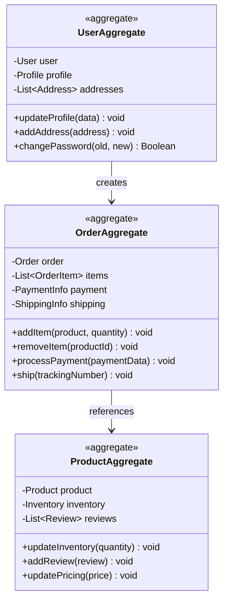

## Process Flow Patterns

### CI/CD Pipeline Pattern
```mermaid
flowchart LR
    subgraph "Development"
        Dev[Developer]
        IDE[IDE/Editor]
        LocalTests[Local Tests]
    end
    
    subgraph "Version Control"
        GitRepo[Git Repository]
        PullRequest[Pull Request]
        CodeReview[Code Review]
    end
    
    subgraph "CI Pipeline"
        Trigger[Trigger Build]
        Checkout[Checkout Code]
        Build[Build Application]
        UnitTests[Unit Tests]
        Integration[Integration Tests]
        Security[Security Scan]
        Quality[Quality Gates]
    end
    
    subgraph "CD Pipeline"
        Artifact[Build Artifact]
        Deploy[Deploy to Staging]
        E2ETests[E2E Tests]
        Approval[Manual Approval]
        Production[Deploy to Production]
        Monitor[Monitor & Validate]
    end
    
    Dev --> IDE
    IDE --> LocalTests
    LocalTests --> GitRepo
    GitRepo --> PullRequest
    PullRequest --> CodeReview
    CodeReview --> Trigger
    
    Trigger --> Checkout
    Checkout --> Build
    Build --> UnitTests
    UnitTests --> Integration
    Integration --> Security
    Security --> Quality
    
    Quality --> Artifact
    Artifact --> Deploy
    Deploy --> E2ETests
    E2ETests --> Approval
    Approval --> Production
    Production --> Monitor
    
    Monitor -.-> Dev
```

### Event-Driven Architecture Pattern
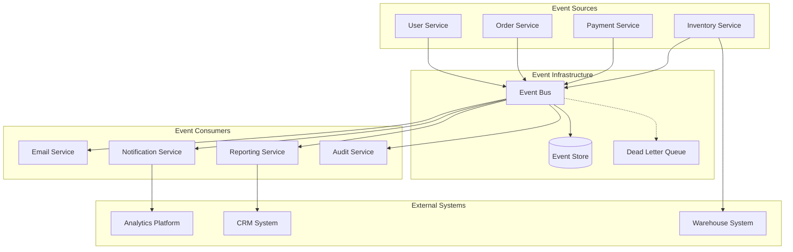

## Advanced Styling Patterns

### Color-Coded System Components
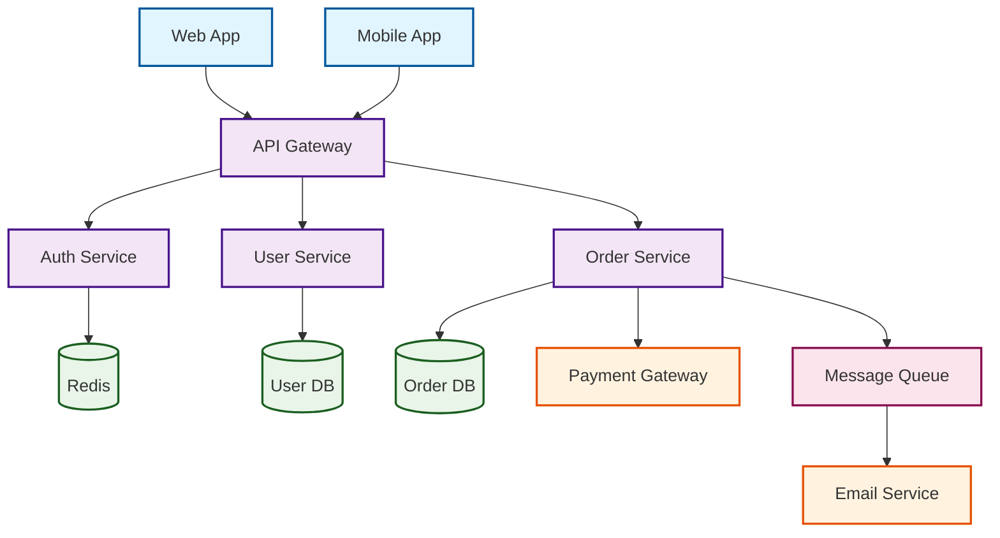

### Status and Flow Indicators
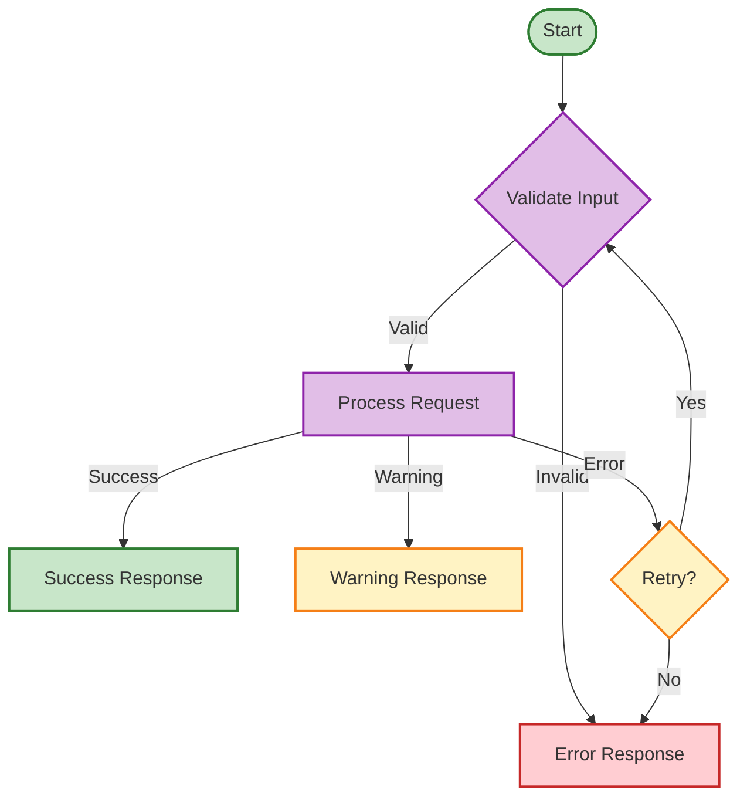

## Complex Interaction Patterns

### Saga Pattern for Distributed Transactions
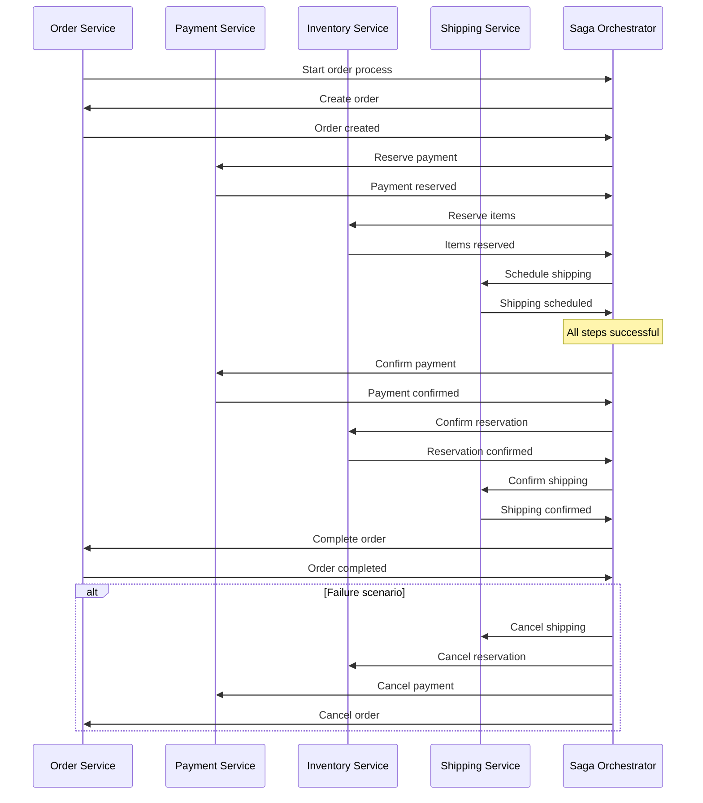

### CQRS Pattern
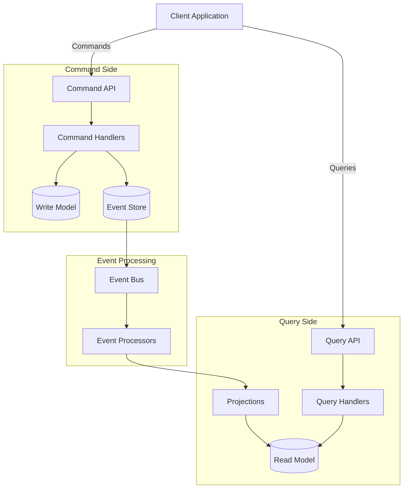

## Documentation Integration Patterns

### Architecture Decision Record (ADR) Diagram
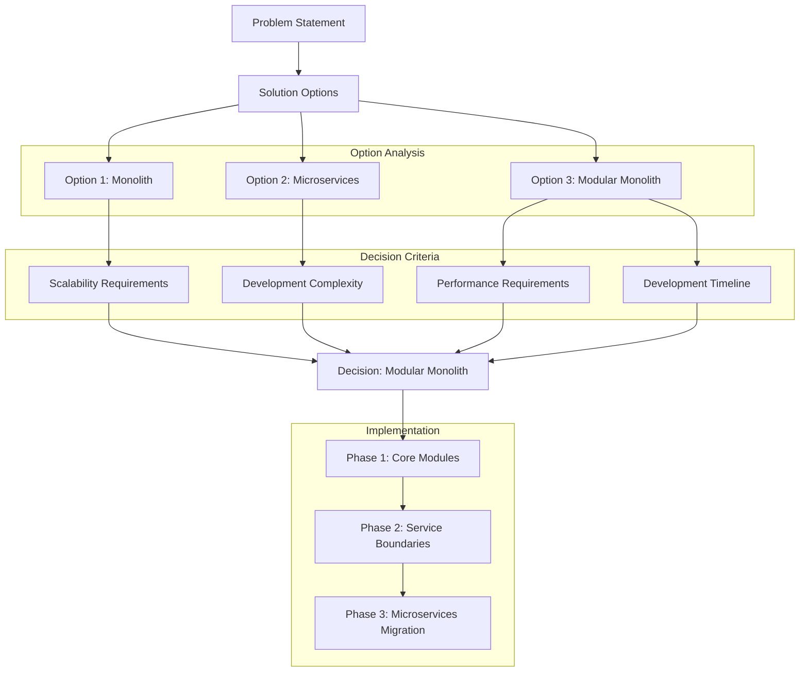

### System Context Diagram
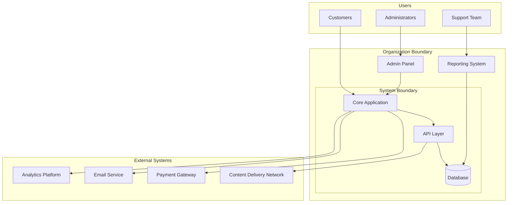

## Template Usage Guidelines

### Choosing the Right Pattern

1. **For System Architecture**:
   - Use microservices patterns for distributed systems
   - Use layered patterns for traditional applications
   - Use event-driven patterns for decoupled systems

2. **For Data Models**:
   - Use domain-driven design for complex business logic
   - Use simple entity relationships for CRUD applications
   - Use aggregate patterns for bounded contexts

3. **For Process Flows**:
   - Use flowcharts for business processes
   - Use sequence diagrams for system interactions
   - Use state diagrams for status workflows

### Customization Guidelines

1. **Adapt to Context**:
   - Modify entity names to match your domain
   - Adjust relationships based on business rules
   - Customize styling to match organization standards

2. **Maintain Consistency**:
   - Use consistent naming conventions
   - Apply uniform styling across diagrams
   - Follow established arrow and connection patterns

3. **Keep It Simple**:
   - Start with basic patterns and add complexity gradually
   - Focus on key relationships and flows
   - Use subgraphs to group related components

## Integration with Documentation

### Markdown Integration Best Practices

```markdown
## System Architecture

The following diagram illustrates our microservices architecture:

```mermaid
[diagram code here]
```

### Component Responsibilities

- **API Gateway**: Routes requests and handles authentication
- **User Service**: Manages user data and authentication
- **Order Service**: Processes orders and manages order lifecycle
```

### Dynamic Documentation

For documentation that needs to stay current with code:

1. **Reference Patterns**: Link to this pattern library
2. **Version Control**: Track diagram changes with code changes
3. **Automated Updates**: Consider tooling for automatic diagram updates
4. **Review Process**: Include diagrams in code review processes

## Conclusion

These patterns provide a foundation for creating professional, consistent diagrams that effectively communicate system design and processes. Use them as starting points and adapt them to your specific needs while maintaining clarity and consistency across your documentation.

Remember to:
- Choose patterns appropriate to your audience and purpose
- Maintain consistency in styling and terminology
- Keep diagrams focused and avoid unnecessary complexity
- Update diagrams as systems evolve
- Use these patterns as building blocks for more complex visualizations