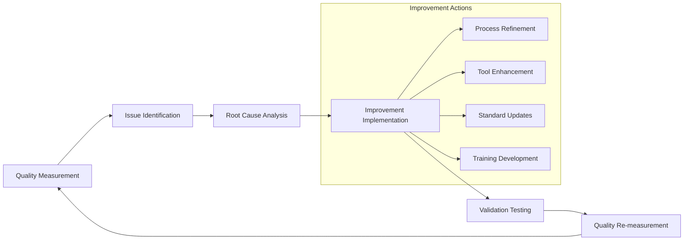

# Quality Assurance Guide for Knowledge Management

This comprehensive guide establishes quality standards, validation procedures, and continuous improvement practices for the knowledge management system, ensuring high-quality, reliable, and maintainable knowledge resources.

## Overview

Quality assurance in knowledge management encompasses structural integrity, content accuracy, consistency patterns, and user experience optimization. This guide provides systematic approaches to maintaining and improving knowledge quality across all operations.

## Quality Framework

```mermaid
graph TD
    A[Quality Framework] --> B[Structural Quality]
    A --> C[Content Quality] 
    A --> D[Process Quality]
    A --> E[User Experience Quality]
    
    B --> B1[Directory Structure]
    B --> B2[File Organization]
    B --> B3[Naming Conventions]
    B --> B4[Matrix Integrity]
    
    C --> C1[Accuracy Validation]
    C --> C2[Completeness Assessment]
    C --> C3[Consistency Checks]
    C --> C4[Relevance Evaluation]
    
    D --> D1[Workflow Validation]
    D --> D2[Agent Coordination]
    D --> D3[Tool Integration]
    D --> D4[Error Recovery]
    
    E --> E1[Navigation Optimization]
    E --> E2[Discoverability]
    E --> E3[Readability Standards]
    E --> E4[Cross-Reference Quality]
```



## Quality Standards

### Structural Quality Standards

#### Directory Structure Requirements
```bash
# Standard structure validation
✅ Required: README.md in every directory
✅ Required: Consistent naming (lowercase, hyphens for spaces)
✅ Required: Logical hierarchy (topic → subtopic → block)
✅ Required: Maximum 3-level nesting for maintainability

# Structure validation commands
/knowledge:validate-knowledge <topic> --verbose
tree .knowledge/<topic>  # Visual structure verification
```

#### File Organization Standards
```markdown
Topic Directory Requirements:
├── README.md (topic matrix) ✅ MANDATORY
├── subtopic1/
│   ├── README.md (subtopic matrix) ✅ MANDATORY
│   ├── block1.md (knowledge block) ✅ CONTENT REQUIRED
│   └── block2.md (knowledge block) ✅ CONTENT REQUIRED
└── subtopic2/
    ├── README.md (subtopic matrix) ✅ MANDATORY
    └── block1.md (knowledge block) ✅ CONTENT REQUIRED
```

#### Matrix Quality Requirements
```markdown
README.md Structure Requirements:
1. # Topic Knowledge Matrix (consistent title format) ✅
2. ## Subtopics section with 📁 emoji links ✅
3. ## Blocks section with 📄 emoji links ✅  
4. ## Structure section (backward compatibility) ✅
5. ## Integrated Knowledge section with block content ✅
6. ## Subtopic Summaries (if subtopics exist) ✅

Link Validation Requirements:
- All subtopic links → valid directories ✅
- All block links → existing .md files ✅
- Consistent emoji usage (📁 for folders, 📄 for files) ✅
- Proper markdown link syntax ✅
```

### Content Quality Standards

#### Accuracy Validation
```markdown
Research Quality Criteria:
├── Multiple source validation (minimum 3 sources for claims) ✅
├── Authoritative source prioritization ✅
├── Currency verification (prefer recent information) ✅
├── Cross-domain perspective inclusion ✅
└── Fact-checking against established knowledge ✅

Agent Research Quality:
├── Perplexity MCP: Technical accuracy verification ✅
├── Context7 MCP: Framework-specific validation ✅
├── Web Search: Current implementation verification ✅
└── Cross-reference: Internal consistency checking ✅
```

#### Content Completeness Assessment
```bash
# Completeness validation checklist
Block Content Requirements:
□ Minimum 50 words for substantive blocks
□ Header structure (H2/H3 organization)
□ Practical examples or use cases
□ Cross-references to related knowledge
□ External authoritative sources (when applicable)

# Validation commands
find .knowledge/<topic> -name "*.md" -not -name "README.md" -exec wc -w {} \;
grep -r "^##" .knowledge/<topic>/  # Header structure check
grep -r "http" .knowledge/<topic>/  # External reference check
```

#### Consistency Standards
```markdown
Naming Convention Standards:
├── Topics: lowercase, single words or hyphens (authentication, api-design)
├── Subtopics: descriptive phrases with hyphens (oauth-implementation) 
├── Blocks: descriptive names with hyphens (jwt-best-practices.md)
└── Consistent terminology across related knowledge areas

Content Style Standards:
├── Clear, concise explanations ✅
├── Consistent markdown formatting ✅
├── Standardized code block formatting ✅
├── Uniform cross-reference style ✅
└── Professional tone and language ✅
```

### Process Quality Standards

#### Workflow Validation
```bash
# Git workflow quality checks
Pre-workflow Validation:
□ Clean working directory (git status)
□ Current branch verification
□ Base branch synchronization
□ Permission validation

Post-workflow Validation:
□ Feature branch creation success
□ Knowledge structure integrity
□ Commit message convention compliance
□ Pull request template completion
```

#### Agent Coordination Quality
```markdown
Agent Orchestration Standards:
├── Proper Task tool usage for agent invocation ✅
├── Context preservation between coordination phases ✅
├── Graceful fallback handling for agent unavailability ✅
├── Quality validation of agent outputs ✅
└── Error recovery with appropriate messaging ✅

Research Quality Validation:
├── Multi-angle analysis completion ✅
├── Source diversity and authority ✅
├── Findings synthesis and organization ✅
└── Implementation guidance provision ✅

Architecture Quality Validation:
├── Structural recommendations with rationale ✅
├── Integration planning with existing knowledge ✅
├── Scalability considerations ✅
└── Quality checkpoint establishment ✅
```

## Validation Procedures

### Automated Quality Checks

#### Structural Validation
```bash
# Run comprehensive structural validation
/knowledge:validate-knowledge <topic> --fix --verbose

# Validation checklist automated checks
✅ Directory structure integrity
✅ README.md presence in all directories
✅ Valid internal link references  
✅ Consistent file naming patterns
✅ Matrix format compliance
✅ Cross-reference accuracy
```

#### Content Quality Validation
```bash
# Content quality assessment
/knowledge:analyze-knowledge-gaps <topic> --depth=deep --suggest-fixes

# Quality metrics automated analysis
✅ Content completeness assessment
✅ Block content depth evaluation
✅ Cross-reference relationship analysis
✅ Knowledge coverage gap identification
✅ Domain-specific pattern compliance
✅ Quality improvement recommendations
```

#### Matrix Consistency Validation
```bash
# Matrix generation and consistency
/knowledge:generate-knowledge-matrix <topic> --recursive --template=standard

# Matrix quality verification
✅ Template format compliance
✅ Content integration accuracy
✅ Navigation link functionality
✅ Structural consistency across levels
✅ Cross-reference completeness
```

### Manual Quality Reviews

#### Content Review Checklist
```markdown
Content Accuracy Review:
□ Technical information accuracy verification
□ Best practices alignment with industry standards
□ Code examples functionality and correctness
□ External resource link validity and relevance
□ Internal cross-reference accuracy and helpfulness

Content Quality Review:
□ Clear, understandable explanations
□ Appropriate detail level for target audience
□ Logical flow and organization
□ Complete coverage of topic aspects
□ Practical applicability and usefulness
```

#### Structural Review Checklist
```markdown
Organization Review:
□ Intuitive topic and subtopic organization
□ Logical knowledge block grouping
□ Appropriate nesting depth (max 3 levels)
□ Consistent naming across related areas
□ Effective knowledge discovery pathways

Matrix Review:
□ Complete and accurate topic matrix integration
□ Functional navigation links throughout
□ Appropriate content integration in matrices
□ Effective subtopic summaries
□ Consistent formatting and presentation
```

### Quality Gates

#### Pre-Commit Quality Gates
```bash
# Mandatory checks before commit
Gate 1: Structural Integrity
- All directories have README.md files ✅
- No broken internal links ✅
- Consistent naming conventions ✅
- Valid matrix format compliance ✅

Gate 2: Content Quality  
- Minimum content standards met ✅
- No empty or placeholder files ✅
- Appropriate cross-references included ✅
- Quality agent validation completed ✅

Gate 3: Integration Consistency
- Matrix generation successful ✅
- Cross-references validated ✅
- No integration conflicts detected ✅
- User navigation pathways verified ✅
```

#### Pre-Merge Quality Gates  
```markdown
Pull Request Quality Review:
□ Comprehensive description with context
□ All automated quality checks passed
□ Manual review completed by domain expert
□ Integration testing with existing knowledge verified
□ User experience impact assessed positively
□ Documentation standards compliance confirmed
```

## Quality Metrics and Monitoring

### Structural Health Metrics
```bash
# Key structural health indicators
Directory Coverage: find .knowledge -type d -not -exec test -e '{}/README.md' \; -print | wc -l
Link Integrity: broken_links=$(grep -r "]\(" .knowledge/ | grep -v "http" | while read line; do
    # Validate internal links exist
    # Count broken references
done)
Naming Consistency: naming_violations=$(find .knowledge -name "*[A-Z]*" -o -name "*_*" | wc -l)
Depth Analysis: max_depth=$(find .knowledge -type d | awk -F/ '{print NF}' | sort -nr | head -1)
```

### Content Quality Metrics
```bash
# Content quality measurement
Content Density: avg_words=$(find .knowledge -name "*.md" -not -name "README.md" -exec wc -w {} \; | awk '{sum+=$1; count++} END {print sum/count}')
Cross-Reference Density: cross_refs=$(grep -r "]\(" .knowledge/ | grep -v "http" | wc -l)
External Reference Quality: external_refs=$(grep -r "http" .knowledge/ | wc -l)
Header Structure Quality: proper_headers=$(grep -r "^##" .knowledge/ | wc -l)
```

### Process Quality Metrics
```bash
# Workflow and process effectiveness  
Agent Success Rate: successful_orchestrations/total_orchestrations
Validation Pass Rate: automatic_validation_passes/total_validations  
Error Recovery Rate: successful_recoveries/total_errors
User Experience Score: navigation_success_rate × content_usefulness_score
```

### Quality Trending Analysis
```bash
# Quality improvement tracking
Weekly Quality Score: structural_score + content_score + process_score + ux_score
Quality Improvement Rate: (current_period_score - previous_period_score) / previous_period_score
Issue Resolution Time: average_time_from_identification_to_resolution
User Satisfaction Trend: feedback_scores_over_time
```

## Continuous Improvement

### Quality Feedback Loop


### Automated Quality Monitoring
```bash
# Scheduled quality assessments
Daily: Structural integrity checks, broken link detection
Weekly: Content quality analysis, cross-reference validation  
Monthly: Comprehensive quality review, metric trending analysis
Quarterly: Standard updates, process optimization review
```

### Quality Improvement Initiatives

#### Pattern Recognition and Standardization
```markdown
Success Pattern Identification:
├── High-quality knowledge block analysis
├── Effective organization pattern recognition
├── User navigation behavior analysis
└── Agent coordination success pattern documentation

Standardization Implementation:
├── Best practice template development
├── Quality checkpoint automation
├── Training material creation
└── Process documentation updates
```

#### Tool and Process Enhancement
```bash
# Continuous tool improvement
Quality Tool Enhancement:
- Validation command feature expansion
- Gap analysis sophistication improvement  
- Matrix generation template optimization
- Error detection and recovery enhancement

Process Optimization:
- Workflow efficiency improvement
- Agent coordination pattern refinement
- Quality gate automation enhancement
- User experience optimization
```

## Quality Troubleshooting

### Common Quality Issues and Resolutions

#### Structural Issues
```bash
# Issue: Missing README.md files
Detection: /knowledge:validate-knowledge <topic> --verbose
Resolution: /knowledge:validate-knowledge <topic> --fix
Prevention: Pre-commit validation gates

# Issue: Broken internal links
Detection: grep -r "]\(" .knowledge/<topic>/ | validation script
Resolution: Manual link correction or content restructuring
Prevention: Automated link validation in CI/CD

# Issue: Inconsistent naming
Detection: find .knowledge -name "*[A-Z]*" -o -name "*_*"
Resolution: Systematic renaming with reference updates
Prevention: Naming convention enforcement in validation
```

#### Content Issues
```bash
# Issue: Low-quality content blocks
Detection: /knowledge:analyze-knowledge-gaps <topic> --depth=deep
Resolution: Agent-assisted content enhancement
Prevention: Minimum content standards in quality gates

# Issue: Missing cross-references
Detection: Cross-reference density analysis
Resolution: Manual cross-reference addition guided by analysis
Prevention: Cross-reference suggestions in agent coordination

# Issue: Outdated information
Detection: Source recency analysis, external link validation
Resolution: Research-driven content updates with agent assistance
Prevention: Scheduled content review and update cycles
```

### Quality Recovery Procedures
```bash
# Emergency quality recovery
1. Identify scope of quality issues
2. Prioritize by user impact and severity
3. Apply automated fixes where safe
4. Manual correction for complex issues
5. Validate fixes with comprehensive testing
6. Document lessons learned and prevention measures
```

## Best Practices Summary

### Quality Assurance Best Practices
1. **Implement comprehensive validation** at every workflow stage
2. **Use automated tools extensively** but supplement with manual reviews
3. **Maintain quality metrics** and track improvements over time
4. **Establish clear quality standards** and communicate them effectively
5. **Create feedback loops** for continuous improvement

### Content Quality Best Practices
1. **Prioritize accuracy and authority** in all knowledge content
2. **Maintain consistency** in formatting, style, and organization
3. **Ensure completeness** while avoiding information overload
4. **Optimize for discoverability** through effective cross-referencing
5. **Regular validation and updates** to maintain currency and relevance

### Process Quality Best Practices
1. **Follow established workflows** and coordination patterns consistently
2. **Implement graceful error handling** and recovery procedures
3. **Monitor and measure** process effectiveness continuously
4. **Invest in automation** for repetitive quality assurance tasks
5. **Document and share** successful quality improvement initiatives

This quality assurance framework ensures that the knowledge management system maintains high standards while continuously improving through systematic measurement, validation, and enhancement processes.