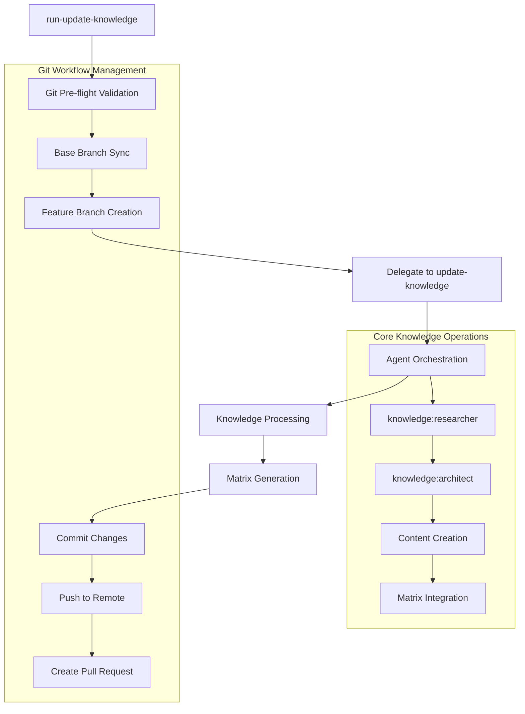
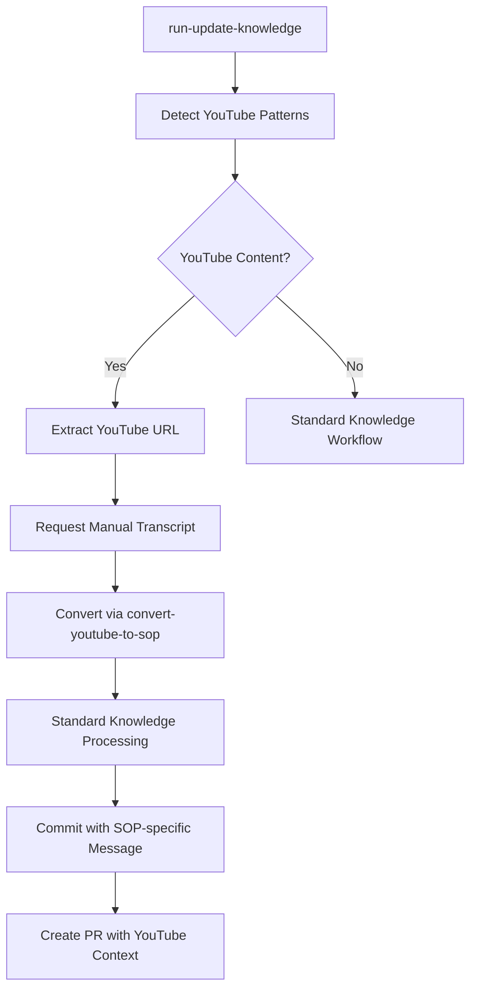

# Knowledge Update Workflow Guide

This guide provides comprehensive documentation for the streamlined knowledge update workflow, designed for efficient knowledge management operations with optimal agent coordination.

## Overview

The knowledge update workflow has been restructured into two complementary components:

1. **Core Knowledge Operations** (`/knowledge:update-knowledge`) - Focuses purely on knowledge processing with agent orchestration
2. **Workflow Management** (`/run-update-knowledge`) - Handles complete git workflow lifecycle with feature branches and PRs

This separation enables both standalone knowledge operations and complete collaborative workflows.

## Workflow Architecture



## Component Responsibilities

### Meta-Command: run-update-knowledge
**Location**: `ubuntu-vm/user/commands/run-update-knowledge.md`

**Responsibilities:**
- Git workflow management (validation, branching, commits, PRs)
- Environment validation and prerequisite checking
- Feature branch creation with standardized naming
- Conventional commit message generation
- Automated pull request creation with templates
- Error handling and recovery for git operations

**Usage Pattern:**
```bash
/run-update-knowledge authentication/oauth:jwt-implementation main "JWT tokens provide stateless authentication"
```

### Core Command: update-knowledge
**Location**: `ubuntu-vm/project/knowledge/commands/update-knowledge.md`

**Responsibilities:**
- Agent orchestration (knowledge:researcher + knowledge:architect)
- Knowledge structure creation and validation
- Content processing and organization
- Matrix generation and integration
- Subtopic architecture management

**Usage Pattern:**
```bash
/knowledge:update-knowledge authentication/oauth:jwt-implementation "JWT tokens provide stateless authentication"
```

## YouTube-to-SOP Integration

The run-update-knowledge command now includes intelligent YouTube-to-SOP conversion capabilities, automatically detecting YouTube content requests and converting them to structured Standard Operating Procedures (SOPs) within the knowledge base.

### YouTube Content Detection

The workflow automatically detects YouTube conversion requests using pattern matching:

#### Detection Patterns
- "youtube", "video", "sop from", "convert youtube"
- "youtube.com", "youtu.be", "transcript"  
- "video tutorial", "tutorial video"

#### URL Extraction
- Automatically extracts YouTube URLs from description text
- Supports both youtube.com/watch?v= and youtu.be/ formats
- Validates URL format before proceeding

#### Optional Flags
- `--timestamps`: Preserve timestamp references in SOP
- `--chapters`: Organize content by chapters/sections

### YouTube-to-SOP Workflow Process



### Integration Examples

```bash
# Convert YouTube tutorial to development setup SOP
/run-update-knowledge development/setup:claude-guide main "Convert this YouTube tutorial https://www.youtube.com/watch?v=abc123 to an SOP for Claude Code setup"

# Convert with timestamp preservation
/run-update-knowledge devops/deployment:docker-sop dev "This YouTube video https://youtu.be/xyz789 shows Docker deployment. Convert to SOP with --timestamps"

# Convert with chapter organization  
/run-update-knowledge security/compliance:gdpr-procedures main "Convert YouTube GDPR tutorial https://www.youtube.com/watch?v=sec123 to compliance SOP with --chapters"
```

## Agent Orchestration Modes

The update-knowledge command operates in five intelligent orchestration modes:

### 1. Dual-Agent Mode
**Trigger**: New content with statement but no specific block
**Process**: 
1. **knowledge:researcher** - Comprehensive multi-angle research
2. **knowledge:architect** - Structure analysis and recommendations
3. **Implementation** - Synthesized knowledge block creation

**Example:**
```bash
/knowledge:update-knowledge authentication "Modern authentication patterns"
```

### 2. Single-Agent Mode
**Trigger**: Specific block update with statement
**Process**:
1. **knowledge:architect** - Block-specific structural guidance
2. **Implementation** - Direct block creation/update

**Example:**
```bash
/knowledge:update-knowledge authentication/oauth:jwt-implementation "JWT implementation details"
```

### 3. SOP Integration Mode
**Trigger**: Pre-converted SOP content with statement but no specific block  
**Process**:
1. **knowledge:architect** - SOP integration guidance for knowledge architecture
2. **Implementation** - Optimized SOP content integration

**Example:**
```bash
/knowledge:update-knowledge development/setup "SOP content from YouTube conversion..."
```

### 4. SOP Block Mode
**Trigger**: Specific SOP block update with statement
**Process**:
1. **knowledge:architect** - SOP block integration optimization
2. **Implementation** - Direct SOP block creation with architectural guidance

**Example:**
```bash
/knowledge:update-knowledge development/setup:claude-sop "Pre-converted SOP block content..."
```

### 5. Matrix-Only Mode  
**Trigger**: No statement provided (matrix update only)
**Process**:
1. **Direct Matrix Generation** - No agent consultation needed
2. **Structure Update** - Regenerate matrices from existing content

**Example:**
```bash
/knowledge:update-knowledge authentication/oauth
```

## Complete Workflow Examples

### Example 0: YouTube-to-SOP Conversion Workflow
```bash
# Complete YouTube-to-SOP workflow with git management
/run-update-knowledge development/tools:github-actions-sop main "Convert this YouTube tutorial https://www.youtube.com/watch?v=abc123 on GitHub Actions to comprehensive SOP with --timestamps for deployment workflows"

# Process:
# 1. Detects YouTube content via pattern matching ("youtube", "tutorial", URL)
# 2. Extracts YouTube URL and --timestamps flag from description
# 3. Validates git environment and creates feature/knowledge/development-tools branch
# 4. Requests manual transcript input from user
# 5. Invokes convert-youtube-to-sop command:
#    - Converts video transcript to structured SOP documentation
#    - Integrates SOP into .knowledge/development/tools/github-actions-sop.md
#    - Updates knowledge matrices to include new SOP block
# 6. Invokes knowledge:update-knowledge for final processing:
#    - Uses SOP block mode with knowledge:architect guidance
#    - Optimizes SOP integration with existing knowledge architecture
# 7. Commits with YouTube-specific message: "docs(knowledge): add SOP from YouTube video abc123 to development tools block"
# 8. Creates PR with YouTube-to-SOP specific template and review checklist
```

### Example 1: New Topic Creation with Full Workflow
```bash
# Complete workflow with git management
/run-update-knowledge security/encryption main "Implement comprehensive encryption standards"

# Process:
# 1. Validates git environment and permissions
# 2. Syncs main branch and creates feature/knowledge/security-encryption
# 3. Invokes dual-agent orchestration:
#    - knowledge:researcher: Multi-angle encryption research
#    - knowledge:architect: Structure recommendations  
# 4. Creates knowledge structure and matrices
# 5. Commits with conventional message
# 6. Pushes feature branch and creates PR
```

### Example 2: Subtopic Update with Architectural Guidance
```bash
# Specialized block update with single-agent guidance
/run-update-knowledge api/rest/versioning:semantic-versioning dev "Use semantic versioning for API compatibility"

# Process:
# 1. Git workflow setup (validation, sync, branch creation)
# 2. Single-agent orchestration:
#    - knowledge:architect: Block integration guidance
# 3. Creates semantic-versioning.md block
# 4. Updates parent matrices recursively
# 5. Commits and creates PR with specific context
```

### Example 3: Matrix Refresh Without Content Changes
```bash
# Matrix-only update for existing content
/run-update-knowledge database/optimization

# Process:
# 1. Standard git workflow setup
# 2. Matrix-only mode (no agent orchestration)
# 3. Regenerates matrices from existing blocks
# 4. Commits matrix updates and creates PR
```

## Knowledge Structure Patterns

### Topic Organization
```
.knowledge/
├── authentication/
│   ├── README.md                    # Topic matrix
│   ├── oauth/
│   │   ├── README.md               # Subtopic matrix  
│   │   ├── jwt-implementation.md   # Knowledge block
│   │   └── token-refresh.md        # Knowledge block
│   └── mfa/
│       ├── README.md               # Subtopic matrix
│       └── totp-setup.md           # Knowledge block
```

### Matrix Structure (Standard Template)
```markdown
# Topic/Subtopic Knowledge Matrix

## Subtopics
- [📁 oauth](oauth/)
- [📁 mfa](mfa/)

## Blocks  
- [📄 Best Practices](best-practices.md)

## Structure
### Subtopics
- [📁 oauth](oauth/)
### Blocks
- [📄 Best Practices](best-practices.md)

## Integrated Knowledge
### Best Practices
[Block content integrated here]

## Subtopic Summaries  
### 📁 oauth
[Summary from oauth/README.md]
```

## Agent Research Framework

### Multi-Perspective Research (knowledge:researcher)
```
Foundation Threads (Parallel):
├── Perplexity MCP: Technical foundations and theory
├── Context7 MCP: Framework-specific documentation  
└── Web Search: Current implementations and trends

Creative Investigation Vectors:
├── Technical perspective: Implementation patterns
├── Stakeholder perspective: Developer, business, operational views
├── Temporal perspective: Historical evolution, current state, future
└── Contrarian analysis: Limitations and alternative approaches

Chained Investigation:
├── Follow promising leads from foundation research
├── Investigate relationships and dependencies
└── Explore practical application scenarios
```

### Architectural Analysis (knowledge:architect)
```
Structure Design:
├── Optimal subtopic organization
├── Block naming conventions
├── Hierarchy design for research scope
└── Integration with existing architecture

Implementation Guidance:
├── Specific directory and file names
├── Content organization within blocks
├── Matrix generation requirements  
└── Validation and quality checkpoints
```

## Error Handling and Recovery

### Git Workflow Errors
```bash
# Pre-flight validation failures
❌ Not in git repository → Navigate to project root
❌ Uncommitted changes → Commit or stash changes
❌ Already on knowledge branch → Switch to base branch
❌ Invalid base branch → Use valid branch (dev/main)

# Operation failures  
❌ Branch creation failed → Check branch naming conflicts
❌ Commit failed → Verify staged changes exist
❌ Push failed → Check remote permissions and connectivity
❌ PR creation failed → Use manual PR creation guidance
```

### Knowledge Processing Errors
```bash
# Agent orchestration failures
⚠️ Agent unavailable → Fallback to direct processing
⚠️ Research tools unavailable → Continue with available tools
⚠️ Architecture guidance failed → Use standard patterns

# Content processing failures
❌ Invalid topic path → Validate path structure
❌ Permission denied → Check .knowledge directory permissions
❌ Block creation failed → Verify content and naming
```

### YouTube-to-SOP Processing Errors
```bash
# YouTube detection errors
❌ YouTube pattern detected but no URL found → Provide valid YouTube URL in description
❌ Invalid YouTube URL format → Use youtube.com/watch?v= or youtu.be/ format
❌ YouTube URL extraction failed → Check URL placement in description text

# Transcript processing errors
❌ Empty transcript provided → Obtain transcript from YouTube or video source
❌ Transcript too short → Verify complete transcript was copied
⚠️ Transcript without timestamps → SOP will have limited video linking

# convert-youtube-to-sop failures
❌ SOP conversion command unavailable → Ensure convert-youtube-to-sop is deployed
❌ SOP file creation failed → Check .knowledge directory permissions
❌ Matrix integration failed → Verify knowledge base structure integrity

# Integration processing failures
❌ SOP content not detected → Verify SOP was created in knowledge structure
⚠️ SOP integration mode failed → Fallback to standard processing
❌ Knowledge architect guidance unavailable → Continue with direct SOP integration
```

## Performance Optimization

### Optimized Script Usage
- **Matrix Generation**: Uses `update-knowledge_matrix-regenerator.sh` when available
- **Agent Orchestration**: Uses `update-knowledge_agent-orchestrator.sh` for coordination
- **Workflow Management**: Batch operations where possible
- **Fallback Support**: Manual processing when scripts unavailable

### Parallel Processing
- **Research Threads**: Simultaneous Perplexity, Context7, and web search
- **Matrix Updates**: Recursive matrix generation with dependency tracking
- **Validation**: Concurrent structure and content validation

## Integration Points

### Command Integration
```bash
# Workflow validation
/knowledge:validate-knowledge <topic> --fix --verbose

# Gap analysis  
/knowledge:analyze-knowledge-gaps <topic> --depth=deep --suggest-fixes

# Matrix regeneration
/knowledge:generate-knowledge-matrix <topic> --recursive --template=detailed
```

### Agent Integration
```bash
# Direct agent invocation via Task tool
Task tool: knowledge:researcher "Research topic with multi-angle analysis"
Task tool: knowledge:architect "Analyze structure and provide guidance" 
Task tool: knowledge:create-diagrams "Generate architectural diagrams"
```

## Quality Assurance

### Validation Checkpoints
1. **Pre-workflow**: Git environment and permissions
2. **Post-processing**: Knowledge structure integrity
3. **Pre-commit**: Content quality and consistency
4. **Post-PR**: Comprehensive review checklist

### Content Standards
- **Headers**: Consistent markdown structure
- **Links**: Valid internal and external references  
- **Examples**: Code snippets and practical guidance
- **Cross-references**: Integration with related knowledge

## Best Practices

### Workflow Execution
1. **Always use run-update-knowledge** for complete workflows
2. **Use update-knowledge directly** only for specialized processing
3. **Validate before and after** knowledge operations
4. **Review PR templates** before merging changes

### Knowledge Organization
1. **Follow agent recommendations** for structure optimization
2. **Use consistent naming** patterns across topics
3. **Maintain matrix quality** with regular regeneration
4. **Cross-reference related** knowledge areas appropriately

### Agent Collaboration
1. **Trust the research process** - agents provide comprehensive analysis
2. **Implement architectural guidance** - structure recommendations optimize discovery
3. **Synthesize findings** - combine research with practical implementation
4. **Document decisions** - capture reasoning for future reference

## Troubleshooting

### Common Issues and Solutions
```bash
# Issue: "Already on knowledge branch"
Solution: git checkout dev  # Switch to base branch first

# Issue: "No changes to commit"  
Solution: Verify knowledge processing completed successfully

# Issue: "PR creation failed"
Solution: Use manual PR creation with provided template

# Issue: "Agent orchestration timeout"
Solution: Retry with simplified content or use direct processing

# Issue: "Matrix links broken"
Solution: Run /knowledge:validate-knowledge --fix

# Issue: "YouTube content not detected"
Solution: Include explicit YouTube URL and detection keywords in description

# Issue: "SOP conversion failed"  
Solution: Verify transcript quality and convert-youtube-to-sop command availability

# Issue: "SOP integration mode not triggered"
Solution: Check for SOP files in target directory or SOP keywords in description
```

### Recovery Procedures
```bash
# Cleanup failed workflow
git checkout dev
git branch -D knowledge/failed-topic-name
git reset --hard origin/dev

# Restart workflow from clean state
/run-update-knowledge topic/subtopic base-branch "content"
```

This workflow guide provides the foundation for efficient, high-quality knowledge management using intelligent agent coordination and streamlined git operations.