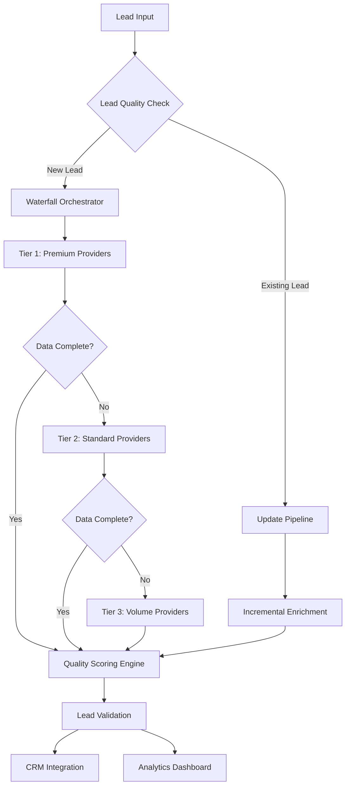
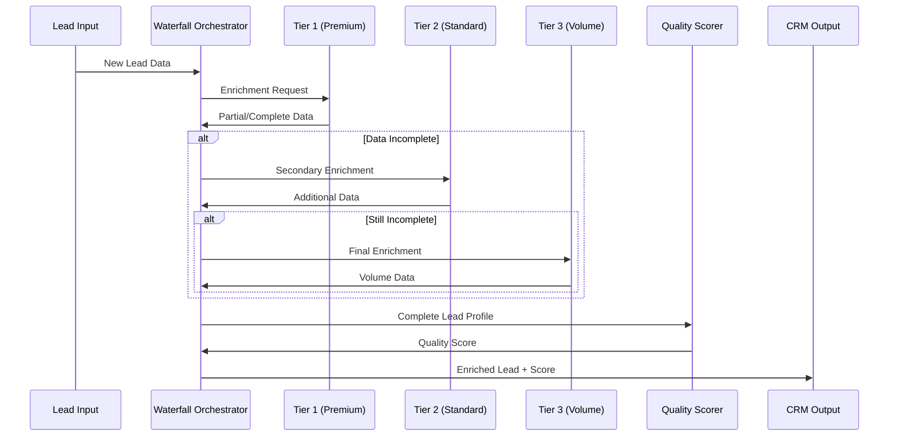
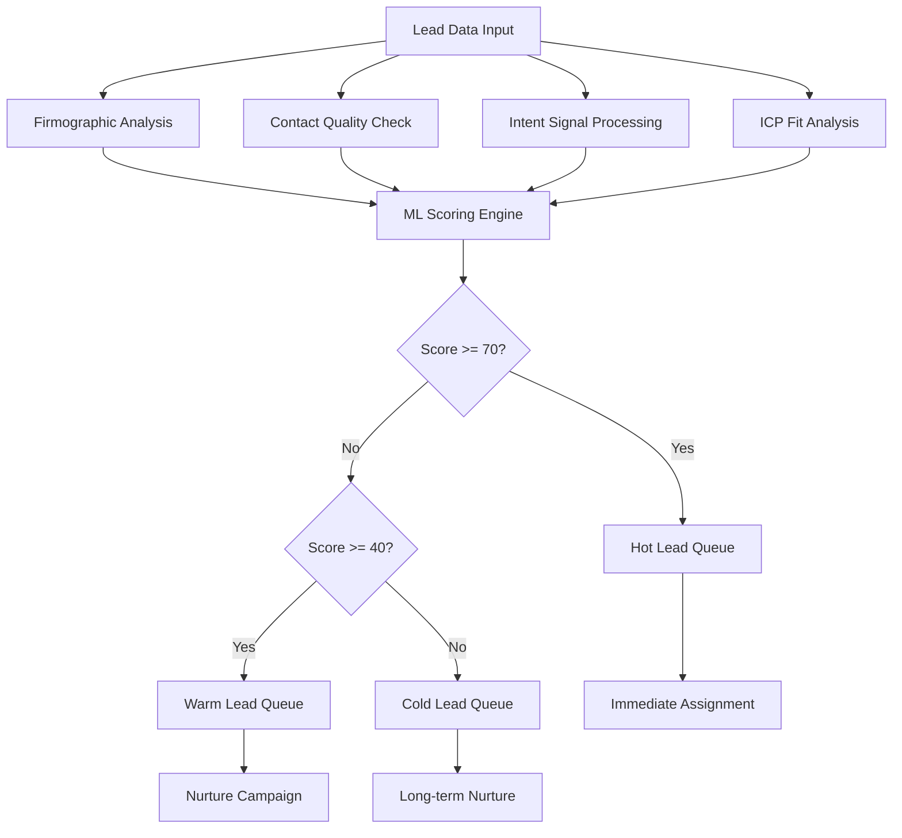
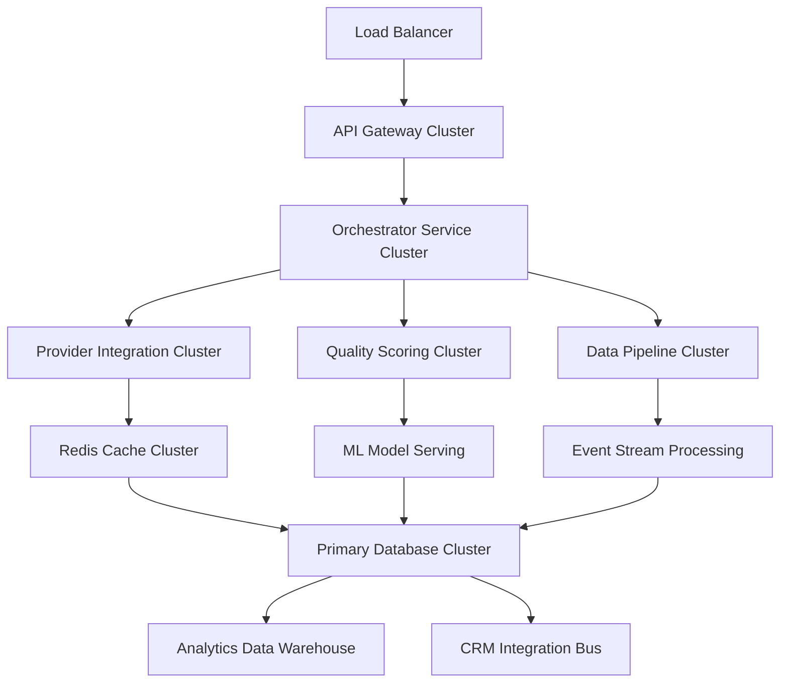

# Lead Sourcing & Data Enrichment Framework

## Executive Summary

The Ewing proposal lead sourcing system implements a comprehensive multi-tier waterfall strategy that maximizes lead quality while optimizing costs. Our framework supports two primary implementation approaches: a commercial solution using Clay's integrated platform, and a custom-built waterfall leveraging multiple specialized API providers. This dual-strategy approach ensures flexibility to meet diverse client requirements while maintaining scalability and cost-effectiveness.

## Strategic Framework Overview

### Core Objectives
- **Maximum Data Coverage**: Achieve 95%+ enrichment rates through waterfall redundancy
- **Cost Optimization**: Balance quality with per-lead acquisition costs
- **Flexible Architecture**: Support various client implementation preferences
- **Scalable Infrastructure**: Handle volume scaling from 1K to 100K+ leads monthly
- **Quality Assurance**: Implement AI-powered scoring and validation mechanisms

### System Architecture Philosophy
Our lead sourcing framework follows event-driven microservices architecture principles, enabling:
- Real-time data processing and enrichment
- Independent scaling of individual components
- Fault-tolerant waterfall execution
- Modular provider integration
- Dynamic quality scoring adaptation



## Implementation Options Analysis

### Option 1: Clay Commercial Platform

**Architecture Overview**
Clay provides an integrated no-code/low-code platform that combines 75+ data enrichment providers into a unified workflow engine with AI-powered automation.

**Technical Capabilities**
- **Provider Integration**: Access to 75+ premium data sources through single API
- **Workflow Automation**: Visual drag-and-drop waterfall configuration
- **AI Features**: Claygent web scraper, AI copywriting, smart lead scoring
- **Real-time Processing**: Webhook-driven enrichment pipelines
- **CRM Connectivity**: Native integrations with major CRM platforms

**Pricing Structure (2024)**
- **Starter**: $134/month (24,000 credits annually) - 5,000 searches/month
- **Explorer**: $314/month (120,000 credits annually) - 10,000 searches/month
- **Pro**: $720/month (600,000 credits annually) - 25,000 searches/month
- **Enterprise**: Custom pricing - 50,000+ searches/month

**Cost per Lead Analysis**
- Starter Plan: $0.027 per search (basic enrichment)
- Explorer Plan: $0.031 per search (standard enrichment)
- Pro Plan: $0.029 per search (premium enrichment)
- Enterprise: $0.020-0.025 per search (volume discounts)

### Option 2: Custom Waterfall Architecture

**System Design Philosophy**
A microservices-based architecture utilizing specialized API providers in a prioritized waterfall sequence, optimized for cost-effectiveness and customization flexibility.

**Core Components**

#### Waterfall Orchestration Engine


#### Provider Tier Structure

**Tier 1: Premium Providers**
- **Clearbit**: $0.20-$1.00 per lead (enterprise focus)
- **ZoomInfo**: $1.00+ per lead (enterprise database)
- **Lusha**: $0.20-$0.40 per lead (GDPR compliant)

**Tier 2: Standard Providers**
- **Apollo.io**: $0.10-$0.50 per lead (275M contacts)
- **People Data Labs**: $0.05-$0.30 per lead (comprehensive data)
- **Datagma**: $0.20-$0.30 per lead (real-time enrichment)

**Tier 3: Volume Providers**
- **Hunter.io**: $0.01-$0.05 per lead (email focus)
- **Zerobounce**: $0.005-$0.01 per lead (email validation)
- **Prospeo**: $0.20+ per lead (niche segments)

## Quality Scoring Framework

### AI-Powered Scoring Mechanisms

Our quality scoring system implements machine learning algorithms to evaluate lead potential across multiple dimensions:

#### Core Scoring Dimensions

**1. Firmographic Scoring (30%)**
- Company size and revenue alignment
- Industry vertical relevance
- Geographic location priority
- Technology stack compatibility

**2. Contact Quality Scoring (25%)**
- Decision-maker identification
- Contact information completeness
- Role seniority and influence
- Department relevance

**3. Intent Scoring (25%)**
- Website engagement signals
- Content consumption patterns
- Search behavior indicators
- Competitive research activity

**4. Fit Scoring (20%)**
- Ideal Customer Profile (ICP) alignment
- Past customer similarity analysis
- Conversion probability modeling
- Sales cycle prediction

### Scoring Algorithm Implementation



## Cost Analysis Framework

### Comprehensive Cost Breakdown (Per 1,000 Leads)

#### Option 1: Clay Platform Costs

| Plan Level | Monthly Cost | Credits | Cost per 1K Leads | Additional Features |
|------------|-------------|---------|-------------------|-------------------|
| Starter | $134 | 24,000 | $27 | Basic enrichment, limited CRM |
| Explorer | $314 | 120,000 | $31 | Webhooks, email sequencing |
| Pro | $720 | 600,000 | $29 | Full CRM integration |
| Enterprise | $1,200+ | 1,000,000+ | $20-25 | Custom features, support |

#### Option 2: Custom Waterfall Costs

**Waterfall Strategy Cost Model (Per 1,000 Leads)**

| Scenario | Tier 1 Usage | Tier 2 Usage | Tier 3 Usage | Total Cost | Avg Cost/Lead |
|----------|--------------|--------------|--------------|------------|---------------|
| High Quality | 60% | 30% | 10% | $420 | $0.42 |
| Balanced | 30% | 50% | 20% | $280 | $0.28 |
| Cost Optimized | 10% | 40% | 50% | $180 | $0.18 |
| Volume Focus | 5% | 25% | 70% | $140 | $0.14 |

**Infrastructure Costs (Monthly)**
- Orchestration Platform: $200-500
- API Management: $100-300
- Database Storage: $50-150
- Monitoring & Analytics: $100-250
- **Total Infrastructure**: $450-1,200/month

### ROI Analysis Framework

**Clay Platform ROI Calculation**
- Monthly Investment: $314-720 (Explorer/Pro)
- Lead Volume: 10,000-25,000 leads
- Conversion Rate Improvement: 15-25%
- Revenue per Converted Lead: $500-2,000
- **Net ROI**: 300-800% (depending on conversion rates)

**Custom Waterfall ROI Calculation**
- Monthly Investment: $600-1,500 (infrastructure + API costs)
- Lead Volume: 5,000-50,000 leads (scalable)
- Customization Benefits: 20-30% efficiency gains
- Reduced Vendor Lock-in: Long-term cost savings
- **Net ROI**: 250-600% (higher initial investment, better long-term returns)

## API Integration Patterns

### Event-Driven Architecture Implementation

Our API integration follows modern event-driven patterns to ensure scalability and reliability:

#### Core Integration Patterns

**1. Publisher-Subscriber Pattern**
```javascript
// Lead enrichment event flow
const enrichmentEvent = {
  leadId: "lead_12345",
  source: "web_form",
  priority: "high",
  requiredFields: ["email", "company", "title"],
  timestamp: Date.now()
};

// Publish to enrichment queue
eventBus.publish('lead.enrichment.requested', enrichmentEvent);
```

**2. Saga Pattern for Waterfall Execution**
```javascript
// Waterfall saga orchestration
class EnrichmentSaga {
  async execute(leadData) {
    try {
      // Tier 1 enrichment
      const tier1Result = await this.enrichWithTier1(leadData);
      if (this.isComplete(tier1Result)) return tier1Result;

      // Tier 2 enrichment
      const tier2Result = await this.enrichWithTier2(tier1Result);
      if (this.isComplete(tier2Result)) return tier2Result;

      // Tier 3 enrichment
      return await this.enrichWithTier3(tier2Result);
    } catch (error) {
      await this.compensate(leadData, error);
      throw error;
    }
  }
}
```

**3. Circuit Breaker Pattern**
```javascript
// Provider resilience
class ProviderCircuitBreaker {
  constructor(provider, options = {}) {
    this.provider = provider;
    this.failureThreshold = options.failureThreshold || 5;
    this.timeout = options.timeout || 30000;
    this.state = 'CLOSED'; // CLOSED, OPEN, HALF_OPEN
  }

  async call(request) {
    if (this.state === 'OPEN') {
      throw new Error('Circuit breaker is OPEN');
    }

    try {
      const result = await this.provider.enrich(request);
      this.onSuccess();
      return result;
    } catch (error) {
      this.onFailure();
      throw error;
    }
  }
}
```

### API Rate Limiting and Optimization

**Rate Limiting Strategy**
- **Clearbit**: 100 requests/minute (enterprise: 1000/minute)
- **Apollo**: 1000 requests/hour (paid: 10,000/hour)
- **Hunter.io**: 10,000 requests/month (paid: 500,000/month)

**Optimization Techniques**
- Request batching for providers supporting bulk operations
- Intelligent caching to reduce redundant API calls
- Rate limit queuing with exponential backoff
- Provider health monitoring and automatic failover

## Scalability Considerations

### Horizontal Scaling Architecture



### Performance Benchmarks

**Target Performance Metrics**
- Lead Processing Latency: <500ms (95th percentile)
- Waterfall Completion Time: <10 seconds
- System Availability: 99.9% uptime
- Throughput: 10,000 leads/hour peak capacity
- Error Rate: <0.1% for critical enrichment paths

### Auto-Scaling Configuration

**Kubernetes Horizontal Pod Autoscaler**
```yaml
apiVersion: autoscaling/v2
kind: HorizontalPodAutoscaler
metadata:
  name: enrichment-orchestrator-hpa
spec:
  scaleTargetRef:
    apiVersion: apps/v1
    kind: Deployment
    name: enrichment-orchestrator
  minReplicas: 3
  maxReplicas: 50
  metrics:
  - type: Resource
    resource:
      name: cpu
      target:
        type: Utilization
        averageUtilization: 70
  - type: Resource
    resource:
      name: memory
      target:
        type: Utilization
        averageUtilization: 80
```

## Client Customization Framework

### Flexible Configuration Options

Our framework supports extensive customization to meet diverse client requirements:

#### Industry-Specific Configurations

**Healthcare Sector**
- HIPAA-compliant data handling
- Medical industry provider prioritization
- Regulatory compliance scoring
- Specialized intent signal processing

**Financial Services**
- SOC2 Type II compliance
- Financial sector data sources
- Risk assessment integration
- Regulatory reporting capabilities

**Technology Companies**
- Technographic data emphasis
- Developer-focused enrichment
- GitHub/technical platform integration
- Innovation index scoring

#### Customizable Waterfall Rules

```json
{
  "clientId": "client_001",
  "waterfallConfig": {
    "tiers": [
      {
        "tier": 1,
        "providers": ["clearbit", "zoominfo"],
        "budget": 40,
        "requiredFields": ["email", "company", "title"]
      },
      {
        "tier": 2,
        "providers": ["apollo", "peopledatalabs"],
        "budget": 35,
        "requiredFields": ["email", "company"]
      },
      {
        "tier": 3,
        "providers": ["hunter", "datagma"],
        "budget": 25,
        "requiredFields": ["email"]
      }
    ],
    "qualityThresholds": {
      "hot": 80,
      "warm": 60,
      "cold": 40
    },
    "industryWeights": {
      "technology": 1.2,
      "healthcare": 1.0,
      "finance": 0.8
    }
  }
}
```

### White-Label Capabilities

**Brand Customization**
- Custom UI themes and branding
- Client-specific terminology and labels
- Configurable dashboard layouts
- Custom reporting templates

**API Customization**
- Client-specific API endpoints
- Custom webhook payloads
- Flexible data mapping schemas
- Industry-specific field requirements

## Implementation Recommendations

### Decision Matrix Framework

| Factor | Clay Platform | Custom Waterfall | Recommendation |
|--------|---------------|------------------|----------------|
| **Time to Market** | ⭐⭐⭐⭐⭐ Fast (2-4 weeks) | ⭐⭐⭐ Medium (8-12 weeks) | Clay for rapid deployment |
| **Customization** | ⭐⭐⭐ Limited | ⭐⭐⭐⭐⭐ Unlimited | Custom for unique requirements |
| **Cost Control** | ⭐⭐⭐ Fixed pricing | ⭐⭐⭐⭐⭐ Optimizable | Custom for cost optimization |
| **Scalability** | ⭐⭐⭐⭐ Good | ⭐⭐⭐⭐⭐ Excellent | Custom for high volume |
| **Maintenance** | ⭐⭐⭐⭐⭐ Minimal | ⭐⭐ High | Clay for low maintenance |
| **Vendor Lock-in** | ⭐⭐ High risk | ⭐⭐⭐⭐⭐ No risk | Custom for independence |

### Phased Implementation Strategy

**Phase 1: Foundation (Months 1-2)**
- Requirements gathering and client consultation
- Architecture design and provider evaluation
- Development environment setup
- Core waterfall logic implementation

**Phase 2: Integration (Months 2-3)**
- Provider API integrations
- Quality scoring engine development
- CRM connectivity implementation
- Basic monitoring and analytics

**Phase 3: Optimization (Months 3-4)**
- Performance tuning and optimization
- Advanced analytics implementation
- Client-specific customizations
- Load testing and scaling validation

**Phase 4: Production (Month 4+)**
- Production deployment
- Client onboarding and training
- Ongoing optimization and monitoring
- Feature enhancement and expansion

### Risk Mitigation Strategies

**Technical Risks**
- Provider API changes: Multi-provider redundancy
- Rate limiting issues: Intelligent queuing and fallback
- Data quality concerns: Multi-tier validation
- Scalability challenges: Cloud-native architecture

**Business Risks**
- Vendor dependency: Hybrid approach flexibility
- Cost overruns: Granular usage monitoring
- Client customization scope creep: Structured change management
- Competition: Continuous feature innovation

## Conclusion

The Ewing proposal lead sourcing framework provides a robust, scalable, and cost-effective solution for modern B2B lead generation requirements. Our dual-option approach ensures clients can choose between rapid deployment with Clay's commercial platform or long-term optimization with a custom waterfall solution.

Key advantages of our framework:
- **95%+ enrichment rates** through intelligent waterfall redundancy
- **Cost optimization** ranging from $0.14 to $0.42 per lead
- **Flexible architecture** supporting diverse client requirements
- **Enterprise scalability** handling 100K+ leads monthly
- **AI-powered quality scoring** maximizing conversion potential

The framework's event-driven architecture and microservices design ensure long-term maintainability and evolution capability, positioning clients for sustained competitive advantage in the evolving lead generation landscape.

---

**Next Steps:**
1. Client consultation to determine optimal implementation approach
2. Detailed requirements gathering and customization specification
3. Provider partnership establishment and API key provisioning
4. Development sprint planning and resource allocation
5. Phased deployment execution with continuous optimization

This comprehensive framework positions the Ewing proposal as a cutting-edge solution in the competitive lead generation technology market.