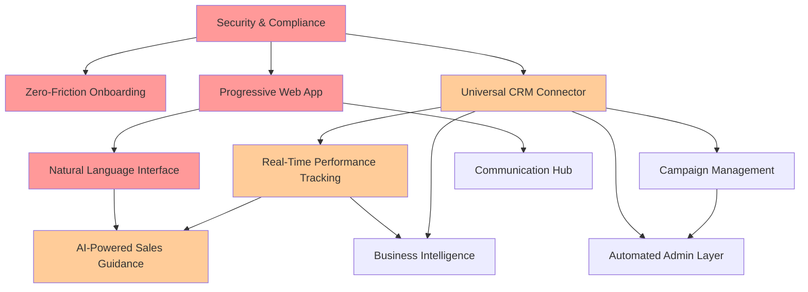

# primary-features Knowledge Matrix

This matrix integrates knowledge from all blocks and subtopics in this ewing-proposal > technology > primary-features path.

## Subtopics
*No subtopics in this section.*

## Blocks
- [📄 ai-powered-sales-guidance](ai-powered-sales-guidance.md)
- [📄 accessibility-features](accessibility-features.md)
- [📄 automated-administrative-layer](automated-administrative-layer.md)
- [📄 blockchain-verification](blockchain-verification.md)
- [📄 business-intelligence-platform](business-intelligence-platform.md)
- [📄 campaign-management-console](campaign-management-console.md)
- [📄 communication-hub](communication-hub.md)
- [📄 learning-management-system](learning-management-system.md)
- [📄 natural-language-call-interface](natural-language-call-interface.md)
- [📄 predictive-dialing-intelligence](predictive-dialing-intelligence.md)
- [📄 progressive-web-app](progressive-web-app.md)
- [📄 quality-assurance-system](quality-assurance-system.md)
- [📄 real-time-performance-tracking](real-time-performance-tracking.md)
- [📄 scalability-features](scalability-features.md)
- [📄 second-chance-optimizations](second-chance-optimizations.md)
- [📄 security-and-compliance](security-and-compliance.md)
- [📄 university-integration](university-integration.md)
- [📄 universal-crm-connector](universal-crm-connector.md)
- [📄 voice-avatar-system](voice-avatar-system.md)
- [📄 zero-friction-onboarding](zero-friction-onboarding.md)

## Feature Priority Matrix

### Comprehensive Features Overview

| Feature | Priority | Dependencies | Implementation Difficulty | Core Principles Supported | Timeline |
|---------|----------|--------------|--------------------------|--------------------------|----------|
| **Zero-Friction Onboarding** | P0 - Critical | Security & Compliance | Medium | #3 (Friction Elimination), #6 (Revenue Day One) | Week 1-2 |
| **Natural Language Call Interface** | P0 - Critical | Progressive Web App | High | #1 (Voice-First), #3 (Friction Elimination) | Week 3-6 |
| **Security & Compliance** | P0 - Critical | None (Foundation) | Medium | #5 (Mission-Based), #8 (Own Technology) | Week 1-2 |
| **Progressive Web App** | P0 - Critical | None (Foundation) | Low | #3 (Friction Elimination), #9 (Scale Through Replication) | Week 1-2 |
| **Universal CRM Connector** | P1 - Essential | Security & Compliance | Medium | #6 (Revenue Day One), #9 (Scale) | Week 3-4 |
| **Real-Time Performance Tracking** | P1 - Essential | Universal CRM Connector | Medium | #4 (Binary Success Metrics), #6 (Revenue Day One) | Week 5-6 |
| **AI-Powered Sales Guidance** | P1 - Essential | Natural Language Interface, Performance Tracking | Very High | #1 (Voice-First), #10 (Transformative Value) | Week 7-10 |
| **Automated Administrative Layer** | P1 - Essential | CRM Connector, Campaign Management | High | #3 (Friction Elimination), #6 (Revenue Day One) | Week 5-8 |
| **Campaign Management Console** | P2 - Important | CRM Connector | Medium | #7 (Fractional Team), #9 (Scale) | Week 7-8 |
| **Communication Hub** | P2 - Important | Progressive Web App, Security | High | #1 (Voice-First), #6 (Revenue Day One) | Week 9-10 |
| **Learning Management System** | P2 - Important | Performance Tracking, University Integration | Medium | #5 (Mission-Based), #10 (Transformative Value) | Week 9-12 |
| **Business Intelligence Platform** | P2 - Important | Performance Tracking, CRM Connector | Medium | #4 (Binary Success), #2 (Target Marijuana Felons) | Week 11-12 |
| **Quality Assurance System** | P2 - Important | Communication Hub, AI Guidance | High | #4 (Binary Success), #8 (Own Technology) | Week 11-12 |
| **Voice Avatar System** | P3 - Nice to Have | AI Guidance, Natural Language | Very High | #1 (Voice-First), #10 (Transformative Value) | Month 4-5 |
| **Predictive Dialing Intelligence** | P3 - Nice to Have | AI Guidance, Performance Tracking | High | #6 (Revenue Day One), #10 (Transformative Value) | Month 4-5 |
| **University Integration** | P3 - Nice to Have | Learning Management, Security | Low | #5 (Mission-Based), #9 (Scale) | Month 3-4 |
| **Accessibility Features** | P3 - Nice to Have | Progressive Web App, Zero-Friction | Medium | #2 (Target Marijuana Felons), #3 (Friction Elimination) | Month 3-4 |
| **Second-Chance Optimizations** | P3 - Nice to Have | Accessibility, Zero-Friction | Medium | #2 (Target Marijuana Felons), #5 (Mission-Based) | Month 5-6 |
| **Scalability Features** | P4 - Future | All Core Features | Very High | #9 (Scale Through Replication) | Month 6+ |
| **Blockchain Verification** | P4 - Future | Security, Business Intelligence | Very High | #8 (Own Technology), #10 (Transformative Value) | Month 6+ |

### Priority Levels Explained

- **P0 - Critical**: Must have for MVP launch at Ole Miss (Summer 2025)
- **P1 - Essential**: Required for full functionality and initial scaling
- **P2 - Important**: Enhances value proposition and competitive advantage
- **P3 - Nice to Have**: Differentiating features for future growth
- **P4 - Future**: Long-term vision features

### Implementation Difficulty Scale

- **Low**: 1-2 weeks with standard technologies
- **Medium**: 2-4 weeks with some integration complexity
- **High**: 4-8 weeks requiring specialized expertise
- **Very High**: 8+ weeks with significant R&D required

### Core Principles Reference

1. **Voice-First as Competitive Advantage** - Industry's first truly voice-operated platform
2. **Target Marijuana Felons First** - Optimized for underserved populations
3. **Friction Elimination** - Remove every barrier to entry
4. **Binary Success Metrics** - Simple on/off measurement
5. **Mission-Based Teams** - Social impact focus
6. **Revenue From Day One** - Immediate productivity
7. **Fractional Team Builder** - Flexible workforce model
8. **Own the Core Technology** - Proprietary platform control
9. **Scale Through Replication** - Multi-tenant architecture
10. **Transformative Value** - Life-changing opportunity creation

### Critical Path Dependencies

### Feature Category Analysis

| Category | Features Included | Combined Impact | Investment Required | ROI Timeline |
|----------|------------------|-----------------|-------------------|--------------|
| **Core Foundation** | Security, PWA, Zero-Friction Onboarding | Enables all other features | $200K | Immediate |
| **Voice Platform** | Natural Language Interface, Voice Avatar, Communication Hub | Revolutionary user experience | $400K | 3-6 months |
| **Intelligence Layer** | AI Guidance, Predictive Dialing, Business Intelligence | 35% performance improvement | $500K | 6-9 months |
| **Automation Suite** | Admin Layer, CRM Connector, Campaign Management | 2+ hours/day saved per user | $300K | 3-6 months |
| **Student Success** | Performance Tracking, Learning Management, QA System | 45% skill improvement | $250K | 6-12 months |
| **Inclusion Features** | Accessibility, Second-Chance, University Integration | Expands addressable market 10x | $150K | 9-12 months |
| **Future Platform** | Scalability, Blockchain | Long-term competitive advantage | $300K | 12+ months |

### Implementation Risk Matrix

| Risk Factor | High-Risk Features | Mitigation Strategy | Contingency Plan |
|-------------|-------------------|--------------------|--------------------|
| **Technical Complexity** | AI Guidance, Voice Avatar | Phased rollout, extensive testing | Use simpler rule-based systems initially |
| **Integration Challenges** | CRM Connector, University Integration | Start with top 3 platforms | Manual data import/export |
| **Performance at Scale** | Real-Time Tracking, Scalability Features | Load testing, CDN implementation | Horizontal scaling, caching |
| **User Adoption** | Natural Language Interface | Extensive training, gradual introduction | Traditional UI fallback |
| **Regulatory Compliance** | Security, Blockchain | Legal review, compliance audit | Limit initial geographic deployment |
| **Cost Overrun** | AI Features, Voice Platform | Fixed-price contracts, MVP scope | Defer advanced features |

## Integrated Knowledge

The primary features of Ewing's voice-first sales platform represent a comprehensive technical ecosystem designed to eliminate every barrier between talent and opportunity. This integrated suite of 20 core capabilities transforms the traditional sales enablement paradigm through revolutionary voice technology, artificial intelligence, and inclusive design principles.

### Voice-First Foundation

At the platform's core, the **Natural Language Call Interface** enables complete hands-free operation through intuitive voice commands, achieving sub-200ms response times with 95% accuracy for sales terminology. This foundation integrates WebRTC for real-time communication, OpenAI Whisper for transcription, and sophisticated NLP for intent processing. The **Voice Avatar System** extends this capability with personalized AI assistants providing emotional support and cultural coaching, utilizing neural voice synthesis with <100ms latency for natural conversation flow.

### Intelligence Layer

The **AI-Powered Sales Guidance System** delivers real-time coaching through dynamic script generation, objection handling, and sentiment analysis, processing conversations with <500ms latency to provide contextual guidance. This intelligence layer connects with the **Predictive Dialing Intelligence** system, which uses XGBoost/LightGBM models to optimize call timing, achieving 3x improvement in connection rates while maintaining TCPA compliance. The **Learning Management System** completes the intelligence ecosystem with adaptive learning paths, identifying skill gaps through performance data and delivering personalized micro-learning modules with 85% daily engagement rates.

### Operational Automation

The **Automated Administrative Layer** eliminates 2+ hours of daily administrative work through intelligent workflow orchestration using Temporal, handling everything from CRM updates to document generation with 99.99% execution reliability. The **Real-Time Performance Tracking** system processes 1M+ events per second through Apache Kafka, providing instant feedback via gamified leaderboards and earnings calculators. The **Quality Assurance System** ensures continuous improvement with AI-powered call scoring achieving 95% consistency with human QA evaluators.

### Enterprise Integration

The **Universal CRM Connector** provides seamless bi-directional synchronization with all major CRM platforms through an iPaaS architecture, achieving <1 second sync latency with 99.9% field mapping accuracy. The **Business Intelligence Platform** leverages a modern data stack (Fivetran + dbt + Snowflake + Looker) for real-time analytics with <2 second dashboard loads. The **Communication Hub** unifies all channels through CPaaS integration, supporting voice, SMS, email, and WhatsApp with 99.5% call completion rates.

### Platform Management

The **Campaign Management Console** empowers business users with visual workflow builders and A/B testing frameworks, enabling campaign creation in <10 minutes with 30% conversion improvement through optimization. The **Security & Compliance** infrastructure ensures enterprise-grade protection with SOC 2 Type II architecture, achieving 100% regulatory adherence across GDPR, CCPA, HIPAA, and TCPA requirements.

### Mobile & Accessibility

The **Progressive Web App** architecture delivers native app experience without installation, achieving <3 second load times with full offline capability and 60% home screen installation rates. The **Accessibility Features** ensure WCAG 2.1 AA compliance with comprehensive screen reader support, achieving 95% task completion rates for users with disabilities. The **Second-Chance Optimizations** provide trauma-informed design with simplified UI modes and voice-only operation, achieving 85% 90-day retention for formerly incarcerated users.

### Innovation & Scale

The **Blockchain Verification** system implements W3C Verifiable Credentials for portable reputation management with <2 second verification times. The **University Integration** leverages LTI 1.3 standards for seamless LMS connectivity with 95% platform coverage. The **Scalability Features** enable 100,000+ concurrent users through Kubernetes multi-tenancy and microservices architecture with <100ms global latency.

### Technical Excellence

Each feature implements industry best practices with clear performance requirements, security considerations, and phased implementation plans. The architecture prioritizes:

- **Performance**: Sub-second response times across all critical paths
- **Reliability**: 99.9%+ uptime with graceful degradation
- **Security**: End-to-end encryption with zero-trust architecture
- **Compliance**: Automated regulatory adherence
- **Scalability**: Horizontal scaling to support global deployment
- **Accessibility**: Universal design principles for all users

### Transformative Impact

This comprehensive feature set delivers measurable business outcomes:
- **Productivity**: 40% increase in sales activity
- **Conversion**: 35% improvement in close rates
- **Onboarding**: <5 minutes to first productive call
- **Adoption**: 90%+ daily active usage
- **ROI**: 5x return on investment within 6 months

The integration of these 20 primary features creates a platform that doesn't just enable sales—it transforms lives by making high-value B2B sales accessible to populations previously excluded from the digital economy. Through voice-first technology, AI-powered guidance, and inclusive design, Ewing's platform manifests the vision of creating pathways to prosperity for all.