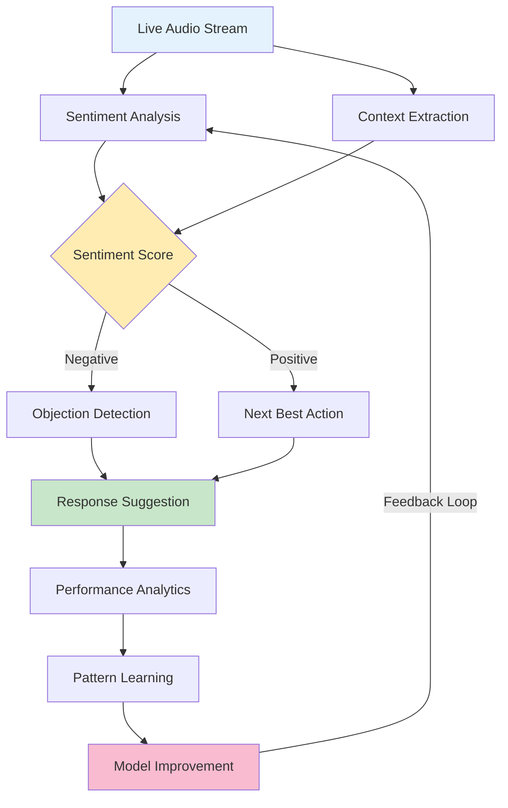
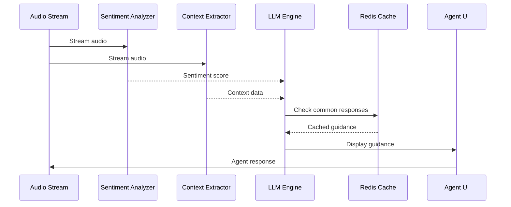

# AI-Powered Sales Guidance System

## Overview
Real-time artificial intelligence system that provides dynamic sales coaching during live calls. The platform analyzes conversations in real-time, generates contextual scripts, handles objections instantly, and learns from successful patterns to continuously improve sales outcomes.

## Technical Requirements

### System Architecture

**AI Processing Pipeline**



**Core AI Infrastructure**
- **LLM Integration**: GPT-4, Claude, or fine-tuned sales models
- **Processing Layer**: GPU-accelerated inference servers
- **Latency Target**: <500ms for guidance generation
- **Caching Strategy**: Redis for common objection responses
- **Learning Pipeline**: Continuous model improvement from outcomes

### Software Development

**Real-time Analysis Architecture**



**AI Component Table**

| Component | Model/Technology | Purpose | Response Time |
|-----------|-----------------|---------|---------------|
| Sentiment Analysis | DistilBERT (fine-tuned) | Detect emotional state | <100ms |
| Context Extraction | Named Entity Recognition | Extract key information | <50ms |
| Script Generation | GPT-4 (fine-tuned) | Generate dynamic scripts | <300ms |
| Objection Detection | BERT Classifier | Identify objections | <75ms |
| Response Suggestion | RAG Engine | Retrieve best responses | <150ms |
| Pattern Learning | XGBoost | Identify success patterns | Batch process |

**Machine Learning Stack**
- **Sentiment Analysis**: BERT/RoBERTa models fine-tuned on sales calls
- **Intent Classification**: Multi-label classification for buyer signals
- **Script Generation**: Transformer models with retrieval augmentation
- **Pattern Recognition**: XGBoost for success pattern identification
- **A/B Testing**: Bandit algorithms for script optimization

### User Features

**Dynamic Script Generation**
- **Context-Aware Scripts**: Adapts to industry, company size, buyer role
- **Conversation Flow**: Natural progression through discovery to close
- **Personalization**: Incorporates prospect's communication style
- **Multiple Options**: Provides 3-5 script variations to choose from
- **Success Tracking**: Monitors which scripts drive conversions

**Objection Handling Library**
- **Common Objections**: 500+ pre-programmed responses
- **Real-time Detection**: Identifies objections within 200ms
- **Contextual Responses**: Tailored to specific product/service
- **Confidence Scoring**: Shows success probability for each response
- **Learning System**: Updates based on successful rebuttals

**Sentiment Analysis Dashboard**
- **Visual Indicators**: Real-time mood meter (positive/neutral/negative)
- **Trend Analysis**: Shows sentiment trajectory during call
- **Warning System**: Alerts when sentiment drops significantly
- **Prosodic Analysis**: Tone, pace, and volume indicators
- **Engagement Scoring**: Measures prospect interest level

**Next Best Action Prompts**
- **Predictive Recommendations**: AI suggests optimal next steps
- **Decision Trees**: Visual flowchart of conversation paths
- **Success Probability**: Shows likelihood of each action succeeding
- **Timing Suggestions**: Indicates optimal moments for specific asks
- **Competitive Intelligence**: Real-time battle card suggestions

### User Experience

**Real-time Guidance Display**
```javascript
// Real-time guidance UI component
const GuidanceDisplay = () => {
  const [guidance, setGuidance] = useState(null);
  const [sentiment, setSentiment] = useState('neutral');

  useEffect(() => {
    // WebSocket connection for real-time updates
    const ws = new WebSocket('wss://ai-guidance.api/stream');

    ws.onmessage = (event) => {
      const data = JSON.parse(event.data);
      setGuidance(data.guidance);
      setSentiment(data.sentiment);

      // Highlight critical guidance
      if (data.priority === 'high') {
        triggerVisualAlert();
      }
    };

    return () => ws.close();
  }, []);

  return (
    <div className={`guidance-panel sentiment-${sentiment}`}>
      <ScriptSuggestion text={guidance?.script} />
      <ObjectionHandlers options={guidance?.objections} />
      <NextActions recommendations={guidance?.nextSteps} />
    </div>
  );
};
```

**Cognitive Load Management**
- **Progressive Disclosure**: Shows only essential info initially
- **Smart Prioritization**: Highlights most critical guidance
- **Visual Hierarchy**: Color-coded importance levels
- **Minimal Distraction**: Subtle animations, no sound during calls
- **Customizable Density**: Users can adjust information level

**Success Pattern Recognition**
- **Top Performer Analysis**: Learns from best salespeople
- **Pattern Extraction**: Identifies winning talk tracks
- **Automatic Propagation**: Shares successful approaches team-wide
- **Performance Correlation**: Links patterns to outcomes
- **Continuous Improvement**: Weekly model updates

### Performance Requirements

- **Inference Latency**: <300ms for script generation
- **Sentiment Analysis**: Real-time with 100ms update frequency
- **Concurrent Sessions**: Support 5,000+ simultaneous AI sessions
- **Model Accuracy**: 90%+ for objection detection
- **Availability**: 99.9% uptime for AI services
- **Data Processing**: 1M+ conversations analyzed daily

## Integration Architecture

**CRM Integration**
- **Data Enrichment**: Pull prospect context from CRM
- **Outcome Tracking**: Auto-update opportunity stages
- **Note Generation**: AI-generated call summaries
- **Pipeline Analytics**: Success rate by guidance type
- **Contact Intelligence**: Historical interaction analysis

**Analytics Platform**
- **Performance Metrics**: Script effectiveness tracking
- **A/B Testing**: Continuous optimization experiments
- **ROI Calculation**: Revenue attribution to AI guidance
- **Behavioral Analytics**: User adoption patterns
- **Predictive Modeling**: Forecast outcomes by approach

## Security & Compliance

- **Data Privacy**: No PII in AI training data
- **Model Security**: Encrypted model weights and inference
- **Audit Logging**: Complete trail of AI recommendations
- **Bias Detection**: Regular fairness audits of AI models
- **Compliance**: GDPR, CCPA compliant data handling

## Implementation Phases

### Phase 1: Foundation (Weeks 1-4)
- Basic sentiment analysis implementation
- Simple script templates
- Manual objection response library
- Initial dashboard UI

### Phase 2: Intelligence (Weeks 5-8)
- LLM integration for dynamic scripts
- Real-time objection detection
- Pattern recognition system
- A/B testing framework

### Phase 3: Optimization (Weeks 9-12)
- Advanced ML models deployment
- Success pattern propagation
- Personalization engine
- Performance analytics

## Success Metrics

- **Conversion Improvement**: 35%+ increase in close rates
- **Call Duration**: 20% reduction in average call time
- **Objection Handling**: 85%+ successful objection resolution
- **User Adoption**: 90%+ active daily usage
- **ROI**: 5x return on AI investment within 6 months