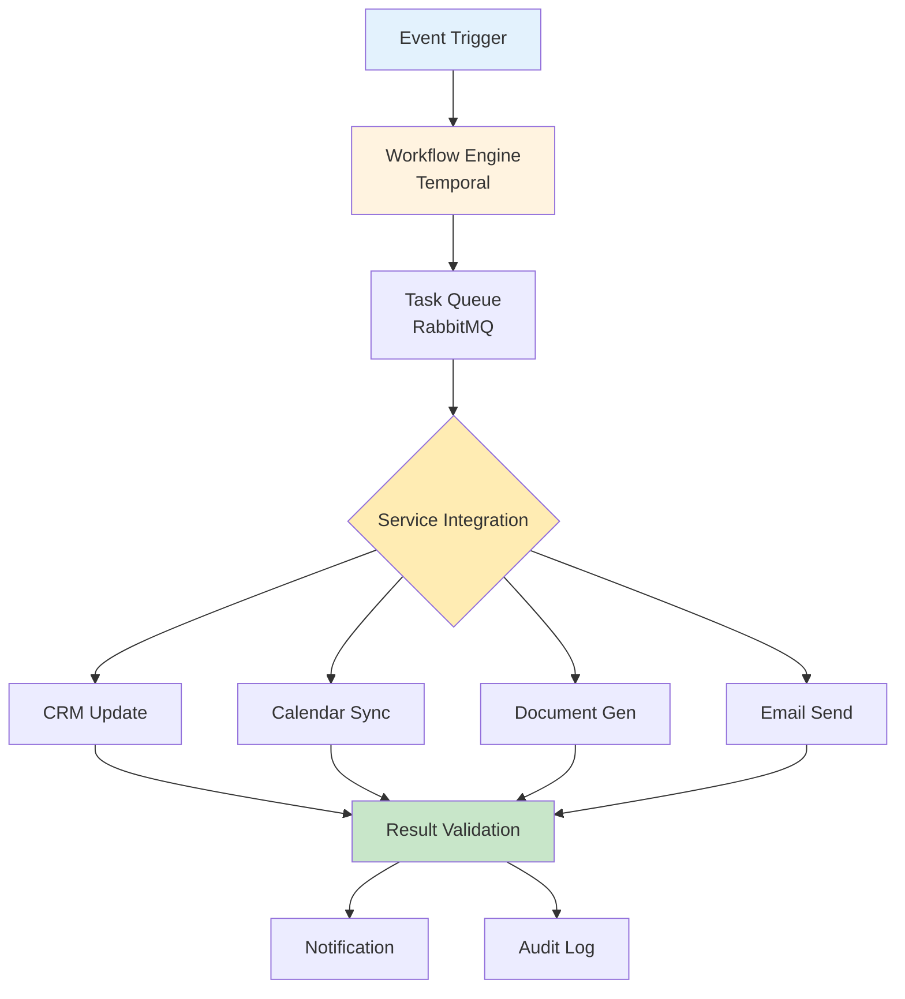

# Automated Administrative Layer

## Overview
Intelligent automation system that eliminates manual administrative tasks, enabling sales representatives to focus entirely on selling. Handles call routing, CRM updates, calendar management, document generation, and compliance automatically.

## Technical Requirements

### System Architecture

**Workflow Orchestration Pipeline**



**Core Infrastructure**
- **Workflow Engine**: Temporal for durable workflow execution
- **Message Queue**: RabbitMQ for task distribution
- **Integration Platform**: Apache Camel for system connectivity
- **Document Engine**: Puppeteer for PDF generation
- **Email Service**: SendGrid for automated communications

### Software Development

**Workflow Automation Framework**
```typescript
class AutomationEngine {
  constructor(private temporal: TemporalClient) {}

  async processCallCompletion(callData: CallData) {
    // Parallel automation tasks
    const workflows = [
      this.temporal.start('updateCRM', callData),
      this.temporal.start('scheduleFollowUp', callData),
      this.temporal.start('generateDocument', callData),
      this.temporal.start('sendEmail', callData),
      this.temporal.start('updateCompliance', callData)
    ];

    await Promise.all(workflows);

    // Smart routing for next call
    const nextProspect = await this.intelligentRouting(callData.userId);
    return this.temporal.start('initiateCall', nextProspect);
  }

  async intelligentRouting(userId: string): Promise<Prospect> {
    const userProfile = await this.getUserProfile(userId);
    const availableProspects = await this.getProspectPool();

    // ML-based matching
    return this.mlModel.matchProspect(userProfile, availableProspects);
  }
}
```

### User Features

**Smart Call Routing**
- **Skill-Based Assignment**: Match prospects to rep expertise
- **Performance-Based Distribution**: High-value leads to top performers
- **Time-Zone Optimization**: Route calls at optimal contact times
- **Industry Specialization**: Domain expertise matching
- **Language Matching**: Connect with native speakers

**Automatic CRM Synchronization**
- **Real-Time Updates**: Sub-second CRM field updates
- **Bi-Directional Sync**: Changes flow both directions
- **Conflict Resolution**: Intelligent merge strategies
- **Field Mapping**: Flexible schema transformation
- **Bulk Operations**: Efficient batch processing

**Intelligent Calendar Management**
```javascript
class CalendarAutomation {
  async scheduleFollowUp(callData, prospectPreferences) {
    // Find optimal meeting time
    const availability = await this.findMutualAvailability(
      callData.repCalendar,
      prospectPreferences.preferredTimes
    );

    // Create calendar event
    const meeting = {
      title: `Follow-up with ${callData.prospectName}`,
      startTime: availability.bestSlot,
      duration: 30,
      attendees: [callData.repEmail, callData.prospectEmail],
      meetingLink: await this.createVideoLink()
    };

    // Send invitations
    await this.calendarService.createEvent(meeting);
    await this.emailService.sendInvite(meeting);
  }
}
```

**Document Generation**
- **Proposal Creation**: Auto-populate from CRM data
- **Contract Generation**: Templates with dynamic fields
- **Quote Builder**: Real-time pricing calculations
- **Report Generation**: Call summaries and analytics
- **E-Signature Integration**: DocuSign/HelloSign automation

**Email Follow-Up Automation**
- **Sequence Triggers**: Based on call outcomes
- **Personalization**: Dynamic content insertion
- **A/B Testing**: Optimize subject lines and content
- **Engagement Tracking**: Open rates and click tracking
- **Unsubscribe Management**: Automatic preference handling

**Compliance Recording**
- **Consent Collection**: Automated opt-in verification
- **Call Recording**: Secure storage with encryption
- **Retention Policies**: Automatic deletion schedules
- **Access Controls**: Role-based playback permissions
- **Audit Trail**: Complete chain of custody

### User Experience

**Zero-Touch Operations**
- **Background Processing**: All automation invisible to user
- **Smart Defaults**: Intelligent assumptions reduce configuration
- **Exception Handling**: Only surface when human input needed
- **Rollback Capability**: Undo automated actions if needed
- **Transparency**: Clear logs of all automated actions

**Integration Dashboard**
```typescript
const AutomationDashboard = () => {
  const [automations, setAutomations] = useState<Automation[]>();
  const [health, setHealth] = useState<SystemHealth>();

  return (
    <Dashboard>
      <AutomationStatus>
        <ActiveWorkflows count={automations?.active} />
        <CompletedToday count={automations?.completed} />
        <ErrorRate percentage={health?.errorRate} />
      </AutomationStatus>

      <IntegrationHealth>
        {health?.integrations.map(integration => (
          <IntegrationCard
            key={integration.name}
            status={integration.status}
            lastSync={integration.lastSync}
            recordsProcessed={integration.recordsProcessed}
          />
        ))}
      </IntegrationHealth>
    </Dashboard>
  );
};
```

### Performance Requirements

- **Processing Speed**: <500ms per automation task
- **Throughput**: 100K+ automated workflows/hour
- **Reliability**: 99.99% successful execution rate
- **Concurrency**: 10,000+ parallel workflows
- **Data Consistency**: ACID compliance for all operations
- **Recovery Time**: <30 seconds for failed workflow retry

## Integration Architecture

**CRM Connectors**
- **Salesforce**: Native API with bulk operations
- **HubSpot**: Webhook-based real-time sync
- **Pipedrive**: REST API with rate limiting
- **Microsoft Dynamics**: Graph API integration
- **Custom CRMs**: Configurable webhook/API adapters

**Calendar Systems**
- **Google Calendar**: OAuth 2.0 integration
- **Outlook/Exchange**: Microsoft Graph API
- **CalDAV**: Standard calendar protocol support
- **Calendly**: Automated scheduling links
- **Zoom**: Direct meeting creation

## Security & Compliance

- **Data Encryption**: AES-256 for all automated data
- **Access Control**: Service accounts with minimal permissions
- **Compliance Validation**: TCPA, GDPR checks before actions
- **Error Handling**: Graceful failures with notifications
- **Audit Logging**: Complete trail of all automations

## Implementation Phases

### Phase 1: Basic Automation (Week 1-2)
- CRM field updates
- Simple email templates
- Basic calendar booking
- Manual workflow triggers

### Phase 2: Intelligent Routing (Week 3-4)
- ML-based call assignment
- Automated document generation
- Sequence automation
- Compliance recording

### Phase 3: Full Orchestration (Week 5-6)
- Complex workflow chains
- Predictive automation
- Custom integrations
- Advanced analytics

## Success Metrics

- **Time Savings**: 2+ hours/day per rep on admin tasks
- **Data Accuracy**: 99.5%+ CRM data quality
- **Compliance Rate**: 100% consent documentation
- **User Adoption**: 95%+ using automation features
- **ROI**: 300% return from productivity gains