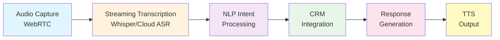
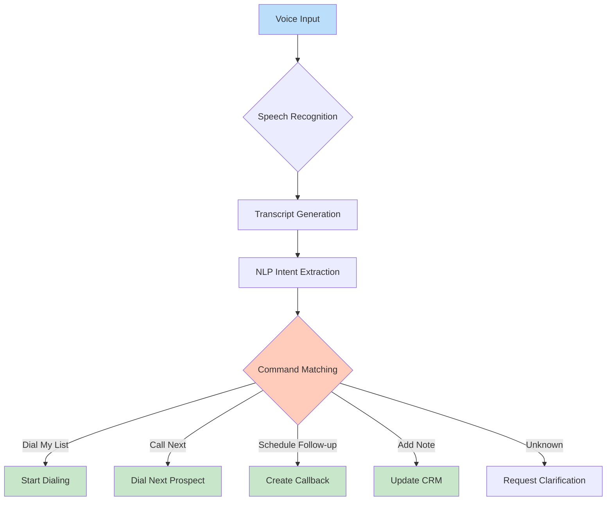

# Natural Language Call Interface

## Overview
Voice-operated sales platform enabling complete hands-free operation through natural language commands. Users simply speak "Dial my list" to begin productive calling, transforming complex CRM operations into intuitive voice interactions that eliminate computer literacy barriers.

## Technical Requirements

### System Architecture

**Core Voice Processing Pipeline**

**WebRTC Real-time Communication**
- **Framework**: WebRTC with Opus codec for high-quality audio (48kHz sampling)
- **Infrastructure**: Cloudflare Realtime SFU for WebSocket streaming
- **Latency Target**: Sub-200ms audio capture and transmission
- **Browser Support**: Chrome 90+, Edge 90+, Firefox 88+, Safari 14.1+
- **Fallback**: Native telephony through Salesfinity partnership

**Streaming Transcription Architecture**
- **Primary**: OpenAI Whisper with 680K hours multilingual training
- **Alternatives**: Google Cloud Speech-to-Text (100ms latency), Amazon Transcribe
- **Optimization**: WhisperX for 4x speed improvements
- **Accuracy Target**: 95%+ for sales terminology, 99%+ for common phrases
- **Real-time Processing**: WebSocket streaming with incremental results

### Software Development

**Voice Command Architecture**

**System Components Table**

| Component | Technology | Purpose | Latency Target |
|-----------|------------|---------|----------------|
| Audio Capture | WebRTC MediaStream API | High-quality audio input | <50ms |
| Speech Recognition | Web Speech API / Whisper | Convert speech to text | <200ms |
| Intent Processing | BERT/NLP Models | Extract user commands | <100ms |
| Command Execution | Event-driven handlers | Execute voice actions | <50ms |
| Response Generation | Template/AI engines | Create voice responses | <300ms |
| Text-to-Speech | Web Speech Synthesis | Voice output | <150ms |

**Backend Services**
- **Node.js/NestJS**: Microservices architecture for voice processing
- **Apache Kafka**: Event streaming for real-time command processing
- **Redis**: Session management and command caching
- **PostgreSQL**: Command history and analytics storage

### User Features

**Voice Commands**
- **Call Control**: "Dial my list", "Call next", "End call", "Hold", "Transfer"
- **CRM Updates**: "Add note: interested in Q2", "Set callback Tuesday 2pm"
- **Navigation**: "Show dashboard", "Open contacts", "Search for John Smith"
- **Script Management**: "Show objection handlers", "Next talking point"
- **Administrative**: "Log my hours", "Show commission", "Request break"

**Multilingual Support**
- **Launch Languages**: English, Spanish (95%+ accuracy)
- **Planned Expansion**: French, Portuguese, Mandarin
- **Auto-Detection**: Automatic language switching mid-conversation
- **Regional Variants**: US, UK, Australian English; Mexican, Spain Spanish

**Voice Biometric Authentication**
- **Technology**: Speaker recognition using voice embeddings
- **Enrollment**: 30-second voice sample during onboarding
- **Security**: Liveness detection to prevent recording attacks
- **Fallback**: PIN or face recognition if voice fails
- **Privacy**: Biometric templates encrypted, never leave device

### User Experience

**Ambient Noise Cancellation**
- **Client-side**: WebRTC native echo cancellation and AGC
- **Server-side**: RNNoise neural network noise suppression
- **Environmental Adaptation**: Auto-adjust for office, home, outdoor
- **Quality Monitoring**: Real-time audio quality indicators
- **Fallback**: Manual noise gate controls

**Response Time Optimization**
- **Voice Activity Detection**: 50ms voice onset detection
- **Streaming Recognition**: Begin processing before utterance ends
- **Predictive Caching**: Pre-load likely next commands
- **Edge Processing**: Local command recognition for common phrases
- **Target Latency**: <500ms total response time

**Error Handling**
- **Misrecognition Recovery**: "Did you mean..." suggestions
- **Confirmation Dialogs**: Critical actions require voice confirmation
- **Undo Capability**: Voice-activated undo for recent actions
- **Help System**: "What can I say?" voice-activated help
- **Graceful Degradation**: Fall back to touch/type when voice fails

## Performance Requirements

- **Concurrent Users**: 10,000+ simultaneous voice sessions
- **Recognition Accuracy**: 95%+ for domain-specific vocabulary
- **Response Time**: <200ms for command recognition
- **Audio Quality**: 16kHz minimum, 48kHz optimal
- **Network Bandwidth**: 64kbps per active voice session
- **Uptime Target**: 99.95% availability

## Security & Compliance

- **Voice Data Encryption**: End-to-end encryption for all audio
- **GDPR Compliance**: Voice recordings deletable on request
- **HIPAA Ready**: Healthcare-safe voice processing option
- **Consent Management**: Explicit consent for voice recording
- **Audit Trail**: Complete log of voice commands and actions

## Integration Points

- **CRM Systems**: Salesforce, HubSpot, Pipedrive voice commands
- **Calendar**: Google, Outlook calendar voice integration
- **Email**: Voice-to-email composition and sending
- **Analytics**: Voice command usage tracking and optimization
- **Training**: Voice command tutorial and practice mode

## Implementation Phases

### Phase 1: Foundation (Weeks 1-4)
- WebRTC infrastructure setup
- Basic ASR integration (Whisper)
- Simple command recognition (10 commands)
- Voice activity detection

### Phase 2: Enhancement (Weeks 5-8)
- NLP intent processing
- CRM command integration
- Multilingual support (Spanish)
- Noise cancellation implementation

### Phase 3: Scale (Weeks 9-12)
- Voice biometric authentication
- Advanced command library (50+ commands)
- Performance optimization
- Enterprise security features

## Success Metrics

- **Adoption Rate**: 80%+ users preferring voice over traditional UI
- **Accuracy**: 95%+ command recognition accuracy
- **Speed**: 3x faster task completion vs. manual entry
- **Satisfaction**: 4.5+ star user rating for voice interface
- **ROI**: 40% productivity increase from voice automation