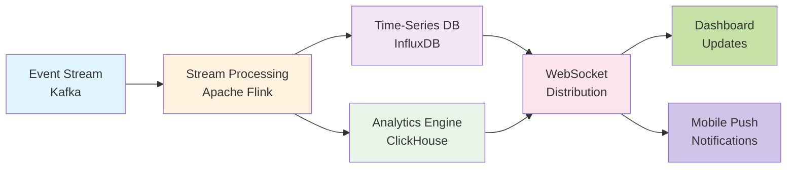
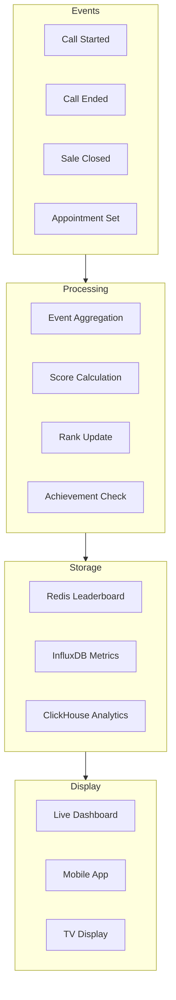

# Real-Time Performance Tracking

## Table of Contents
- [Technical Requirements](#technical-requirements)
  - [System Architecture](#system-architecture)
  - [Software Development](#software-development)
  - [User Features](#user-features)
  - [User Experience](#user-experience)
  - [Performance Requirements](#performance-requirements)
- [Analytics & Insights](#analytics--insights)
- [Implementation Phases](#implementation-phases)
  - [Phase 1: Core Metrics (Week 1-2)](#phase-1:-core-metrics-week-1-2)
  - [Phase 2: Real-Time (Week 3-4)](#phase-2:-real-time-week-3-4)
  - [Phase 3: Advanced Analytics (Week 5-6)](#phase-3:-advanced-analytics-week-5-6)
- [Success Metrics](#success-metrics)

## Overview
Comprehensive performance monitoring system providing instant feedback on sales activities through gamified leaderboards, earnings calculators, and achievement tracking. Creates competitive yet supportive environment driving continuous improvement.

## Technical Requirements

### System Architecture

**Real-Time Analytics Pipeline**



**Infrastructure Components**
- **Event Streaming**: Apache Kafka handling 1M+ events/second
- **Stream Processing**: Apache Flink for real-time aggregations
- **Time-Series Storage**: InfluxDB for metrics with millisecond precision
- **Analytics Database**: ClickHouse for sub-second OLAP queries
- **Cache Layer**: Redis Sorted Sets for leaderboard operations

### Software Development

**Performance Metrics Architecture**



**Performance Metrics Table**

| Metric Type | Storage | Update Frequency | Query Performance | Use Case |
|-------------|---------|-----------------|-------------------|----------|
| Leaderboard Rankings | Redis Sorted Sets | Real-time | <10ms | Live competition |
| Call Metrics | InfluxDB | Every second | <50ms | Time-series analysis |
| Earnings Data | PostgreSQL | On transaction | <100ms | Commission tracking |
| Analytics | ClickHouse | Batch (5 min) | <500ms | Complex queries |
| Achievements | Redis + PostgreSQL | On event | <25ms | Gamification |
        event = {
            'timestamp': datetime.utcnow().isoformat(),
            'user_id': user_id,
            'type': event_type,
            'metadata': metadata
        }

        await self.kafka_producer.send('performance-events', event)

        # Update real-time leaderboard
        if event_type == 'call_completed':
            self.redis_client.zincrby('daily:leaderboard', 1, user_id)

        # Calculate earnings in real-time
        if event_type == 'sale_closed':
            commission = self.calculate_commission(metadata['amount'])
            self.redis_client.hincrby(f'earnings:{user_id}', 'today', commission)
```

### User Features

**Binary Success Metrics**
- **On-Phone Time**: Active vs. idle tracking with precision
- **Call Status**: Real-time connected/disconnected indicators
- **Productivity Score**: Calls made vs. target percentage
- **Response Rate**: Answer rate tracking and trends
- **Conversion Tracking**: Appointments set, deals closed

**Live Leaderboards**
- **Multi-Dimensional Rankings**: Calls, sales, revenue, appointments
- **Time-Based Views**: Hourly, daily, weekly, monthly, all-time
- **Team Comparisons**: Individual vs. team vs. company
- **Achievement Badges**: Milestone recognition system
- **Anonymous Mode**: Option to hide from public rankings

**Daily Earnings Calculator**
- **Real-Time Commission**: Updates after each sale
- **Projected Earnings**: Based on current performance
- **Bonus Tracking**: Progress toward tier bonuses
- **Payment History**: Complete earning records
- **Tax Estimation**: Withholding calculations

**Streak Tracking**
- **Activity Streaks**: Consecutive days calling
- **Performance Streaks**: Days hitting targets
- **Improvement Streaks**: Better than yesterday tracking
- **Team Streaks**: Collective achievement tracking
- **Recovery Bonuses**: Rewards for returning after breaks

### User Experience

**Dashboard Implementation**
```typescript
const PerformanceDashboard: React.FC = () => {
  const [metrics, setMetrics] = useState<Metrics>();
  const [leaderboard, setLeaderboard] = useState<LeaderboardEntry[]>();

  useEffect(() => {
    // WebSocket for real-time updates
    const ws = new WebSocket('wss://metrics.api/stream');

    ws.onmessage = (event) => {
      const data = JSON.parse(event.data);

      if (data.type === 'metrics_update') {
        setMetrics(data.metrics);
        animateChange(data.metrics);
      }

      if (data.type === 'leaderboard_update') {
        setLeaderboard(data.entries);
        highlightMovement(data.entries);
      }
    };

    return () => ws.close();
  }, []);

  return (
    <Dashboard>
      <MetricsGrid metrics={metrics} />
      <Leaderboard entries={leaderboard} />
      <EarningsWidget earnings={metrics?.earnings} />
      <StreakTracker streaks={metrics?.streaks} />
    </Dashboard>
  );
};
```

**Personal Best Notifications**
- **Achievement Alerts**: Pop-ups for new records
- **Milestone Celebration**: Animations for major achievements
- **Progress Indicators**: Visual progress toward goals
- **Motivational Messages**: AI-generated encouragement
- **Share Options**: Social sharing of achievements

**Team Performance Comparison**
- **Relative Ranking**: Position within peer group
- **Performance Gaps**: Distance to next rank
- **Improvement Suggestions**: AI-powered recommendations
- **Collaboration Metrics**: Team contribution scores
- **Peer Recognition**: Kudos and endorsement system

### Performance Requirements

- **Update Latency**: <100ms for metric updates
- **Query Performance**: <50ms for leaderboard queries
- **Concurrent Users**: 10,000+ viewing dashboards
- **Data Retention**: 13 months of detailed history
- **Aggregation Speed**: Real-time for all time windows
- **Mobile Sync**: <1 second cross-device updates

## Analytics & Insights

**Predictive Analytics**
- **Performance Forecasting**: ML-based outcome prediction
- **Burnout Detection**: Early warning indicators
- **Optimal Time Recommendations**: Best calling windows
- **Goal Achievement Probability**: Success likelihood scores
- **Coaching Recommendations**: Personalized improvement tips

**Behavioral Analytics**
- **Activity Patterns**: Time-of-day performance analysis
- **Engagement Scoring**: Platform usage metrics
- **Learning Curves**: Skill improvement tracking
- **Retention Predictors**: Churn risk indicators
- **Success Correlations**: Factor analysis for top performers

## Implementation Phases

### Phase 1: Core Metrics (Week 1-2)
- Basic call tracking
- Simple leaderboard
- Manual commission calculation
- Daily summary emails

### Phase 2: Real-Time (Week 3-4)
- Streaming architecture
- Live dashboard updates
- Automated earnings calculation
- Push notifications

### Phase 3: Advanced Analytics (Week 5-6)
- Predictive models
- Behavioral insights
- Custom reports
- API access

## Success Metrics

- **Engagement Rate**: 95%+ daily dashboard views
- **Motivation Impact**: 40% increase in call volume
- **Accuracy**: 99.9% metric calculation accuracy
- **User Satisfaction**: 4.6+ rating for tracking features
- **Performance Improvement**: 25% average productivity gain