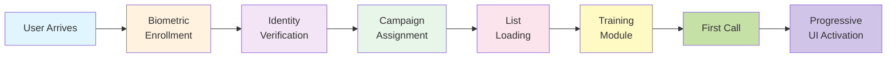
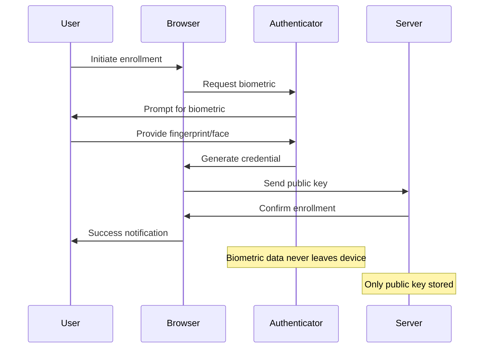

# Zero-Friction Onboarding

## Table of Contents
- [Technical Requirements](#technical-requirements)
  - [System Architecture](#system-architecture)
  - [Software Development](#software-development)
  - [User Features](#user-features)
  - [User Experience](#user-experience)
  - [Performance Requirements](#performance-requirements)
- [Security & Compliance](#security--compliance)
- [Implementation Phases](#implementation-phases)
  - [Phase 1: Foundation (Week 1-2)](#phase-1:-foundation-week-1-2)
  - [Phase 2: Automation (Week 3-4)](#phase-2:-automation-week-3-4)
  - [Phase 3: Optimization (Week 5-6)](#phase-3:-optimization-week-5-6)
- [Success Metrics](#success-metrics)

## Overview
Seamless user onboarding that eliminates all traditional barriers to entry. Users can start making productive calls within minutes using biometric authentication, pre-configured campaigns, and progressive disclosure interfaces that adapt to skill level.

## Technical Requirements

### System Architecture

**Onboarding Flow Pipeline**



**Authentication Infrastructure**
- **WebAuthn API**: Platform authenticator for biometrics
- **FIDO2 Compliance**: Industry-standard security protocols
- **Fallback Methods**: SMS OTP, email magic links
- **Zero-Knowledge Architecture**: Biometrics never leave device
- **Session Management**: JWT tokens with refresh strategy

### Software Development

**Biometric Authentication Flow**



**Authentication Methods Table**

| Method | Technology | Security Level | Fallback | User Experience |
|--------|------------|----------------|----------|-----------------|
| Face ID | WebAuthn/FaceID | Very High | PIN/Password | Seamless, <1s |
| Fingerprint | TouchID/Android | Very High | PIN/Password | Quick, <2s |
| Voice | Speaker Recognition | High | SMS OTP | Natural, <3s |
| SMS OTP | Twilio Verify | Medium | Email Magic Link | Familiar, <30s |
| Email Link | SendGrid | Medium | Support Contact | Universal, <60s |

**Progressive Web App Setup**
- **Service Workers**: Offline functionality from first load
- **App Manifest**: Installable on all devices
- **Push Notifications**: Engagement from day one
- **Background Sync**: Queue actions when offline
- **Cache Strategy**: Aggressive pre-caching of assets

### User Features

**Biometric Everything**
- **Face Recognition**: FaceID on iOS, Windows Hello
- **Fingerprint**: TouchID, Android fingerprint
- **Voice Authentication**: Speaker recognition backup
- **Behavioral Biometrics**: Typing patterns, mouse movements
- **Multi-Factor Options**: Combine biometrics for security

**No Software Installation**
- **Pure Web-Based**: Runs in any modern browser
- **Progressive Enhancement**: Features scale with capability
- **Cross-Platform**: Desktop, tablet, mobile identical experience
- **Auto-Updates**: Service worker handles updates silently
- **Instant Access**: No downloads, plugins, or extensions

**Pre-Configured Campaigns**
- **Auto-Assignment**: Students matched to campaigns by skill
- **Industry Templates**: Pre-built scripts and objection handlers
- **Smart Routing**: Optimal lead distribution algorithms
- **Warm Transfers**: Inherit context from previous calls
- **Goal Setting**: Daily/weekly targets auto-configured

### User Experience

**Progressive Disclosure UI**
```javascript
class ProgressiveInterface {
  constructor(userProfile) {
    this.skillLevel = userProfile.skillLevel || 'beginner';
    this.features = this.getFeatureSet(this.skillLevel);
  }

  getFeatureSet(level) {
    const features = {
      beginner: ['dial', 'end_call', 'basic_script'],
      intermediate: [...this.beginner, 'crm_update', 'objections'],
      advanced: [...this.intermediate, 'analytics', 'coaching', 'admin']
    };
    return features[level];
  }

  async upgradeInterface(newLevel) {
    this.skillLevel = newLevel;
    this.features = this.getFeatureSet(newLevel);
    await this.animateTransition();
  }
}
```

**Instant List Access**
- **Pre-Qualification**: Lists vetted and ready
- **Smart Segmentation**: Prospects matched to rep skills
- **Time-Zone Optimization**: Call at optimal times
- **Duplicate Detection**: Automatic de-duplication
- **Priority Scoring**: High-value prospects first

**Single Sign-On Integration**
- **SAML 2.0**: Enterprise identity providers
- **OAuth 2.0**: Social login options
- **OpenID Connect**: Modern authentication flow
- **LDAP/AD**: Corporate directory integration
- **Zero-Trust**: Continuous authentication

### Performance Requirements

- **Time to First Call**: <3 minutes from account creation
- **Authentication Speed**: <2 seconds for biometric login
- **Campaign Load Time**: <1 second for list display
- **UI Adaptation**: Instant progressive disclosure
- **Cross-Device Sync**: <500ms for state synchronization
- **Offline Capability**: Full functionality without internet

## Security & Compliance

- **Biometric Privacy**: BIPA compliant, templates encrypted
- **Data Minimization**: Collect only essential information
- **Consent Management**: Clear opt-in for all features
- **Audit Trail**: Complete onboarding journey tracking
- **Compliance Checks**: Automatic TCPA, GDPR verification

## Implementation Phases

### Phase 1: Foundation (Week 1-2)
- WebAuthn implementation
- Basic PWA setup
- Simple campaign templates
- Manual list upload

### Phase 2: Automation (Week 3-4)
- Biometric enrollment flow
- Auto-campaign assignment
- Progressive UI framework
- SSO integration

### Phase 3: Optimization (Week 5-6)
- Advanced matching algorithms
- Multi-device sync
- Offline capabilities
- Analytics integration

## Success Metrics

- **Onboarding Completion**: 95%+ users fully onboarded
- **Time to Productivity**: <5 minutes to first call
- **Authentication Success**: 99%+ biometric recognition rate
- **User Satisfaction**: 4.7+ star rating for onboarding
- **Dropout Rate**: <5% abandon during onboarding